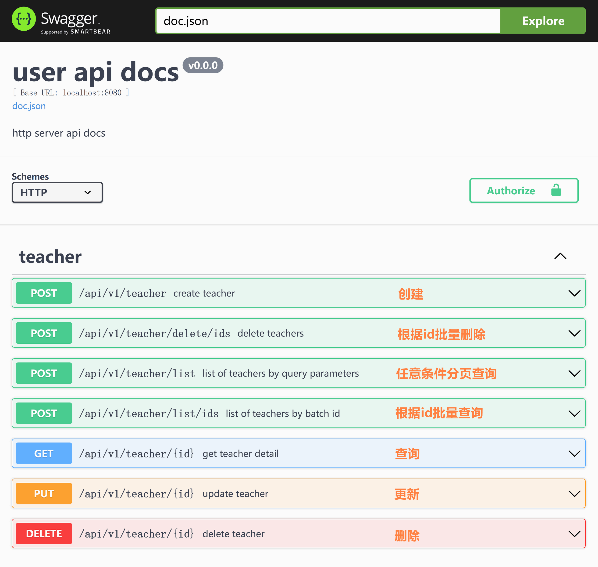

### 🏷安装 sponge

> [!tip] 安装sponge之前需要先安装`go`和`protoc`。

**✅ 安装 go**

下载go地址： [https://studygolang.com/dl](https://studygolang.com/dl)

> [!note] 要求1.16以上版本，把`go install`命令编译生成的二进制文件所在目录(通常是$GOPATH/bin)添加到系统环境变量path。

查看go版本 `go version`

<br>

**✅ 安装 protoc**

下载protoc地址： [https://github.com/protocolbuffers/protobuf/releases/tag/v3.20.3](https://github.com/protocolbuffers/protobuf/releases/tag/v3.20.3)

> [!note] 要求v3.20以上版本，把 protoc 二进制文件所在目录(建议是$GOPATH/bin)添加到系统环境变量path。

查看protoc版本: `protoc --version`


<br>

**✅ 安装 sponge**

安装完go和protoc之后，接下来安装sponge，支持在windows、mac、linux环境安装。

> [!tip] 如果不能科学上网，安装sponge时，获取github的库会遇到超时失败问题，建议设置为国内代理，执行命令 **go env -w GOPROXY=https://goproxy.cn,direct**

<!-- tabs:start -->

#### **Windows环境**

> [!note] 在windows环境中需要安装mingw64、make、cmder来支持linux命令环境才可以使用sponge。

**✅ 安装 mingw64**

下载mingw64地址： [x86_64-8.1.0-release-posix-seh-rt_v6-rev0.7z](https://sourceforge.net/projects/mingw-w64/files/Toolchains%20targetting%20Win64/Personal%20Builds/mingw-builds/8.1.0/threads-posix/seh/x86_64-8.1.0-release-posix-seh-rt_v6-rev0.7z)

下载后解压到`D:\Program Files\mingw64`目录，把linux常用命令所在的目录`D:\Program Files\mingw64\bin`添加系统环境变量PATH。

<br>

**✅ 安装 make 命令**

切换到`D:\Program Files\mingw64\bin`目录，找到`mingw32-make.exe`可执行文件，复制并改名为`make.exe`。

查看make版本：`make -v`

<br>

**✅ 安装 cmder**

下载cmder地址： [cmder-v1.3.20.zip](https://github.com/cmderdev/cmder/releases/download/v1.3.20/cmder.zip)

下载后解压到`D:\Program Files\cmder`目录下，并把目录`D:\Program Files\cmder`添加到系统环境变量path。

对cmder进行简单的配置：

- **配置鼠标右键启动cmder**，按下组合键`win+x`，再按字母`a`进入有管理权限的终端，执行命令`Cmder.exe /REGISTER ALL`。 随便在一个文件夹里按下鼠标右键，选择`Cmder Here`即可打开cmder界面。
- **解决输入命令时的空格问题**，打开cmder界面，按下组合键win+alt+p进入设置界面，在左上角搜索`Monospace`，取消勾选，保存退出。

> [!attention] 在windows环境使用sponge开发项目，为了避免找不到linux命令错误，请使用cmder，不要用系统自带的cmd终端、Goland和VS Code下的终端。

打开`cmder.exe`终端，检查是否支持常用的linux命令。

```bash
ls --version
make --version
cp --version
chmod --version
rm --version
```

<br>

**✅ 安装 sponge**

打开`cmder.exe`终端(不是windows自带的cmd)，执行命令安装sponge：

```bash
# 安装sponge
go install github.com/zhufuyi/sponge/cmd/sponge@latest

# 初始化sponge，自动安装sponge依赖插件
sponge init

# 查看插件是否都安装成功，如果发现有插件没有安装成功，执行命令重试 sponge tools --install
sponge tools

# 查看sponge版本
sponge -v
```

#### **Mac环境**

在mac环境安装sponge。

```bash
# 安装sponge
go install github.com/zhufuyi/sponge/cmd/sponge@latest

# 初始化sponge，自动安装sponge依赖插件
sponge init

# 查看插件是否都安装成功，如果发现有插件没有安装成功，执行命令重试 sponge tools --install
sponge tools

# 查看sponge版本
sponge -v
```

#### **Linux环境**

在linux环境安装sponge。

```bash
# 安装sponge
go install github.com/zhufuyi/sponge/cmd/sponge@latest

# 初始化sponge，自动安装sponge依赖插件
sponge init

# 查看插件是否都安装成功，如果发现有插件没有安装成功，执行命令重试 sponge tools --install
sponge tools

# 查看sponge版本
sponge -v
```

<!-- tabs:end -->

> [!tip] 升级最新sponge框架版本，执行命令 `sponge upgrade`

<br>

### 🏷启动sponge UI界面服务

sponge 支持丰富的生成代码命令，部分常用的生成代码命令都有对应的UI界面，UI界面有记忆功能、有参数详细的说明、有生成代码后的使用步骤说明，因此使用UI界面更加简单易用。

打开终端，执行命令：

```bash
sponge run
```

在浏览器访问 http://localhost:24631 ，进入sponge生成代码的UI界面。

> [!note] 在sponge的UI界面只支持在本地生成代码，不支持跨ip，原因是把前端文件(html、js、css)和后端服务统一编译到了sponge可执行文件，前端的js使用默认ip `127.0.0.1` 不可改变。如果需要远程部署sponge UI服务，请下载sponge源码，搜索字段`spongeServiceAddr`，配置成你的IP地址或域名，最后编译出新的sponge可执行文件，部署到目标服务器上。

在sponge UI界面上支持5种方式创建项目， 分别是:

- `⓵基于sql创建的web服务`
- `⓶基于sql创建的微服务`
- `⓷基于protobuf创建的web服务`
- `⓸基于protobuf创建的微服务`
- `⓹基于protobuf创建的rpc网关服务`

每种方式创建的项目使用场景在[生成代码框架](https://go-sponge.com/zh-cn/framework-design?id=%f0%9f%8f%b7%e7%94%9f%e6%88%90%e4%bb%a3%e7%a0%81%e6%a1%86%e6%9e%b6)章节中介绍，根据项目实际需要选择其中一种方式即可。在sponge UI界面还支持生成多种公共代码，这些公共代码都可以无缝嵌入到项目代码中，除了在UI界面生成代码，更多生成代码命令集成在项目代码下的Makefile文件中，通过Makefile生成的代码都是无缝嵌入到项目代码中。这么多生成代码命令目的是尽可能让golang也可以实现"低代码开发"。

<br>

### 🏷创建项目示例

下面使用`⓵基于sql创建的web服务`方式来创建项目示例，也是5种方式中创建项目最简单之一，不需要编写任何一行go代码，只需连接mysql数据库，就可以生成一个线上部署的完整web服务项目，web服务的api接口包括了标准化的`CRUD`、`任意条件的分页查询`、`缓存`，也包括了丰富的组件，开箱即用。

> [!tip] 生成代码需要依赖mysql服务和mysql表，如果都没有准备好，这里有[docker启动mysql服务脚本](https://github.com/zhufuyi/sponge/blob/main/test/server/mysql/docker-compose.yaml)，启动mysql服务之后导入[mysql表sql](https://github.com/zhufuyi/sponge_examples/blob/main/1_web-gin-CRUD/test/sql/user.sql)。

进入sponge的UI界面，点击左边菜单栏【SQL】--> 【创建web项目】，填写`mysql dsn地址`，然后点击`获取表名`，接着填写其他参数，鼠标放在问号`?`位置查看参数说明，填写完参数后，点击按钮`下载代码`生成web服务完整项目代码，如下图所示：


解压代码文件，这是创建的user项目代码目录：

```
.
├─ build
├─ cmd
│   └─ user
│       ├─ initial
│       └─ main.go
├─ configs
├─ deployments
│   ├─ binary
│   ├─ docker-compose
│   └─ kubernetes
├─ docs
├─ internal
│   ├─ cache
│   ├─ config
│   ├─ dao
│   ├─ ecode
│   ├─ handler
│   ├─ model
│   ├─ routers
│   ├─ server
│   └─ types
└─ scripts
```

打开终端，切换到代码目录，执行命令：

```bash
# 生成swagger文档
make docs

# 编译和运行服务
make run
```

在浏览器打开 [http://localhost:8080/swagger/index.html](http://localhost:8080/swagger/index.html)，在页面上进行增删改查api接口测试，如下图所示：



<br>

`⓵基于sql创建的web服务`只能选择一个mysql表来创建项目代码，如果有多个mysql表，如何批量生成标准化的CRUD api接口代码无缝嵌入到项目代码呢？如果想新增非标准化CRUD的自定义api接口，又如何操作呢？在[web开发(mysql)](https://go-sponge.com/zh-cn/web-development-mysql)章节中详细介绍。

> [!tip] 共有5种方式创建不同类型项目，在后面的章节中详细介绍。

<br>
