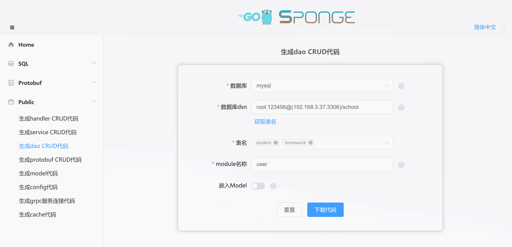

### 🔹任意条件分页查询

CRUD api 接口中有一个接口叫任意条件分页查询，这个接口参数包括`分页`和`条件`两部分，具体使用规则如下：

```yaml
分页参数 (必须):
	page: 页码，从0开始。
	size(limit): 每页行数，默认最大1000，只有 ⓵基于sql创建的web服务 是size，其他方式创建的服务使用limit。
	sort: 排序字段, 默认是id倒序，可以改为其他字段排序，字段名称前面有减号"-"表示倒序，没有减号表示升序，多字段排序用逗号分隔。

条件参数columns (非必须):
	name: 列名称
	exp: 表达式，如果为空，默认是等号=, 可以填写 =, !=, >, >=, <, <=, like
	value: 列值
	logic: 多列之间逻辑，如果为空表示逻辑与and，可以填写 &(and), ||(or)

示例: 查询大于20岁的男性
	{
	    page: 0,
	    size: 20,
	    columns: [
			{
				name: "age",
				exp: ">",
				value: 20,
			},
			{
				name: "gender",
				value: "male",
			}
		]
	}
```

<br>

---

### 🔹生成和使用dao CRUD代码

点击左边菜单栏【Public】-->【生成dao CRUD代码】，填写`mysql dsn地址`，然后点击`获取表名`，选择mysql表(可多选)，
接着填写其他参数，填写完参数后，点击按钮`下载代码`生成dao CRUD代码，如下图所示：



> [!tip] 等价命令 **sponge web dao --module-name=user --db-dsn="root:123456@(192.168.3.37:3306)/school" --db-table=teach**，有更简单的等价命令，使用参数`--out`指定user服务代码目录，直接合并代码到user服务代码，**sponge web dao --db-dsn="root:123456@(192.168.3.37:3306)/school" --db-table=teach --out=user**

生成的dao CRUD代码目录如下，在目录`internal`下的子目录`cache`、`dao`、`model`包含了以表名开头的go文件和测试文件。

```
.
└─ internal
     ├─ cache
     ├─ dao
     └─ model
```

解压代码，把目录`internal`移动到`web服务`或`微服务`代码目录下，就完成了在微服务中批量添加dao CURD api接口。

> [!note] 移动目录`internal`正常情况下不会有冲突文件，如果有冲突文件，说明之前已经指定相同的mysql表来生成dao CRUD代码了，此时忽略覆盖文件。

<br>

接下来引用dao CRUD接口，在`web服务`和`微服务`调用dao CRUD的代码文件位置不一样。

**在web服务的handler调用dao CRUD接口：**

进入目录`internal/handler`，

- 对于`⓵基于sql创建的web服务`，打开`表名.go`文件。
- 对于`⓷基于protobuf创建的web服务`，打开`proto文件名.go`文件。
- 也可以是新创建的go文件。

在结构体里面引用dao接口，示例如下：

```go
type userHandler struct {
	// 引用dao接口
	userDao                 dao.UserDao
}
```

<br>

**在微服务的service调用dao CRUD接口：**

进入目录`internal/service`，

- 对于`⓶基于sql创建的微服务`，打开`表名.go`文件。
- 对于`⓸基于protobuf创建的微服务`，打开`proto文件名.go`文件。
- 也可以是新创建的go文件。

在结构体里面引用dao接口，示例如下：

```go
type userService struct {
	// 引用dao接口
	userDao                 dao.UserDao
}
```

<br>

经过简单的声明之后就可以在api接口模板代码中调用dao CRUD接口了。

<br>

---

### 🔹生成和使用cache代码

点击左边菜单栏【Public】-->【生成cache代码】，按提示说明填写完参数后，点击按钮`下载代码`生成cache代码，如下图所示：


> [!tip] 等价命令 **sponge web cache --module-name=user --cache-name=userToken --prefix-key=user:token: --key-name=id --key-type=uint64 --value-name=token --value-type=string**，有更简单的等价命令，使用参数`--out`指定user服务代码目录，直接合并代码到user服务代码，**sponge web cache --cache-name=userToken --prefix-key=user:token: --key-name=id --key-type=uint64 --value-name=token --value-type=string --out=user**

生成的cache代码目录如下，在目录`internal`下的子目录`cache`包含了go文件和测试文件。

```
.
└─ internal
     └─ cache
```

解压代码，把目录`internal`移动到`web服务`或`微服务`代码目录下。

<br>

接下来引用cache接口，在`web服务`和`微服务`调用cache的代码文件位置不一样。

**在web服务的handler调用cache代码：**

进入目录`internal/handler`，

- 对于`⓵基于sql创建的web服务`，打开`表名.go`文件。
- 对于`⓷基于protobuf创建的web服务`，打开`proto文件名.go`文件。
- 也可以是新创建的go文件。

在结构体里面引用cache接口，示例如下：

```go
type userHandler struct {
	// 引用cache接口
	userTokenCache       cache.UserTokenCache
}
```

<br>

**在微服务的service调用cache代码：**

进入目录`internal/service`，

- 对于`⓶基于sql创建的微服务`，打开`表名.go`文件。
- 对于`⓸基于protobuf创建的微服务`，打开`proto文件名.go`文件。
- 也可以是新创建的go文件。

在结构体里面引用cache接口，示例如下：

```go
type userService struct {
	// 引用cache接口
	userTokenCache       cache.UserTokenCache
}
```

<br>

经过简单的声明之后就可以在api接口模板代码中调用cache接口了。
