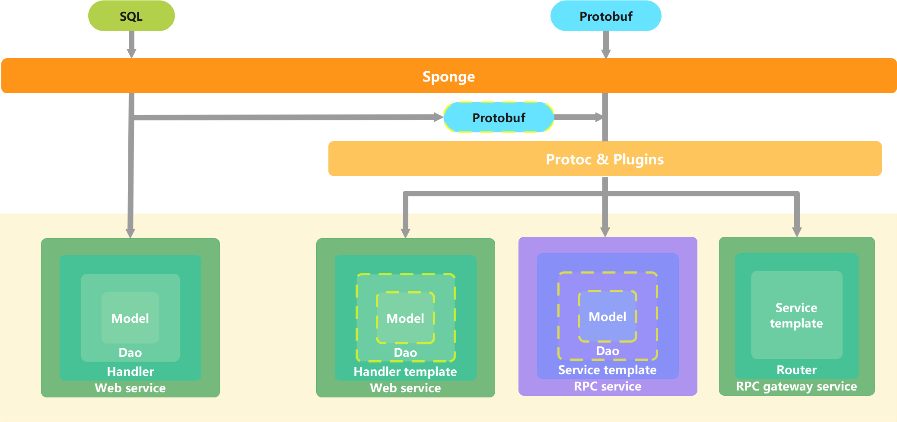
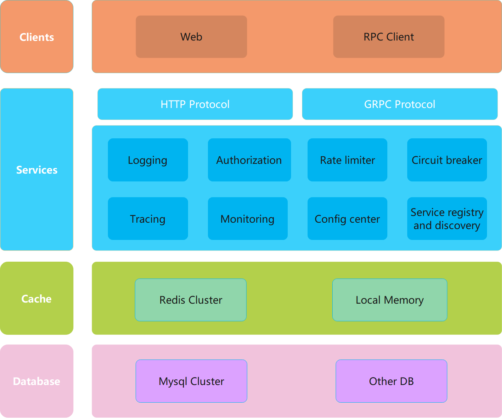

### 🏷sponge的发展阶段

**sponge的发展主要经过下面几个阶段：**

> 🔹**第一阶段**，把配置文件yaml转换为go代码，把mysql表转换为gorm代码，生成简单的gorm CRUD代码，现阶段作为开发辅助写代码工具用。

> 🔹**第二阶段**，支持生成dao CRUD代码、handler CRUD代码、web服务代码，现阶段支持生成标准化CRUD api接口的web服务代码，但不支持生成自定义api接口代码，有一定的局限性。

> 🔹**第三阶段**，支持使用protobuf协议来生成自定义api接口，增加了生成通用的web服务代码，现阶段支持`sql web开发`和`protobuf web开发`两种方式。

> 🔹**第四阶段**，支持`基于sql生成微服务(gRPC)代码`、`基于protobuf生成通用的微服务(gRPC)代码`、`基于protobuf生成rpc网关服务代码`，现阶段微服务框架已经成型。

> 🔹**第五阶段**，支持生成代码命令UI界面化，丰富的开箱即用的组件，微服务(gRPC)服务测试，构建部署自动化等，已经具备作为基础开发框架。

总的来说，sponge是一个集成了`自动生成代码`、`web和微服务框架`、`基础开发框架`的golang生产力工具。

<br>

### 🏷生成代码框架

生成代码主要基于**sql**和**protobuf**两种方式，每种方式拥有生成不同功能代码，生成代码的框架图如下所示：


<p align="center">sponge生成代码框架图</p>

<br>

从图中可以看出，基于sql创建项目有2种方式：

- `⓵基于sql创建的web服务`(gin，绿色方框)
- `⓶基于sql创建的微服务`(gRPC，紫色方框)

基于protobuf创建的项目有3种方式：

- `⓷基于protobuf创建的web服务`(gin，绿色方框)
- `⓸基于protobuf创建的微服务`(gRPC，紫色方框)
- `⓹基于protobuf创建的rpc网关服务`(gin和gRPC，绿色方框)

也就是说sponge一共支持5种创建项目方式，这5种创建项目方式适用于不同的项目场景：

<!-- tabs:start -->

#### **⓵基于sql创建的web服务**

`⓵基于sql创建的web服务`是使用mysql作为数据存储的传统web服务，包括了从开发到部署的完整功能、标准化CRUD api接口。

**适用场景：** 使用mysql作为数据存储，并且绝大多数api接口是标准化CRUD接口的web项目，例如后台管理项目。

**特点：**

- 不需要编写任何一行go代码就可以运行使用，只需连接mysql数据库，一键生成包含标准化CRUD api接口的完整项目工程代码，开箱即用。
- 支持批量添加标准化CRUD api接口，生成的标准化CRUD api接口代码无缝嵌入项目代码中。
- 支持自定义api接口，但需要像传统web开发那样人工去编写完整的api接口代码。

如上图所示，生成的web服务代码代码包括 `handler`、 `dao`、`model` 三个子模块代码，向内包含，同样的原理，生成`handler`模块代码包含`dao`、 `model`两个子模块代码。

#### **⓶基于sql创建的微服务**

`⓶基于sql创建的微服务`是使用mysql作为数据存储的微服务(gRPC)，包括了从开发到部署的完整功能、标准化的CRUD api接口、rpc客户端测试代码。

**适用场景：** 使用mysql作为数据存储的通用微服务项目。

**特点：**

- 不需要编写任何一行go代码就可以运行使用，只需连接mysql数据库，一键生成包括标准化CRUD api接口的完整项目工程代码，开箱即用。
- 通过解析sql来生成proto文件里的标准化CRUD api接口描述信息，不需要人工定义。
- 支持批量添加标准化CRUD api接口。
- 支持自定义api接口，只需在proto文件填写自定义api接口描述信息，然后在api接口模板中填写具体逻辑代码。
- 支持单独生成dao CRUD代码无缝嵌入到微服务项目代码中，然后在`service`调用`dao`接口。
- 自动生成grpc客户端测试和压测代码，不需要借助第三方grpc客户端工具测试微服务，直接在`Goland`或`VS code`上测试api接口。

如上图所示，生成的微服务(gRPC)代码包括了 `service`、`dao`、`model`、`protobuf` 四个子模块，向内包含，生成`service`模块代码包括了 `dao`、`model`、`protobuf` 三个子模块代码。

#### **⓷基于protobuf创建的web服务**

`⓷基于protobuf创建的web服务`是通用web服务，包括了从开发到部署所需功能、api接口模板代码，支持自选数据库类型作为数据存储。

**适用场景：** 通用的web服务项目。

**特点：**

- 支持批量生成任意api接口模板代码。
- 新增api接口时，会自动合并新增的api接口代码到模板代码，简化了web服务的api接口开发，在proto文件编写任意api接口描述信息，在生成api接口模板代码填写具体逻辑。
- 如果选用了mysql作为数据存储，其实就是`⓵基于sql创建的web服务`的增强版，不仅支持批量添加标准化CRUD api接口，自定api接口代码(除了具体逻辑代码)也是自动生成的，添加一个完整的自定义api接口时，不需要像传统开发api接口那样人工编写接口全部代码。
- 如果选用非mysql类型数据时，必须人工编写连接数据代码、dao代码，在handler调用dao接口。
- 需要了解使用protobuf。

如上图所示，生成的web服务代码包括了 `handler template`，如果数据类型使用mysql，生成代码还包括`dao`、`model`子模块，如果使用其他数据类型，需要人工编写`dao`、`model`子模块代码。

#### **⓸基于protobuf创建的微服务**

`⓸基于protobuf创建的微服务`是通用微服务(gRPC)服务，包括了从开发到部署所需功能、api接口模板代码，支持自选数据库类型作为数据存储。

**适用场景：** 通用的微服务项目。

**特点：**

- 支持批量生成任意api接口模板代码。
- 新增api接口时，会自动合并新增的api接口代码到模板代码。
- 如果选用了mysql作为数据存储，则与`⓶基于sql创建的微服务`是完全一样，支持批量添加标准化CRUD api接口，也支持单独生成dao CRUD代码无缝嵌入到微服务项目代码中，然后在`service`调用`dao`接口。
- 如果选用非mysql类型数据时，必须人工编写连接数据代码、dao代码，在service调用dao接口。
- 自动生成grpc客户端测试和压测代码，不需要借助第三方grpc客户端工具测试微服务，直接在`Goland`或`VS code`上测试api接口。
- 需要了解使用protobuf。

如上图所示，生成的微服务代码包括了`service template`， 如果数据类型使用mysql，生成代码还包括`dao`、`model`子模块，如果使用其他数据类型，需要人工编写`dao`、`model`子模块代码。

#### **⓹基于protobuf创建的rpc网关服务**

`⓹基于protobuf创建的rpc网关服务`是rpc服务的统一入口的web服务，包括了从开发到部署所需功能、api接口模板代码。

**适用场景：** 微服务架构、分布式系统、跨平台系统。

**特点：**

- 支持批量生成任意api接口模板代码，只需在protobuf定义api接口描述信息，在生成的模板文件编写具体逻辑代码。
- 新增api接口时，会自动合并新增的api接口代码到模板代码。
- 支持无缝嵌入生成的连接rpc服务代码。
- 支持负载均衡、路由、鉴权、监控功能。
- 需要了解使用protobuf。

如上图所示，生成的rpc网关服务代码包括 `router` 和 `service template` 两个子模块，这里的`service`模板代码主要是调用rpc服务api接口。

<!-- tabs:end -->

<br>

### 🏷微服务框架

sponge创建的微服务代码框架如下图所示，这是典型的微服务分层结构，具有高性能，高扩展性，包含常用的服务治理功能，可以很方便替换或添加自己的服务治理功能。


<p align="center">微服务框架图</p>

微服务主要功能：

- Web 框架 [gin](https://github.com/gin-gonic/gin)
- RPC 框架 [grpc](https://github.com/grpc/grpc-go)
- 配置解析 [viper](https://github.com/spf13/viper)
- 配置中心 [nacos](https://github.com/alibaba/nacos)
- 日志组件 [zap](https://go.uber.org/zap)
- 数据库orm组件 [gorm](https://gorm.io/gorm)
- 缓存组件 [go-redis](https://github.com/go-redis/redis), [ristretto](github.com/dgraph-io/ristretto)
- 自动化api接口文档 [swagger](https://github.com/swaggo/swag), [protoc-gen-openapiv2](https://github.com/grpc-ecosystem/grpc-gateway/v2/protoc-gen-openapiv2)
- 鉴权 [jwt](https://github.com/golang-jwt/jwt)
- 参数校验 [validator](https://github.com/go-playground/validator)
- 自适应限流 [ratelimit](pkg/shield/ratelimit)
- 自适应熔断 [circuitbreaker](pkg/shield/circuitbreaker)
- 链路跟踪 [opentelemetry](https://go.opentelemetry.io/otel)
- 指标监控 [prometheus](https://github.com/prometheus/client_golang/prometheus), [grafana](https://github.com/grafana/grafana)
- 服务注册与发现 [etcd](https://github.com/etcd-io/etcd), [consul](https://github.com/hashicorp/consul), [nacos](https://github.com/alibaba/)
- 自适应采集 [profile](https://go.dev/blog/pprof)
- 资源统计 [gopsutil](https://github.com/shirou/gopsutil)
- 代码规范检查 [golangci-lint](https://github.com/golangci/golangci-lint)
- 持续集成部署 [jenkins](https://github.com/jenkinsci/jenkins), [docker](https://www.docker.com/), [kubernetes](https://github.com/kubernetes/kubernetes)

<br>

### 🏷sponge核心功能

#### 🔹模板代码

sponge源码包括了`生成代码工具`、`web和微服务代码`和`基础开发框架脚本`三大部分，其中`web和微服务代码`和`基础开发框架脚本`统称为`模板代码`，可以看到5种方式创建的项目代码目录都是一致的，共用一套sponge源码中的模板代码。

> [!tip] 在sponge源码中，除了`cmd/sponge`、`cmd/protoc-gen-go-gin`、`cmd/protoc-gen-go-rpc-tmpl`这3个目录属于生成代码工具，其他目录的代码都是模板代码。

如果看懂了sponge创建的项目代码，也就看懂了sponge源码(开发过项目都比较容易看懂)，主要了解项目代码中api和internal两个目录下的代码，应该对这两个目录不陌生，api目录主要是定义api接口描述信息的，internal目录主要是存放业务逻辑代码的，使用sponge开发项目主要流程是`在proto文件定义api接口` --> `在生成的模板代码中编写具体逻辑代码`，web和微服务开发都是一样的套路。

> [!tip] 如果项目一开使用单体web服务(`⓵基于protobuf创建的web服务`)，随着业务功能的增加，越来越复杂，如果想要把业务复杂的单体web服务拆分为微服务非常方便，基本不需要重写代码，经过简单的移植代码即可，原因是web和微服务共用一套模板代码。

> [!tip] sponge的生成代码命令和模板代码是同步更新的，执行命令`sponge upgrade`会更新到最新版本，不会出现生成代码命令和模板代码不一致情况。

<br>

#### 🔹生成代码

`生成代码`是sponge项目的三大核心功能之一，自动把生成的代码与模板代码(`web和微服务代码`和`通用基础开发框架脚本`)有规则的组织起来，构建成一个完整的项目代码。模板代码就像一个已固定结构的楼房，`生成代码`是给楼房添砖加瓦和装修。

sponge支持丰富的生成代码功能，使用sponge在开发项目过程中主要有两个地方可以生成代码，一是在UI界面，二是在创建的项目代码下的Makefile文件。

在sponge UI界面上支持5种方式创建项目， 分别是:

- `⓵基于sql创建的web服务`(gin)
- `⓶基于sql创建的微服务`(gRPC)
- `⓷基于protobuf创建的web服务`(gin)
- `⓸基于protobuf创建的微服务`(gRPC)
- `⓹基于protobuf创建的rpc网关服务`(gin, gRPC)

在sponge UI界面还支持生成多种公共代码，这些公共代码都可以无缝嵌入到项目代码中，分别是：

- 生成handler CRUD代码(适用于gin)
- 生成service CRUD代码(适用于gRPC)
- 生成dao CRUD代码(适用于gorm)
- 生成protobuf CRUD代码(适用于在web或微服务添加api接口)
- 生成的module代码(适用于gorm)
- 生成config代码(适用于yaml)
- 生成连接rpc服务代码(适用于gRPC)
- 生成cache代码(适合用于redis)

其实在UI界面的后台执行是sponge生成代码的命令行，在`sponge web`和`sponge micro`命令中可以找到一一对应的生成代码子命令。UI界面有记忆功能、有参数详细的说明、有生成代码后的使用步骤说明，因此使用UI界面比sponge命令行更加简单易用。

<br>

除了在UI界面的生成代码，更多生成代码命令集成在服务代码目录下的Makefile文件中，包括：

- 生成api接口模板代码
- rpc客户端测试代码
- 注册路由代码
- api接口错误码
- 自动合并模板代码
- protoc插件生成的*pb.go代码

通过Makefile生成的代码都是无缝嵌入到项目代码中的，不需要人工调整来适配项目代码。 

sponge包括这么多种生成代码命令都是为了在开发项目过程中尽可能少写代码或者不写代码，让golang也可以"低代码开发"。

<br>

### 🏷项目代码目录结构

sponge创建的项目代码目录结构遵循 [project-layout](https://github.com/golang-standards/project-layout)，如下所示：

```bash
.
├── api            # 对外提供api接口目录，通常是存放proto文件和生成的*.pb.go文件，目录结构通常是`api/xxx/v1`形式，v1表示版本
├── assets         # 存放一些静态资源，例如图片、markdown文件等    
├── build          # 存放构建容器的Dockerfile脚本
├── cmd            # 程序入口目录
│    ├── initial      # 程序初始化，有三个文件，initApp是初始化配置，registerServers是注册服务(http或gRPC)，registerClose是注册释放资源
│    │    ├── main.go     # 程序入口文件
├── configs        # 存放配置文件目录
├── deployments    # 存放部署脚本目录，支持二进制、docker、kubernetes三种方式部署
├─ docs            # 存放api接口的swagger文档目录
├── internal       # 私有应用程序和库的代码目录
│    ├── cache        # 基于业务包装的缓存目录
│    ├── config       # Go结构的配置文件目录
│    ├── dao          # 数据访问目录，例如增删改查mysql表接口
│    ├── ecode        # 系统错误码和自定义业务错误代码目录
│    ├── handler      # http的业务功能实现目录(web服务独有)
│    ├── model        # 数据库模型目录
│    ├── routers      # http路由目录
│    ├── rpcclient    # 连接rpc服务的客户端代码目录
│    ├── server       # 创建服务目录，包括http、grpc等
│    ├── service      # rpc的业务功能实现目录(微服务独有)
│    └── types        # 定义http的请求参数和响应参数结构体目录
├── pkg            # 公共的库目录
├── scripts        # 存放编译、运行、生成代码、构建部署等脚本目录
├── test           # 存放测试服务时依赖的服务启动脚本(例如mysql、redis等)和测试数据(sql)
└── third_party    # 存放外部帮助程序、分叉代码和其他第三方工具
```

> [!tip] web服务和微服务(gRPC)目录结构基本一致，其中有一些是web服务独有的目录(internal目录下的routers、handler、types)，有一些是微服务独有的目录(internal目录下的service)。

<br>

### 🏷项目代码鸡蛋模型

sponge生成代码过程中剥离了业务逻辑与非业务逻辑两大部分代码。以一个完整的web服务项目代码为例，把完整的web服务代码看作一个鸡蛋，**蛋壳**表示web服务框架代码，蛋白和蛋黄都表示业务逻辑代码，**蛋黄**是业务逻辑的核心(需要人工编写的代码)，例如定义mysql表、定义api接口、编写具体逻辑代码都属于蛋黄部分。**蛋白**是业务逻辑核心代码与web框架代码连接的桥梁(自动生成，不需要人工编写)，例如根据proto文件生成的注册路由代码、handler方法函数代码、参数校验代码、错误码、swagger文档等都属于蛋白部分。

`⓷基于protobuf创建的web服务`代码的鸡蛋模型剖析图如下图所示：


<br>

`⓶基于sql创建的微服务` 和 `⓸基于protobuf创建的微服务`代码的鸡蛋模型剖析图如下图所示：


<br>

`⓹基于protobuf创建的rpc网关服务`代码的鸡蛋模型剖析图如下图所示：


<br>
