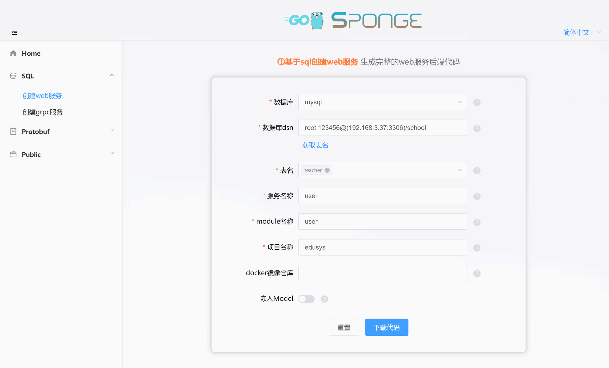
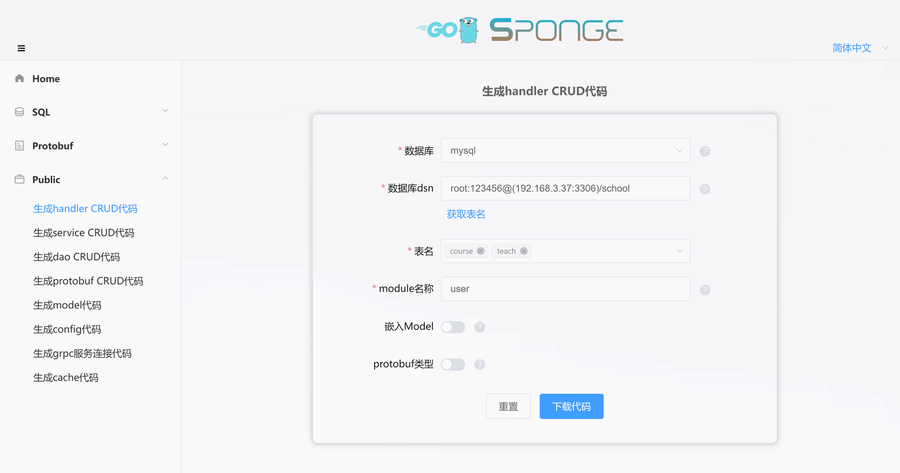

`⓵基于sql创建的web服务`是使用mysql作为数据存储的web服务，因为已经选定了数据库类型，并且sponge支持生成gorm的标准化CRUD代码，所以可以一键生成带有CRUD api接口的完整web服务代码，在web服务代码中支持批量添加标准化CRUD api接口代码，不需要编写任何一行go代码，只需连接mysql数据库。

如果开发只有标准化CRUD api接口的web服务，这是最简单的web开发方式之一，不需要写go代码，实现了web服务api接口"低代码开发"。但添加自定义api接口时，则需要像传统开发api接口一样人工编写完整的api接口代码，这也是`⓵基于sql创建的web服务`的不足之处，不能做到自动生成自定义api接口代码，而在另外一种web开发方式`⓷基于protobuf创建的web服务`(也就是<a href="/zh-cn/web-development-protobuf" target="_blank">web开发</a>)中解决了这个不足。

因此`⓵基于sql创建的web服务`适合使用mysql作为数据存储，并且绝大多数api接口是标准化CRUD接口的web项目，例如后台管理项目。

<br>

### 🏷前期准备

开发web项目前准备：

- 已安装sponge
- mysql服务
- mysql表

> [!tip] 生成代码需要依赖mysql服务和mysql表，如果都没有准备好，这里有[docker启动mysql服务脚本](https://github.com/zhufuyi/sponge/blob/main/test/server/mysql/docker-compose.yaml)，启动mysql服务之后导入示例使用的[库和表的sql](https://github.com/zhufuyi/sponge_examples/blob/main/1_web-gin-CRUD/test/sql/user.sql)。

打开终端，启动sponge UI界面服务：

```bash
sponge run
```

在浏览器访问 http://localhost:24631 ，进入sponge生成代码的UI界面。

<br>

### 🏷创建web服务项目

进入sponge的UI界面，点击左边菜单栏【SQL】-->【创建web项目】，填写`mysql dsn地址`，然后点击按钮`获取表名`，选择表名(可多选)，接着填写其他参数，鼠标放在问号`?`位置可以查看参数说明，填写完参数后，点击按钮`下载代码`生成web服务完整项目代码，如下图所示：



> [!tip] 等价命令 **sponge web http --module-name=user --server-name=user --project-name=edusys --db-dsn=root:123456@(192.168.3.37:3306)/school --db-table=teacher**

> [!tip] 解压的web服务代码目录名称的格式是`服务名称-类型-时间`，如果不想这样的名称，可以修改目录名称(例如把名称中的类型和时间去掉)。

> [!tip] 成功生成代码之后会保存记录，方便下一次生成代码使用，如果`mysql dsn地址`不变，刷新或重新打开页面时会自动获取到表名，不需要点击按钮`获取表名`，直接选择表名。

这是创建的web服务代码目录：

```
.
├─ cmd
│   └─ user
│       ├─ initial
│       └─ main.go
├─ configs
├─ deployments
│   ├─ binary
│   ├─ docker-compose
│   └─ kubernetes
├─ docs
├─ internal
│   ├─ cache
│   ├─ config
│   ├─ dao
│   ├─ ecode
│   ├─ handler
│   ├─ model
│   ├─ routers
│   ├─ server
│   └─ types
└─ scripts
```

解压代码文件，打开终端，切换到web服务代码目录，执行命令：

```bash
# 生成swagger文档
make docs

# 编译和运行服务
make run
```

> [!note] 开发web服务过程中会经常使用`make docs`命令，用来生成swagger文档，如果添加或修改了api接口，需要执行这个命令，否则不需要执行。

在浏览器打开 [http://localhost:8080/swagger/index.html](http://localhost:8080/swagger/index.html)，可以在页面上进行增删改查api接口测试，如下图所示：


> [!tip] CRUD api 接口中有一个任意条件分页查询接口，有了这个接口后，可以少写很多api查询接口，点击查看<a href="/zh-cn/public-doc?id=%f0%9f%94%b9%e4%bb%bb%e6%84%8f%e6%9d%a1%e4%bb%b6%e5%88%86%e9%a1%b5%e6%9f%a5%e8%af%a2" target="_blank">任意条件分页查询接口的使用规则</a>。

> [!note] 如果在配置文件 `configs/服务名称.yml` 修改了http下的端口号，例如把默认值8080改为9090，则必须在代码文件 `cmd/服务名/main.go`
修改 `@host` 值，例如改为localhost:9090，然后执行命令`make docs`，否则因为端口不一致造成请求失败。

<br>

### 🏷自动添加CRUD api接口

如果有新的mysql表需要生成CRUD api接口代码，点击左边菜单栏【Public】-->【生成handler CRUD代码】，填写`mysql dsn地址`，然后点击`获取表名`，选择mysql表(可多选)，
接着填写其他参数，填写完参数后，点击按钮`下载代码`生成handler CRUD代码，如下图所示：



> [!tip] 等价命令 **sponge web handler --module-name=user --db-dsn=root:123456@(192.168.3.37:3306)/school --db-table=cause,teach**，有更简单的等价命令，使用参数`--out`指定web服务代码目录，直接合并代码到web服务代码，**sponge web handler --db-dsn=root:123456@(192.168.3.37:3306)/school --db-table=cause,teach --out=user**

生成的CRUD handler代码目录如下，在目录`internal`下的子目录`cache`、`dao`、`ecode`、`handler`、`model`、`routers`、`types`包含了以表名开头的go文件和测试文件。

```
.
└─ internal
    ├─ cache
    ├─ dao
    ├─ ecode
    ├─ handler
    ├─ model
    ├─ routers
    └─ types
```

解压代码，把目录`internal`移动到web服务代码目录下，就完成了在web服务中批量添加handler CURD api接口。

> [!note] 移动目录`internal`正常情况下不会有冲突文件，如果有冲突文件，说明之前已经指定相同的mysql表来生成handler CRUD代码了，此时忽略覆盖文件。

> [!attention] 每次新添加CRUD api接口，都要检查目录`internal/ecode`下所有错误码文件的全局变量`xxxNO`值，这个编号是生成代码时表随机生成的，有可能会重复，错误码是全局唯一的，不可以重复，如果出现重复，启动服务时会报错，建议人工对`xxxNO`按顺序编号(1~100)来解决这个问题。

在终端执行命令：

```bash
# 生成swagger文档
make docs

# 编译和运行服务
make run
```

在浏览器刷新页面 [http://localhost:8080/swagger/index.html](http://localhost:8080/swagger/index.html)，在页面上可以看到新添加的增删改查api接口，直接测试api接口。

<br>

批量添加标准化的CURD api接口代码到web服务项目代码中，不需要人工编写任何go代码，如果添加自定义api接口，则需要人工编写代码了。

<br>

### 🏷人工添加自定义api接口

`⓵基于sql创建的web服务`这种方式不支持自动生成自定义的api接口模板代码，只能像传统开发web api接口那样，人工编写handler函数、定义请求参数和返回值、定义字段校验tag、定义业务错误码、注册路由、填写swagger用的注解信息、编写具体逻辑代码等一系列步骤。

例如在本项目中添加一个登录接口，需要经过下面6个步骤：

**(1) 定义请求参数和返回结果结构体**

进入目录`internal/types`，打开文件`teacher_types.go`，添加登录的请求和返回结构体代码：

```go
// LoginRequest login request params
type LoginRequest struct {
	Email      string `json:"email" binding:"email"`      // 邮件
	Password   string `json:"password" binding:"min=6"`   // 密码
}

// LoginRespond list data
type LoginRespond []struct {
	ID       uint64 `json:"id"`
	Token    string `json:"token"`
}
```

> [!tip] 结构体字段tag中 `bingding` 是字段校验规则，点击查看更多[validator校验规则](https://github.com/go-playground/validator#baked-in-validations)。

<br>

**(2) 定义错误码**

进入目录`internal/ecode`，打开文件`teacher_http.go`，添加一行代码，定义登录错误码：

```go
var (
	teacherNO       = 1
	teacherName     = "teacher"
	teacherBaseCode = errcode.HCode(teacherNO)

	// ...
	ErrLoginTeacher        = errcode.NewError(teacherBaseCode+8, "failed to login "+teacherName)
	// for each error code added, add +1 to the previous error code
)
```

<br>

**(3) 定义handler函数**

进入目录`internal/handler`，打开文件`teacher.go`，定义一个登录方法，并添加swagger注解：

```go
// Login 登录
// @Summary login
// @Description login by account and password
// @Tags teacher
// @accept json
// @Produce json
// @Param data body types.CreateLoginRequest true "login information"
// @Success 200 {object} types.Result{}
// @Router /api/v1/teacher/login [post]
func (h *teacherHandler) Login(c *gin.Context) {
	// 验证密码

	// 生成和存储token

	response.Success(c, gin.H{
    	"id": 1,
    	"token": "xxxxxx",
    })
}
```

然后把Login方法添加到TeacherHandler接口：

```go
type TeacherHandler interface {
	Create(c *gin.Context)
	// ...
	Login(c *gin.Context)
}
```

<br>

**(4) 注册路由**

进入目录`internal/routers`，打开文件`teacher.go`，把Login路由注册进来：

```go
func teacherRouter(group *gin.RouterGroup, h handler.TeacherHandler) {
	group.POST("/teacher", h.Create)
	// ...
	group.POST("/teacher/login", h.Login)
}
```

<br>

**(5) 编写具体逻辑代码**

编写登录的具体逻辑代码，例如验证密码、生成token等。

> [!tip] 在人工添加的自定义api接口中，可能需要对数据增删改查操作(也叫dao CRUD)，这些dao CRUD代码可以直接生成，不需要人工编写，点击查看<a href="/zh-cn/public-doc?id=%f0%9f%94%b9%e7%94%9f%e6%88%90%e5%92%8c%e4%bd%bf%e7%94%a8dao-crud%e4%bb%a3%e7%a0%81" target="_blank">生成和使用dao CRUD代码说明</a>。

> [!tip] 在人工添加的自定义api接口中，可能需要用到缓存，例如生成的token，这类string类型缓存代码可以直接生成，不需要人工编写，点击查看<a href="/zh-cn/public-doc?id=%f0%9f%94%b9%e7%94%9f%e6%88%90%e5%92%8c%e4%bd%bf%e7%94%a8cache%e4%bb%a3%e7%a0%81" target="_blank">生成和使用cache代码说明</a>。

<br>

**(6) 测试api接口**

编写完具体逻辑代码后，在终端执行命令：

```bash
# 生成swagger文档
make docs

# 编译和运行服务
make run
```

在浏览器刷新 [http://localhost:8080/swagger/index.html](http://localhost:8080/swagger/index.html)，在页面上可以看到登录api接口，在页面测试通过后，一个自定义的api接口才算正式添加完成。

<br>

可以看到添加自定义api接口，比添加标准化CRUD api接口(自动生成)麻烦很多，自定义api接口所有相关代码都是需要人工编写，因此`⓵基于sql创建的web服务`这种方式适合绝大多数api接口是标准化CRUD，极少数是自定义api接口场景。如果web项目中有不少自定义api接口，建议使用`⓷基于protobuf创建的web服务`方式来开发web服务。

<br>

### 🏷设置服务

创建的web服务代码中包含了丰富的组件，有些组件默认是关闭的，根据实际需要开启使用，统一在配置文件`configs/服务名称.yml`进行设置，配置文件里有详细说明。

> [!tip] 可以在服务代码中替换、添加自己的组件(gin middleware)，或者删除不需要的组件，在代码文件`internal/routers/routers.go`修改。

> [!tip] 如果api接口需要添加鉴权，在各个`internal/routers/表名.go`下路由注册代码添加`middleware.Auth()`，当然也可以使用自己的鉴权中间件，如果使用自己的鉴权中间件，需要把`internal/routers/routers.go`下的`jwt.Init`改为自己鉴权初始化。

**默认开启的组件：**

- **logger**：日志组件，默认是输出到终端，默认输出日志格式是console，可以设置输出格式为json，设置日志保存到指定文件，日志文件切割和保留时间。
- **enableMetrics**：指标采集，默认路由`/metrics`。
- **enableStat**：资源统计，统计系统和本程序的cpu和内存资源使用信息，默认每分钟在日志打印一次。
- **cacheType**：缓存组件，默认是本地内存，可以改为redis，注意集群部署时必须使用redis。

**默认关闭的组件：**

- **enableHTTPProfile**：profile组件
- **enableLimit**：自适应限流组件
- **enableCircuitBreaker**：自适应熔断组件
- **enableTrace**：链路跟踪组件
- **registryDiscoveryType**：服务注册与发现组件

其他配置的可以根据需要设置，也可以添加配置，如果添加或更改配置文件字段，需要更新对应的go结构体，在服务代码目录下的终端执行命令 `sponge config --server-dir=./`。

> [!tip] 如果添加或更改配置文件字段，也可以在UI界面生成对应的go结构体代码，点击左边菜单栏【Public】--> 【生成config代码】，选择yaml文件后，点击按钮`下载代码`，然后解压代码，把目录`internal`移动到web服务代码中，确认替换旧文件。

<br>

---

相关视频介绍：

- [一键生成web服务完整项目代码](https://www.bilibili.com/video/BV1RY411k7SE/)
- [批量生成CRUD api接口代码到web服务](https://www.bilibili.com/video/BV1AY411C7J7/)

