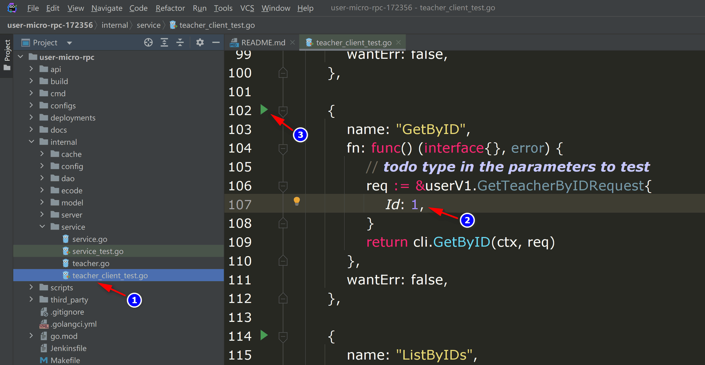

`⓶基于sql创建的微服务`是使用mysql作为数据存储的微服务(gRPC)，因为已经选定了数据库类型，并且sponge支持生成gorm的标准化CRUD代码，所以可以一键生成带有CRUD api接口的完整微服务代码，在微服务代码中可以批量添加CRUD api接口代码，不需要编写任何一行go代码，只需连接mysql数据库。

如果开发只有标准化CRUD api接口的微服务，这是最简单的微服务开发方式之一，不需要写go代码，实现了微服务api接口"低代码开发"。添加自定义api接口时，也比较简单，只需在proto文件定义api接口，然后在生成的api接口模板编写具体逻辑代码。

因此`⓶基于sql创建的微服务`适合选用mysql作为数据库的微服务项目。

<br>

### 🏷前期准备

开发微服务项目前准备：

- 已安装sponge
- mysql服务
- mysql表

> [!tip] 生成代码需要依赖mysql服务和mysql表，如果都没有准备好，这里有[docker启动mysql服务脚本](https://github.com/zhufuyi/sponge/blob/main/test/server/mysql/docker-compose.yaml)，启动mysql服务之后导入示例使用的[库和表的sql](https://github.com/zhufuyi/sponge_examples/blob/main/1_web-gin-CRUD/test/sql/user.sql)。

打开终端，启动sponge UI界面服务：

```bash
sponge run
```

在浏览器访问 http://localhost:24631 ，进入sponge生成代码的UI界面。

<br>

### 🏷创建微服务项目

进入sponge的UI界面，点击左边菜单栏【SQL】-->【创建微服务项目】，填写`mysql dsn地址`，然后点击按钮`获取表名`，选择表名(可多选)，接着填写其他参数，鼠标放在问号`?`位置查可以看参数说明，填写完参数后，点击按钮`下载代码`生成微服务完整项目代码，如下图所示：


> [!tip] 等价命令 **sponge micro rpc --module-name=user --server-name=user --project-name=edusys --db-dsn=root:123456@(192.168.3.37:3306)/school --db-table=teacher**

> [!tip] 解压的微服务代码目录名称的格式是`服务名称-类型-时间`，如果不想这样的名称，可以修改目录名称(例如把名称中的类型和时间去掉)。

> [!tip] 成功生成代码之后会保存记录，方便下一次生成代码使用，如果`mysql dsn地址`不变，刷新或重新打开页面时会自动获取到表名，不需要点击按钮`获取表名`，直接选择表名。

这是创建的微服务代码目录：

```
.
├─ api
│   ├─ types
│   └─ user
│       └─ v1
├─ cmd
│   └─ user
│       ├─ initial
│       └─ main.go
├─ configs
├─ deployments
│   ├─ binary
│   ├─ docker-compose
│   └─ kubernetes
├─ docs
├─ internal
│   ├─ cache
│   ├─ config
│   ├─ dao
│   ├─ ecode
│   ├─ model
│   ├─ server
│   └─ service
└─ scripts
```

创建的微服务代码结构鸡蛋模型：


解压代码文件，打开终端，切换到微服务代码目录，执行命令：

```bash
# 生成与合并api接口相关代码
make proto

# 编译和运行服务
make run
```

> [!note] 开发过程中会经常使用 `make proto`命令，内部执行一系列生成代码子命令：生成api接口的`模板代码`、`错误码`、`rpc客户端测试代码`、`相关的*.pb.go`，`自动合并api接口相关代码`。合并代码时不用担心覆盖已编写业务逻辑代码问题，就算出现意外(断电)，可以在 `/tmp/sponge_merge_backup_code` 目录下找到每次合并前的备份代码，如果是windows环境则存放在 `C:\Users\你的用户名\AppData\Local\Temp\sponge_merge_backup_code`。如果在proto文件添加或更新了api接口描述信息，需要执行这个命令，否则不需要执行。

使用`goland`IDE打开项目代码，进入目录`internal/service`，打开后缀为`_client_test.go`的测试文件，这里包括了在proto文件定义的每个api接口的测试和性能压测函数，测试前先填写请求参数，类似在swagger界面测试api接口，如下图所示：



如果没有`goland` IDE，也可以通过命令来测试，切换到`internal/service`，修改rpc方法的请求参数，执行测试命令`go test -run 测试函数名/rpc方法名`，示例： `go test -run Test_service_teacher_methods/GetByID`。

> [!tip] CRUD api 接口中有一个任意条件分页查询接口，有了这个接口后，可以少写很多api查询接口，点击查看<a href="/zh-cn/public-doc?id=%f0%9f%94%b9%e4%bb%bb%e6%84%8f%e6%9d%a1%e4%bb%b6%e5%88%86%e9%a1%b5%e6%9f%a5%e8%af%a2" target="_blank">任意条件分页查询接口的使用规则</a>。

<br>

### 🏷自动添加CRUD api接口

如果有新的mysql表需要生成CRUD api接口代码，点击左边菜单栏【Public】-->【生成service CRUD代码】，填写`mysql dsn地址`，然后点击`获取表名`，选择mysql表(可多选)，
接着填写其他参数，填写完参数后，点击按钮`下载代码`生成service CRUD代码，如下图所示：


> [!tip] 等价命令 **sponge micro service --module-name=user --db-dsn=root:123456@(192.168.3.37:3306)/school --db-table=cause,teach**，有更简单的等价命令，使用参数`--out`指定user服务代码目录，直接合并代码到user服务代码，**sponge micro service --db-dsn=root:123456@(192.168.3.37:3306)/school --db-table=cause,teach --out=user**

生成的service CRUD代码目录如下，在目录`internal`和`api/user`下的子目录`cache`、`dao`、`ecode`、`model`、`service`、`v1`包含了以表名开头的go文件和测试文件。

```
.
├─ api
│   └─ user
│       └─ v1
└─ internal
     ├─ cache
     ├─ dao
     ├─ ecode
     ├─ model
     └─ service
```

解压代码，把目录`internal`和`api`移动到微服务代码目录下，就完成了在微服务中批量添加service CURD api接口。

> [!note] 移动目录`internal`和`api`正常情况下不会有冲突文件，如果有冲突文件，说明之前已经指定相同的mysql表来生成service CRUD代码了，此时忽略覆盖文件。

> [!attention] 每次新添加CRUD api接口，都要检查目录`internal/ecode`下所有错误码文件的全局变量`xxxNO`值，这个编号是生成代码时表随机生成的，有可能会重复，错误码是全局唯一的，不可以重复，如果出现重复，启动服务时会报错，建议人工对`xxxNO`按顺序编号(1~100)来解决这个问题。

在终端执行命令：

```bash
# 生成与合并api接口相关代码
make proto

# 编译和运行服务
make run
```

> [!attention] 如果执行命令`make proto`时，报错 **api/types/types.proto: File not found.** 或 **internal\cache\xxx.go:40:38: undefined: model.CacheType**，请执行命令`make patch`，再一次执行命令`make proto`。

同样的使用`goland`IDE打开项目代码，进入目录`internal/service`，打开后缀为`_client_test.go`测试文件，测试之前先填写请求参数。如果不使用`goland`IDE来测试，也可以在终端执行测试命令`go test -run 测试函数名/rpc方法名`。

<br>

批量添加标准化的CURD api接口代码到微服务项目代码中，不需要人工编写任何go代码。

<br>

### 🏷人工添加自定义api接口

项目中通常不止有标准化的CRUD api接口，还有自定义的api接口，添加自定义api接口的主要流程是`在proto文件定义api接口` --> `在生成的模板代码中编写具体逻辑代码`。

例如在本项目中添加一个登录接口步骤：

**(1) 在proto文件定义登录接口**

进入目录`api/user/v1`目录，打开文件`teacher.proto`，添加登录接口的描述信息：

```protobuf
import "validate/validate.proto";

service teacher {
  // ...

  // 登录
  rpc Login(LoginRequest) returns (LoginReply) {}
}

message LoginRequest {
  string email = 1 [(validate.rules).string.email = true];
  string password = 2 [(validate.rules).string.min_len = 6];
}

message LoginReply {
  uint64 id = 1;
  string token = 2;
}
```

> [!tip] 字段email和password后面的`validate.rules`是字段校验规则，点击查看更多[validate校验规则](https://github.com/envoyproxy/protoc-gen-validate#constraint-rules)，记得在proto文件添加 import "validate/validate.proto"。


添加api接口描述信息后，在终端执行命令：

```bash
# 生成与合并api接口相关代码
make proto
```

> [!attention] 每次新添加api接口，都要检查api接口对应的错误码文件 `internal/ecode/xxx_rpc.go`，里面的`_xxxBaseCode+`后面的数字是否重复，如果出现重复，启动服务时会报错，解决办法人工修改重复的数字。出现重复数字原因是在proto添加的api接口时，不是在最后添加造成的。

<br>

**(2) 编写具体逻辑代码**

进入目录`internal/service`，打开文件`teacher.go`，在Login方法函数下编写具体逻辑代码，例如验证密码、生成token等。

> [!tip] 在人工添加的自定义api接口中，可能需要对数据增删改查操作(也叫dao CRUD)，这些dao CRUD代码可以直接生成，不需要人工编写，点击查看<a href="/zh-cn/public-doc?id=%f0%9f%94%b9%e7%94%9f%e6%88%90%e5%92%8c%e4%bd%bf%e7%94%a8dao-crud%e4%bb%a3%e7%a0%81" target="_blank">生成和使用dao CRUD代码说明</a>。

> [!tip] 在人工添加的自定义api接口中，可能需要用到缓存，例如生成的token，这类string类型缓存代码可以直接生成，不需要人工编写，点击查看<a href="/zh-cn/public-doc?id=%f0%9f%94%b9%e7%94%9f%e6%88%90%e5%92%8c%e4%bd%bf%e7%94%a8cache%e4%bb%a3%e7%a0%81" target="_blank">生成和使用cache代码说明</a>。

<br>

**(3) 测试api接口**

编写完具体逻辑代码后，在终端执行命令：

```bash
# 编译和运行服务
make run
```

使用`goland`IDE，进入目录`internal/service`，打开后缀为`_client_test.go`测试文件(这里是teacher_client_test.go)，填写Login请求参数后，点击左边绿色按钮进行测试。

如果不使用`goland`IDE来测试，可以在终端执行测试命令`go test -run 测试函数名/rpc方法名`。

<br>

添加一个自定义api接口比较简单，只需在proto文件定义api接口描述信息，然后在生成的模板填写具体逻辑代码，gRPC客户端测试代码是自动生成的，不需要借助第三方gRPC客户端来测试，不需要像传统gRPC开发那样人工编写完整api接口代码，让开发者专注在编写具体业务逻辑。

<br>

### 🏷设置服务

创建的微服务代码中包含了丰富的组件，有些组件默认是关闭的，根据实际需要开启使用，统一在配置文件`configs/服务名称.yml`进行设置，配置文件里有详细说明。

> [!tip] 可以在服务代码中替换、添加自己的组件(grpc interceptor)，或者删除不需要的组件，在代码文件`internal/server/grpc.go`修改。

**默认开启的组件：**

- **logger**：日志组件，默认是输出到终端，默认输出日志格式是console，可以设置输出格式为json，设置日志保存到指定文件，日志文件切割和保留时间。
- **enableMetrics**：指标采集，默认路由`/metrics`。
- **enableStat**：资源统计，统计系统和本程序的cpu和内存资源使用信息，默认每分钟在日志打印一次。
- **cacheType**：缓存组件，默认是本地内存，可以改为redis，注意集群部署时必须使用redis。

**默认关闭的组件：**

- **enableHTTPProfile**：profile组件
- **enableLimit**：自适应限流组件
- **enableCircuitBreaker**：自适应熔断组件
- **enableTrace**：链路跟踪组件
- **registryDiscoveryType**：服务注册与发现组件
- **grpc安全：**
  - **serverSecure**：通过证书验证，支持服务端验证和双向验证
  - **enableToken**：通过token验证

其他配置的可以根据需要设置，也可以添加配置，如果添加或更改配置文件字段，需要更新对应的go结构体，在服务代码目录下的终端执行命令 `sponge config --server-dir=./`。

> [!tip] 如果添加或更改配置文件字段，也可以在UI界面生成对应的go结构体代码，点击左边菜单栏【Public】--> 【生成config代码】，选择yaml文件后，点击按钮`下载代码`，然后解压代码，把目录`internal`移动到微服务代码中，确认替换旧文件。

<br>

---

相关视频介绍：

- [一键生成微服务(gRPC)完整项目代码](https://www.bilibili.com/video/BV1Tg4y1b79U/)
- [批量生成CRUD代码到微服务(gRPC)](https://www.bilibili.com/video/BV1TY411z7rY/)
