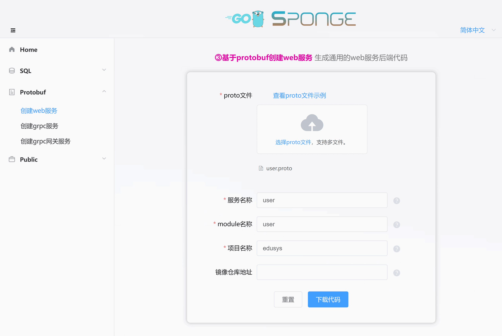
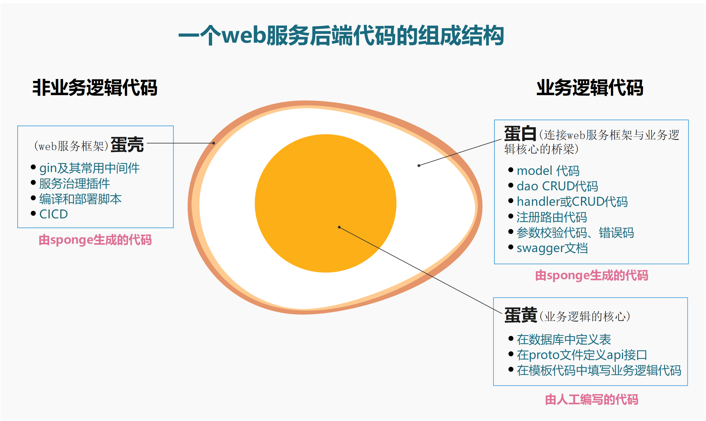

`⓷基于protobuf创建的web服务`是用于通用web服务开发，支持自选数据库类型作为数据存储。而`⓵基于sql创建的web服务`，也就是 <a href="/zh-cn/web-development-mysql" target="_blank">web开发(mysql)</a> 已经选定mysql数据库类型，这是两种方式创建web服务的主要区别之一，可以把`⓵基于sql创建的web服务`看作是`⓷基于protobuf创建的web服务`一个特殊子集。

`⓷基于protobuf创建的web服务`支持选用任意数据库类型，当然也包括mysql，如果选用了mysql数据库类型，不仅支持批量添加标准化的CRUD api接口功能，更重要的是支持生成自定义api接口的模板代码。也就是说`⓷基于protobuf创建的web服务`不需要像传统web开发自定义api接口那样编写完整的api接口代码，只需在proto文件定义api接口描述信息，然后在生成的模板中编写具体逻辑代码。

`⓷基于protobuf创建的web服务`选用其他数据库类型时，需要人工编写dao、model、数据库初始化等代码，不支持自动生成。

因此`⓷基于protobuf创建的web服务`适合通用的web项目开发。

<br>

## 🏷选用mysql进行web开发

选用mysql数据库之后，

- 如果web项目只有标准化CRUD api接口，`⓷基于protobuf创建的web服务`和`⓵基于sql创建的web服务`是完全等价的，都不需要编写任何go代码。
- 如果web项目有不少自定义api接口，`⓷基于protobuf创建的web服务`比`⓵基于sql创建的web服务`更加简单，因为可以批量生成自定义api接口模板代码。

<br>

### 🔹前期准备

开发web项目前准备：

- 已安装sponge
- mysql服务
- mysql表
- proto文件，例如[user.proto](https://github.com/zhufuyi/sponge_examples/blob/main/2_web-gin-protobuf/api/user/v1/user.proto)。

> [!tip] 生成handler CRUD代码需要依赖mysql服务和mysql表，如果都没有准备好，这里有[docker启动mysql服务脚本](https://github.com/zhufuyi/sponge/blob/main/test/server/mysql/docker-compose.yaml)，启动mysql服务之后导入示例使用的[库和表的sql](https://github.com/zhufuyi/sponge_examples/blob/main/1_web-gin-CRUD/test/sql/user.sql)。

打开终端，启动sponge UI界面服务：

```bash
sponge run
```

在浏览器访问 http://localhost:24631 ，进入sponge生成代码的UI界面。

<br>

### 🔹创建web服务项目

进入sponge的UI界面，点击左边菜单栏【Protobuf】-->【创建web项目】，选择proto文件(可多选)，接着填写其他参数，鼠标放在问号`?`位置可以查看参数说明，填写完参数后，点击按钮`下载代码`生成web服务项目代码，如下图所示：



> [!tip] 等价命令 **sponge web http-pb --module-name=user --server-name=user --project-name=edusys --protobuf-file=./user.proto**

> [!tip] 解压的web服务代码目录名称的格式是`服务名称-类型-时间`，可以修改目录名称(例如把名称中的类型和时间去掉)。

> [!tip] 成功生成代码之后会保存记录，方便下一次生成代码使用，刷新或重新打开页面时显示上一次部分参数。

这是创建的web服务代码目录：

```
.
├─ api
│   └─ user
│       └─ v1
├─ cmd
│   └─ user
│       ├─ initial
│       └─ main.go
├─ configs
├─ deployments
│   ├─ binary
│   ├─ docker-compose
│   └─ kubernetes
├─ docs
├─ internal
│   ├─ config
│   ├─ ecode
│   ├─ handler
│   ├─ routers
│   └─ server
└─ scripts
```

创建的web服务代码结构鸡蛋模型：



解压代码文件，打开终端，切换到web服务代码目录，执行命令：

```bash
# 生成与合并api接口相关代码
make proto

# 编译和运行服务
make run
```

> [!note] 开发过程中会经常使用 `make proto`命令，内部执行一系列生成代码子命令：生成api接口的`模板代码`、`错误码`、`注册路由代码`、`swagger文档`、`相关的*.pb.go`，`自动合并api接口模板代码`。合并代码时不用担心覆盖已编写业务逻辑代码问题，就算出现意外(断电)，可以在 `/tmp/sponge_merge_backup_code` 目录下找到每次合并前的备份代码，如果是windows环境则存放在 `C:\Users\你的用户名\AppData\Local\Temp\sponge_merge_backup_code`。如果在proto文件添加或更新了api接口描述信息，需要执行这个命令，否则不需要执行。

在浏览器打开 [http://localhost:8080/apis/swagger/index.html](http://localhost:8080/apis/swagger/index.html)，可以在页面上看到api接口，如下图所示：

> [!warning] 在没有编写具体逻辑代码之前，直接在swagger页面请求，会返回错误码500，因为生成的模板代码(internal/handler/xxx.go)下每个方法函数下都有一行代码 `panic("implement me")`，提示需要实现具体逻辑代码。


> [!note] 如果在配置文件 `configs/服务名称.yml` 修改了http下的端口号，例如把默认值8080改为9090，则必须在目录 `api/user/v1` 下所有proto文件里的host字段改为 `localhost:9090`，然后执行命令`make proto`，否则因为端口不一致造成请求失败。

<br>

### 🔹自动添加CRUD api接口

项目中有些api接口需要标准化的CRUD api接口，这些标准化的CRUD api接口可以直接生成，并且无缝添加到web服务代码中。

点击左边菜单栏【Public】-->【生成handler CRUD代码】，填写`mysql dsn地址`，然后点击`获取表名`，选择mysql表(可多选)，
注意必须开启`protobuf类型`，填写module名称、服务名称等参数，填写完参数后，点击按钮`下载代码`生成handler CRUD代码，如下图所示：


> [!tip] 等价命令 **sponge web handler-pb --module-name=user --db-dsn="root:123456@(192.168.3.37:3306)/school" --db-table=teacher,cause**，有更简单的等价命令，使用参数`--out`指定web服务代码目录，直接合并代码到web服务代码，**sponge web handler --db-dsn="root:123456@(192.168.3.37:3306)/school" --db-table=teacher,cause --out=user**

生成的CRUD handler代码目录如下，在目录`internal`和`api/user`下的子目录`cache`、`dao`、`ecode`、`handler`、`model`、`v1` 包含了以表名开头的go文件和测试文件。

```
.
├─ api
│   └─ user
│       └─ v1
└─ internal
    ├─ cache
    ├─ dao
    ├─ ecode
    ├─ handler
    └─ model
```

解压代码，把目录`internal`和`api`移动到web服务代码目录下，就完成了在web服务中批量添加handler CURD api接口。

> [!note] 移动目录`internal`和`api`正常情况下不会有冲突文件，如果有冲突文件，说明之前已经指定相同的mysql表来生成handler CRUD代码了，此时忽略覆盖文件。

> [!note] 因为选用了mysql数据库类型，在执行`make run`命令之前，进入目录`cmd/服务名称/initial`，打开`initApp.go`，释放默认注释的mysql和cache初始化代码，表示运行服务前初始化mysql和cache。同时打开`registerClose.go`，释放默认注释的mysql和cache关闭连接代码，表示停止服务前释放mysql和cache连接。

> [!note] 在执行`make run`命令之前，打开`configs/服务名称.yml`，修改mysql地址。

在终端执行命令：

```bash
# 补全缺少的types.proto、mysql初始化代码，一个项目中只需执行一次
#make patch

# 生成与合并api接口相关代码
make proto

# 编译和运行服务
make run
```

> [!attention] 如果执行命令`make proto`时，报错 **api/types/types.proto: File not found.** 或 **internal\cache\xxx.go:40:38: undefined: model.CacheType**，请执行命令`make patch`，再一次执行命令`make proto`。

在浏览器刷新页面 [http://localhost:8080/apis/swagger/index.html](http://localhost:8080/apis/swagger/index.html)，在页面上可以看到新添加的增删改查api接口，在页面测试这些增删改查api接口。

> [!tip] CRUD api 接口中有一个任意条件分页查询接口，有了这个接口后，可以少写很多api查询接口，点击查看<a href="/zh-cn/public-doc?id=%f0%9f%94%b9%e4%bb%bb%e6%84%8f%e6%9d%a1%e4%bb%b6%e5%88%86%e9%a1%b5%e6%9f%a5%e8%af%a2" target="_blank">任意条件分页查询接口的使用规则</a>。

批量添加标准化的CURD api接口代码到web服务项目代码中，不需要人工编写任何go代码。

<br>

### 🔹人工添加自定义api接口

随着业务需求增加，可能会增加一些新的自定义的api接口，添加自定义api接口的主要流程是`在proto文件定义api接口` --> `在生成的模板代码中编写具体逻辑代码`。

例如在本项目中添加一个修改密码接口的步骤：

**(1) 在proto文件定义修改密码接口**

进入目录`api/user/v1`目录，打开文件`user.proto`，添加修改密码接口的描述信息：

```protobuf
import "validate/validate.proto";
import "tagger/tagger.proto";

service user {
  // ...

  // 修改密码
  rpc ChangePassword(ChangePasswordRequest) returns (ChangePasswordReply) {
    option (google.api.http) = {
      post: "/api/v1/user/change_password"
      body: "*"
    };
    option (grpc.gateway.protoc_gen_openapiv2.options.openapiv2_operation) = {
      summary: "修改密码",
      description: "修改密码",
      security: {
        security_requirement: {
          key: "BearerAuth";
          value: {}
        }
      }
    };
  }
}

message ChangePasswordRequest {
  uint64 id = 1 [(validate.rules).uint64.gte  = 1, (tagger.tags) = "uri:\"id\"" ];
  string password = 2 [(validate.rules).string.min_len = 6];
}

message ChangePasswordReply {
}
```

> [!tip] 字段id和password后面的`validate.rules`是字段校验规则，点击查看更多[validate校验规则](https://github.com/envoyproxy/protoc-gen-validate#constraint-rules)，而`tagger.tags`是结构体字段tag，这里表示路径参数id。记得在proto文件添加 import "validate/validate.proto" 和 "tagger/tagger.proto"。

添加api接口描述信息后，在终端执行命令：

```bash
# 生成与合并api接口相关代码
make proto
```

<br>

**(2) 编写具体逻辑代码**

进入目录`internal/handler`，打开文件`user.go`，在ChangePassword方法函数下编写具体逻辑代码。

> [!tip] 在人工添加的自定义api接口中，可能需要对数据增删改查操作(也叫dao CRUD)，这些dao CRUD代码可以直接生成，不需要人工编写，点击查看<a href="/zh-cn/public-doc?id=%f0%9f%94%b9%e7%94%9f%e6%88%90%e5%92%8c%e4%bd%bf%e7%94%a8dao-crud%e4%bb%a3%e7%a0%81" target="_blank">生成和使用dao CRUD代码说明</a>。

> [!tip] 在人工添加的自定义api接口中，可能需要用到缓存，例如生成的token，这类string类型缓存代码可以直接生成，不需要人工编写，点击查看<a href="/zh-cn/public-doc?id=%f0%9f%94%b9%e7%94%9f%e6%88%90%e5%92%8c%e4%bd%bf%e7%94%a8cache%e4%bb%a3%e7%a0%81" target="_blank">生成和使用cache代码说明</a>。

<br>

**(3) 测试api接口**

编写完具体逻辑代码后，在终端执行命令：

```bash
# 编译和运行服务
make run
```

在浏览器刷新页面 [http://localhost:8080/apis/swagger/index.html](http://localhost:8080/apis/swagger/index.html)，在页面上可以看到修改密码api接口，在页面上请求接口测试。

<br>

添加一个自定义api接口比较简单，只需在proto文件定义api接口描述信息，然后在生成的模板填写具体逻辑代码，不需要像传统web开发那样编写完整的api接口代码，让开发者专注在编写具体业务逻辑。

<br>

> [!tip] `自动添加CRUD api接口`生成的模板代码文件名称，与基于proto文件生成的模板代码文件名称不一样，虽然两者生成的模板文件都是在目录`internal/handler`下，  前者的模板文件命名规则是`表名.go`，后者的命名规则是`proto文件名.go`。

<br>

### 🔹设置服务

创建的web服务代码中包含了丰富的组件，有些组件默认是关闭的，根据实际需要开启使用，统一在配置文件`configs/服务名称.yml`进行设置，配置文件里有详细说明。

> [!tip] 可以在服务代码中替换、添加自己的组件(gin middleware)，或者删除不需要的组件，在代码文件`internal/routers/routers.go`修改。

> [!tip] 如果api接口需要添加鉴权，在各个`internal/routers/proto文件_router.go`下，释放默认注释的`middleware.Auth()`代码，支持单独路由和分组路由两种方式。当然也可以使用自己的鉴权中间件，如果使用自己的鉴权中间件，需要把`internal/routers/routers.go`下的`jwt.Init`改为自己鉴权初始化。

**默认开启的组件：**

- **logger**：日志组件，默认是输出到终端，默认输出日志格式是console，可以设置输出格式为json，设置日志保存到指定文件，日志文件切割和保留时间。
- **enableMetrics**：指标采集，默认路由`/metrics`。
- **enableStat**：资源统计，统计系统和本程序的cpu和内存资源使用信息，默认每分钟在日志打印一次，如果本程序占用系统资源持续超过80%(可设置)，后台自动采集profile保存到目录`/tmp/服务名称_profile`，可以后续进行离线分析。
- **cacheType**：缓存组件，默认是本地内存，可以改为redis，注意集群部署时必须使用redis。

**默认关闭的组件：**

- **enableHTTPProfile**：profile组件
- **enableLimit**：自适应限流组件
- **enableCircuitBreaker**：自适应熔断组件
- **enableTrace**：链路跟踪组件
- **registryDiscoveryType**：服务注册与发现组件

其他配置的可以根据需要设置，也可以添加配置，如果添加或更改配置文件字段，需要更新对应的go结构体，在服务代码目录下的终端执行命令：

```bash
make update-config
```

<br>

## 🏷选用其他数据库进行web开发

`⓷基于protobuf创建的web服务`默认不包括操作数据库相关代码，开发者可以选用任何数据库类型作为数据存储，上面介绍了`选用mysql微服务进行开发`具体过程，非常简单方便，得益于sponge支持基于mysql表来生成api接口所需的各种代码(例如dao、model、cache)。如果选用其他数据库类型，sponge暂时不支持生成这些代码。

虽然sponge不支持通过其他数据库类型来生成操作数据库相关代码，但基于proto文件生成`api接口模板代码`、`注册路由代码`、`错误码`、`自动合并模板代码`等，避免了编写不少代码，比传统的web服务开发更简单方便。

`选用其他数据库类型`与`选用mysql`的web开发流程基本一样，没什么区别，最大的不同点是数据库操作相关代码，前者是人工编写，后者是自动生成。

<br>

### 🔹前期准备

开发web项目前准备：

- 已安装sponge
- 数据库服务
- proto文件，例如[user.proto](https://github.com/zhufuyi/sponge_examples/blob/main/2_web-gin-protobuf/api/user/v1/user.proto)。

打开终端，启动sponge UI界面服务：

```bash
sponge run
```

在浏览器访问 http://localhost:24631 ，进入sponge生成代码的UI界面。

<br>

### 🔹创建web服务项目

请看上面章节 <a href="/zh-cn/web-development-protobuf?id=%f0%9f%94%b9%e5%88%9b%e5%bb%baweb%e6%9c%8d%e5%8a%a1%e9%a1%b9%e7%9b%ae" target="_blank">创建web服务项目文档</a>。

<br>

### 🔹初始化数据库

**(1) 添加数据库配置**

打开配置文件`configs/服务名称.yml`，添加数据地址配置，示例：

```yml
# mongodb settings
mongodb:
  dsn: "mongodb://127.0.0.1:27017/user"
```

打开终端，切换到服务目录下，执行命令更新配置go结构体代码：

```bash
make update-config
```

<br>

**(2) 添加初始化数据代码**

在目录`internal/model`下新建文件`init.go` ，在这里填写连接数据代码，可以参考[mysql初始化](https://github.com/zhufuyi/sponge/blob/main/internal/model/init.go)。

然后进入目录`cmd/服务名称/initial`，打开`initApp.go`，替换默认注释的mysql和cache初始化代码。同时打开`registerClose.go`，替换默认注释的mysql和cache关闭连接代码。

<br>

### 🔹添加自定义api接口

请看上面章节 <a href="/zh-cn/web-development-protobuf?id=%f0%9f%94%b9%e4%ba%ba%e5%b7%a5%e6%b7%bb%e5%8a%a0%e8%87%aa%e5%ae%9a%e4%b9%89api%e6%8e%a5%e5%8f%a3" target="_blank">人工添加自定义api接口文档</a>。

> [!tip] 在api接口模板代码编写具体逻辑代码时，如果涉及到对数据操作，例如需要人工编写`model`、`dao`等代码。

> [!tip] 在人工添加的自定义api接口中，可能需要用到缓存，例如生成的token，这类string类型缓存代码可以直接生成，不需要人工编写，点击查看<a href="/zh-cn/public-doc?id=%f0%9f%94%b9%e7%94%9f%e6%88%90%e5%92%8c%e4%bd%bf%e7%94%a8cache%e4%bb%a3%e7%a0%81" target="_blank">生成和使用cache代码说明</a>。

<br>

### 🔹设置服务

请看上面章节 <a href="/zh-cn/web-development-protobuf?id=%f0%9f%94%b9%e8%ae%be%e7%bd%ae%e6%9c%8d%e5%8a%a1" target="_blank">设置服务文档</a>。

<br>

---

相关视频介绍：

- [一键生成通用的web服务项目代码](https://www.bilibili.com/video/BV1CX4y1D7xj/)
- [批量生成任意API接口代码到web服务](https://www.bilibili.com/video/BV1P54y1g7J9/)
