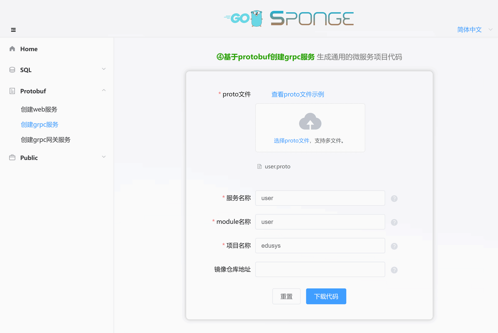
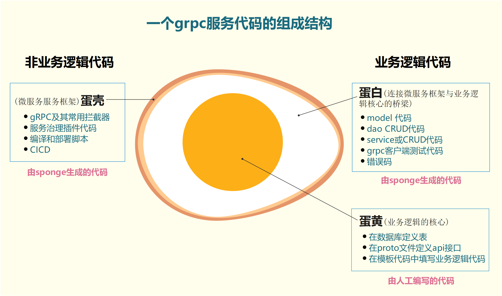

`⓸基于protobuf创建的微服务`是用于通用微服务开发，支持自选数据库类型作为数据存储。而`⓶基于sql创建的微服务`，也就是[微服务开发(mysql)](https://go-sponge.com/zh-cn/microservice-development-mysql)已经选定mysql数据库类型，这是两种方式创建微服务的主要区别，可以把`⓶基于sql创建的微服务`看作是`⓸基于protobuf创建的微服务`一个特殊子集。

`⓸基于protobuf创建的微服务`支持选用任意数据库类型，当然也包括mysql，如果选用mysql数据库类型，基本等价于`⓶基于sql创建的微服务`，除了创建服务时依赖proto文件不一样，其他都一样。

`⓸基于protobuf创建的微服务`选用其他数据库类型时，需要人工编写dao、model、数据库初始化等代码。

因此`⓸基于protobuf创建的微服务`适合通用的微服务项目开发。

<br>

## 🏷选用mysql进行微服务开发

### 🔹前期准备

开发微服务项目前准备：

- 已安装sponge
- mysql服务
- mysql表
- proto文件，例如[user.proto](https://github.com/zhufuyi/sponge_examples/blob/main/2_web-gin-protobuf/api/user/v1/user.proto)。

> [!tip] 生成service CRUD代码需要依赖mysql服务和mysql表，如果都没有准备好，这里有[docker启动mysql服务脚本](https://github.com/zhufuyi/sponge/blob/main/test/server/mysql/docker-compose.yaml)，启动mysql服务之后导入示例使用的[库和表的sql](https://github.com/zhufuyi/sponge_examples/blob/main/1_web-gin-CRUD/test/sql/user.sql)。

打开终端，启动sponge UI界面服务：

```bash
sponge run
```

在浏览器访问 http://localhost:24631 ，进入sponge生成代码的UI界面。

<br>

### 🔹创建微服务项目

进入sponge的UI界面，点击左边菜单栏【Protobuf】-->【创建微服务项目】，选择proto文件(可多选)，接着填写其他参数，鼠标放在问号`?`位置查可以看参数说明，填写完参数后，点击按钮`下载代码`生成微服务完整项目代码，如下图所示：



> [!tip] 等价命令 **sponge micro rpc-pb --module-name=user --server-name=user --project-name=edusys --protobuf-file=./user.protor**

> [!tip] 解压的微服务代码目录名称的格式是`服务名称-类型-时间`，如果不想这样的名称，可以修改目录名称(例如把名称中的类型和时间去掉)。

> [!tip] 成功生成代码之后会保存记录，方便下一次生成代码使用，刷新或重新打开页面时显示上一次部分参数。

这是创建的微服务代码目录：

```
.
├─ api
│   ├─ types
│   └─ user
│       └─ v1
├─ cmd
│   └─ user
│       ├─ initial
│       └─ main.go
├─ configs
├─ deployments
│   ├─ binary
│   ├─ docker-compose
│   └─ kubernetes
├─ docs
├─ internal
│   ├─ config
│   ├─ ecode
│   ├─ server
│   └─ service
└─ scripts
```

创建的微服务代码结构鸡蛋模型：



> [!attention] 如果基于多个proto文件创建微服务，运行服务前要检查目录`internal/ecode`下所有错误码文件的全局变量`xxxNO`值，这个编号是生成代码时表随机生成的，有可能会重复，错误码是全局唯一的，不可以重复，如果出现重复，启动服务时会报错，建议人工对`xxxNO`按顺序编号(1~100)来解决这个问题。

解压代码文件，打开终端，切换到微服务代码目录，执行命令：

```bash
# 生成与合并api接口相关代码
make proto

# 编译和运行服务
make run
```

> [!note] 开发过程中会经常使用 `make proto`命令，内部执行一系列生成代码子命令：生成api接口的`模板代码`、`错误码`、`rpc客户端测试代码`、`相关的*.pb.go`，`自动合并api接口相关代码`。合并代码时不用担心覆盖已编写业务逻辑代码问题，就算出现意外(断电)，可以在 `/tmp/sponge_merge_backup_code` 目录下找到每次合并前的备份代码，如果是windows环境则存放在 `C:\Users\你的用户名\AppData\Local\Temp\sponge_merge_backup_code`。如果在proto文件添加或更新了api接口描述信息，需要执行这个命令，否则不需要执行。

使用`goland`IDE打开项目代码，进入目录`internal/service`，打开后缀为`_client_test.go`的测试文件，这里包括了在proto文件定义的每个api接口的测试和性能压测函数，测试前先填写请求参数，类似在swagger界面测试api接口，如下图所示：


如果没有`goland` IDE，也可以通过命令来测试，切换到`internal/service`，修改rpc方法的请求参数，执行测试命令`go test -run 测试函数名/rpc方法名`，示例： `go test -run Test_service_teacher_methods/GetByID`。

<br>

### 🔹自动添加CRUD api接口

自动添加CRUD api接口与`微服务开发(mysql)`章节中`自动添加CRUD api接口`一样，点击查看
<a href="/zh-cn/microservice-development-mysql?id=%f0%9f%8f%b7%e8%87%aa%e5%8a%a8%e6%b7%bb%e5%8a%a0crud-api%e6%8e%a5%e5%8f%a3" target="_blank">自动添加CRUD api接口文档</a>。


> [!tip] CRUD api 接口中有一个任意条件分页查询接口，有了这个接口后，可以少写很多api查询接口，点击查看<a href="/zh-cn/public-doc?id=%f0%9f%94%b9%e4%bb%bb%e6%84%8f%e6%9d%a1%e4%bb%b6%e5%88%86%e9%a1%b5%e6%9f%a5%e8%af%a2" target="_blank">任意条件分页查询接口的使用规则</a>。

<br>

### 🔹人工添加自定义api接口

人工添加自定义api接口与`微服务开发(mysql)`章节中`人工添加自定义api接口`一样，点击查看
<a href="/zh-cn/microservice-development-mysql?id=%f0%9f%8f%b7%e4%ba%ba%e5%b7%a5%e6%b7%bb%e5%8a%a0%e8%87%aa%e5%ae%9a%e4%b9%89api%e6%8e%a5%e5%8f%a3" target="_blank">人工添加自定义api接口文档</a>。

<br>

### 🔹设置服务

设置服务与`微服务开发(mysql)`章节中`设置服务`一样，点击查看
<a href="/zh-cn/microservice-development-mysql?id=%f0%9f%8f%b7%e8%ae%be%e7%bd%ae%e6%9c%8d%e5%8a%a1" target="_blank">设置服务文档</a>。

<br>

## 🏷选用其他数据库进行微服务开发

`⓸基于protobuf创建的微服务`默认不包括操作数据库相关代码，开发者可以选用任何数据库类型作为数据存储，上面介绍了`选用mysql微服务进行开发`具体过程，非常简单方便，得益于sponge支持基于mysql表来生成api接口所需的各种代码(例如dao、model、cache)。如果选用其他数据库类型，sponge暂时不支持生成这些代码。

虽然sponge不支持通过其他数据库类型来生成操作数据库相关代码，但基于proto文件生成`api接口模板代码`、`rpc客户端测试代码`、`错误码`、`自动合并模板代码`等，避免了编写不少代码，比传统的微服务(gRPC)开发更简单方便。

`选用其他数据库类型`与`选用mysql`的微服务开发流程基本一样，没什么区别，最大的不同点是数据库操作相关代码，前者是人工编写，后者是自动生成。

<br>

### 🔹前期准备

开发微服务项目前准备：

- 已安装sponge
- 数据库服务
- proto文件，例如[user.proto](https://github.com/zhufuyi/sponge_examples/blob/main/2_web-gin-protobuf/api/user/v1/user.proto)。

打开终端，启动sponge UI界面服务：

```bash
sponge run
```

在浏览器访问 http://localhost:24631 ，进入sponge生成代码的UI界面。

<br>

### 🔹创建微服务项目

请看上面章节 <a href="/zh-cn/microservice-development-protobuf?id=%f0%9f%94%b9%e5%88%9b%e5%bb%ba%e5%be%ae%e6%9c%8d%e5%8a%a1%e9%a1%b9%e7%9b%ae" target="_blank">创建微服务项目文档</a>。

<br>

### 🔹初始化数据库

把连接数据代码填写到 `internal/model/init.go` 文件下，可以参考[mysql初始化](https://github.com/zhufuyi/sponge/blob/main/internal/model/init.go)。

然后进入目录`cmd/服务名称/initial`，打开`initApp.go`，替换默认注释的mysql和cache初始化代码。同时打开`registerClose.go`，替换默认注释的mysql和cache关闭连接代码。

<br>

### 🔹添加自定义api接口

> [!node] 在api接口模板代码编写具体逻辑代码时，如果涉及到对数据操作，例如需要人工编写`model`、`dao`等代码。

添加自定义api接口与`微服务开发(mysql)`章节中`人工添加自定义api接口`一样，点击查看
<a href="/zh-cn/microservice-development-mysql?id=%f0%9f%8f%b7%e4%ba%ba%e5%b7%a5%e6%b7%bb%e5%8a%a0%e8%87%aa%e5%ae%9a%e4%b9%89api%e6%8e%a5%e5%8f%a3" target="_blank">人工添加自定义api接口文档</a>。

> [!tip] 在人工添加的自定义api接口中，可能需要用到缓存，例如生成的token，这类string类型缓存代码可以直接生成，不需要人工编写，点击查看<a href="/zh-cn/public-doc?id=%f0%9f%94%b9%e7%94%9f%e6%88%90%e5%92%8c%e4%bd%bf%e7%94%a8cache%e4%bb%a3%e7%a0%81" target="_blank">生成和使用cache代码说明</a>。

<br>

### 🔹设置服务

设置服务与`微服务开发(mysql)`章节中`设置服务`一样，点击查看
<a href="/zh-cn/microservice-development-mysql?id=%f0%9f%8f%b7%e8%ae%be%e7%bd%ae%e6%9c%8d%e5%8a%a1" target="_blank">设置服务文档</a>。

<br>

---

相关视频介绍：

- [一键生成通用微服务(gRPC)项目代码](https://www.bilibili.com/video/BV1WY4y1X7zH/)
- [批量生成任意API接口代码到微服务(gRPC)](https://www.bilibili.com/video/BV1Yo4y1q76o/)
