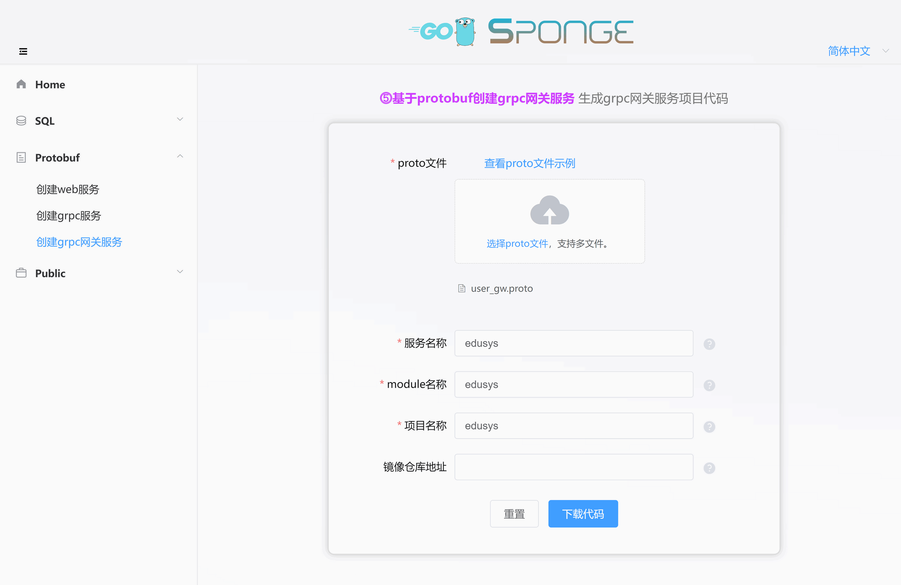
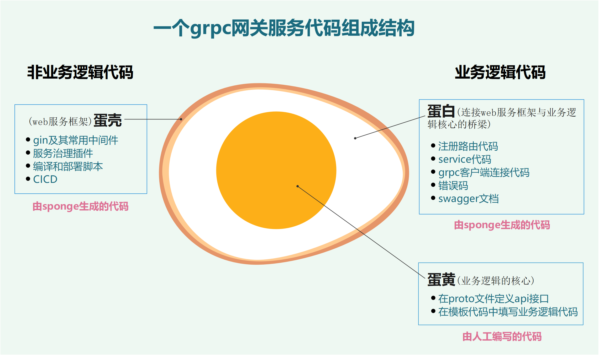
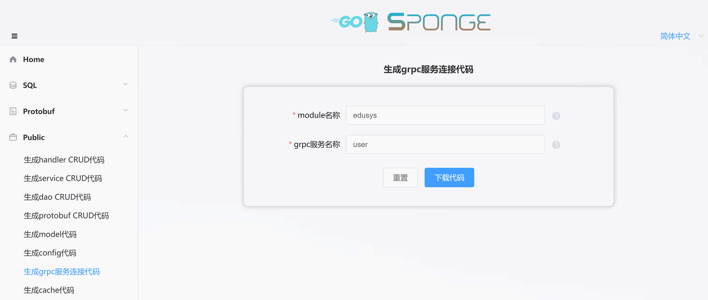

rpc网关是rpc服务的统一入口，它可以为客户端提供负载均衡、路由、安全、监控等功能，从而提高rpc服务的性能、可用性和安全性。

**主要作用：**

- 通常位于客户端和rpc服务之间，它可以将客户端的请求均匀地分发到多个rpc服务器，从而提高rpc服务的吞吐量和可用性。
- 根据客户端的请求，将请求转发到相应的rpc服务器，从而简化客户端的开发。
- 提供身份认证、授权、加密等安全功能，从而保护rpc服务的安全。
- 收集rpc服务的运行状态信息，并提供监控功能，从而帮助用户管理rpc服务。

**适用场景：**

- 在微服务架构中，rpc网关可以作为微服务的统一入口，简化客户端的开发，并提高微服务的扩展性和可维护性。
- 在分布式系统中，rpc网关可以提供负载均衡、路由、安全等功能，从而提高分布式系统的性能和可用性。
- 在跨平台系统种，rpc网关可以支持不同平台的rpc服务，从而帮助用户构建跨平台的rpc系统。

这里`⓹基于protobuf创建的rpc网关服务`是rpc服务的统一入口的web服务，下面介绍rpc网关服务开发具体流程。

<br>

### 🏷前期准备

开发rpc网关服务前准备：

- 已安装sponge
- proto文件，例如[user_gw.proto](https://github.com/zhufuyi/sponge_examples/blob/main/5_micro-gin-rpc-gateway/user-gateway/api/user_gw/v1/user_gw.proto)。
- 微服务[user](https://github.com/zhufuyi/sponge_examples/tree/main/4_micro-grpc-protobuf)，也可以临时快速创建一个微服务，点击查看<a href="/zh-cn/microservice-development-protobuf?id=%f0%9f%94%b9%e5%88%9b%e5%bb%ba%e5%be%ae%e6%9c%8d%e5%8a%a1%e9%a1%b9%e7%9b%ae" target="_blank">创建微服务项目文档</a>

打开终端，启动sponge UI界面服务：

```bash
sponge run
```

在浏览器访问 http://localhost:24631 ，进入sponge生成代码的UI界面。

<br>

### 🏷创建rpc网关服务项目

进入sponge的UI界面，点击左边菜单栏【Protobuf】-->【创建rpc网关项目】，选择proto文件(可多选)，接着填写其他参数，鼠标放在问号`?`位置可以查看参数说明，填写完参数后，点击按钮`下载代码`生成rpc网关服务项目代码，如下图所示：



> [!tip] 等价命令 **sponge micro rpc-gw-pb --module-name=edusys --server-name=edusys --project-name=edusys --protobuf-file=./user_gw.proto**

> [!tip] 解压的rpc网关服务代码目录名称的格式是`服务名称-类型-时间`，如果不想这样的名称，可以修改目录名称(例如把名称中的类型和时间去掉)。

> [!tip] 成功生成代码之后会保存记录，方便下一次生成代码使用，刷新或重新打开页面时显示上一次部分参数。

解压代码文件，这是创建的rpc网关服务代码目录：

```
.
├─ api
│   └─ edusys
│       └─ v1
├─ cmd
│   └─ edusys
│       ├─ initial
│       └─ main.go
├─ configs
├─ deployments
│   ├─ binary
│   ├─ docker-compose
│   └─ kubernetes
├─ docs
├─ internal
│   ├─ config
│   ├─ ecode
│   ├─ routers
│   ├─ server
│   └─ service
└─ scripts
```

创建的rpc网关服务代码结构鸡蛋模型：




<br>

### 🏷对接微服务相关操作

#### 🔹添加连接微服务代码

创建的rpc网关服务是一个独立的rpc网关服务，想要在rpc网关服务内调用具体微服务api接口，先要能够连接上微服务。

进入sponge的UI界面，点击左边菜单栏【Public】-->【生成rpc服务连接代码】，填写module名称，填写rpc服务名称(如果想一次性生成连接多个rpc服务，这里填多个rpc服务名称，用逗号分隔)，填写完参数后，点击按钮`下载代码`生成rpc服务连接代码，如下图所示：



> [!tip] 等价命令 **sponge micro rpc-conn --module-name=edusys  --rpc-server-name=user**。有更简单的等价命令，使用参数`--out`指定rpc网关服务代码目录，直接合并代码到rpc网关服务代码，**sponge micro rpc-conn --rpc-server-name=user --out=edusys**

生成的rpc服务连接代码目录如下：

```
.
└─ internal
    └─ rpcclient
```

解压代码，把目录`internal`移动到rpc网关服务代码目录下。

> [!note] 移动目录`internal`正常情况下不会有冲突文件，如果有冲突文件，说明之前已经指定相同的微服务名称来生成rpc服务连接代码了，此时忽略覆盖文件。

<br>

#### 🔹配置微服务地址

添加连接微服务代码之后，在配置文件`configs/服务名称.yml`设置连接微服务的地址，主要配置内容如下：

```yaml
grpcClient:
  - name: "user"        # 微服务名称
    host: "127.0.0.1"   # 微服务地址，如果开启服务发现，此字段值无效
    port: 8282          # 微服务端口，如果开启服务发现，此字段值无效
    registryDiscoveryType: ""  # 服务发现，默认关闭，支持consul, etcd, nacos
```

> [!tip] 更多grpcClient设置看`configs/服务名称.yml`，例如负载均衡、安全连接等。

如果需要连接多个微服务，需要设置多个微服务的地址，示例如下：

```yaml
grpcClient:
  - name: "user"
    host: "127.0.0.1"
    port: 18282
    registryDiscoveryType: ""
  - name: "relation"
    host: "127.0.0.1"
    port: 28282
    registryDiscoveryType: ""
  - name: "creation"
    host: "127.0.0.1"
    port: 38282
    registryDiscoveryType: ""
```

<br>

#### 🔹添加微服务的proto文件

有了连接微服务代码，虽然在rpc网关服务可以连接到微服务，但是不知道可以调用微服务哪些api接口，所以需要明确告诉rpc网关服务可以调用的微服务接口，把微服务代码目录的`api/微服务名称/v1/xxx.proto`文件复制出来，并移动到rpc网关服务代码目录下`api/微服务名称/v1/xxx.proto`。有了微服务proto文件，rpc网关服务就可以知道有哪些api接口可以调用了。

<br>

#### 🔹运行已经准备好的微服务

在已经准备好的微服务[user](https://github.com/zhufuyi/sponge_examples/tree/main/4_micro-grpc-protobuf)目录下打开终端，执行命令：

```bash
# 生成与合并api接口相关代码
make proto

# 编译和运行服务
make run
```

<br>

### 🏷人工添加api接口

在rpc网关服务添加新的api接口比较简单，主要流程是`在proto文件定义api接口描述信息` --> `在模板文件编写具体逻辑代码`。

> [!note] `在proto文件定义api接口描述信息`是在属于rpc网关服务自己的目录上添加，例如这里目录是`api/edusys/v1`，在该目录下的proto文件添加api接口描述信息，也可以创建新的proto文件，然后添加api接口描述信息。

<br>

**(1) 在proto文件定义api接口描述信息**

进入目录`api/edusys/v1`目录，打开文件`user_gw.proto`，添加修改密码接口的描述信息：

```protobuf
import "validate/validate.proto";
import "tagger/tagger.proto";

service user {
  // ...

  // 修改密码
  rpc ChangePassword(ChangePasswordRequest) returns (ChangeRegisterReply)  {
    option (google.api.http) = {
      post: "/api/v1/user/change_password"
      body: "*"
    };
    option (grpc.gateway.protoc_gen_openapiv2.options.openapiv2_operation) = {
      summary: "修改密码",
      description: "修改密码",
      security: {
        security_requirement: {
          key: "BearerAuth";
          value: {}
        }
      }
    };
  }
}

message ChangePasswordRequest {
  uint64 id = 1 [(validate.rules).uint64.gte  = 1, (tagger.tags) = "uri:\"id\"" ];
  string password = 2 [(validate.rules).string.min_len = 6];
}

message ChangePasswordReply {
}
```

> [!tip] 字段id和password后面的`validate.rules`是字段校验规则，点击查看更多[validate校验规则](https://github.com/envoyproxy/protoc-gen-validate#constraint-rules)，而`tagger.tags`是结构体字段tag，这里表示路径参数id。记得在proto文件添加 import "validate/validate.proto" 和 "tagger/tagger.proto"。

添加api接口描述信息后，在终端执行命令：

```bash
# 生成与合并api接口相关代码
make proto
```

> [!attention] 如果新添加proto文件，要检查`internal/ecode`下所有错误码文件的全局变量`xxxNO`值，这个编号是生成代码时表随机生成的，有可能会重复，错误码是全局唯一的，不可以重复，如果出现重复，启动服务时会报错，建议人工对`xxxNO`按顺序编号(1~100)来解决这个问题。

> [!attention] 如果新添加api接口，要检查api接口对应的错误码文件 `internal/ecode/xxx_http.go`，里面的`xxxBaseCode+`后面的数字是否重复，如果出现重复，启动服务时会报错，解决办法人工修改重复的数字。出现重复数字原因是在proto添加的api接口时，不是在最后添加造成的。

> [!note] 开发过程中会经常使用 `make proto`命令，内部执行一系列生成代码子命令：生成api接口的`模板代码`、`错误码`、`注册路由代码`、`swagger文档`、`相关的*.pb.go`，`自动合并api接口模板代码`。合并代码时不用担心覆盖已编写业务逻辑代码问题，就算出现意外(断电)，可以在 `/tmp/sponge_merge_backup_code` 目录下找到每次合并前的备份代码。如果在proto文件添加或更新了api接口描述信息，需要执行这个命令，否则不需要执行。

<br>

**(2) 在模板文件编写具体逻辑代码**

有了`连接微服务代码`、`微服务api接口`、`生成的模板代码`之后，接下来可以编写具体逻辑代码了，执行命令：

如果只是简单的把http请求转发给微服务处理，生成的模板代码默认已经实现了，不需要写go代码，删除`panic("implement me")`，然后释放`example`下面的注释代码，经过简单的调整一下即可。例如打开`internal/service/user_gw_logic.go`文件，释放注释后的代码如下：

```go
package service

import (
	userV1 "edusys/api/user/v1"
    // ......
)

var _ edusysV1.UserLogicer = (*userClient)(nil)

type userClient struct {
	// example:
	userCli userV1.UserClient
}

// NewUserClient create a client
func NewUserClient() edusysV1.UserLogicer {
	return &userClient{
		// example:
		userCli: userV1.NewUserClient(rpcclient.GetUserRPCConn()),
	}
}

// Register 注册
func (c *userClient) Register(ctx context.Context, req *edusysV1.RegisterRequest) (*edusysV1.RegisterReply, error) {
	// example:
	err := req.Validate()
	if err != nil {
		logger.Warn("req.Validate error", logger.Err(err), logger.Any("req", req), interceptor.ServerCtxRequestIDField(ctx))
		return nil, ecode.StatusInvalidParams.Err()
	}

	reply, err := c.userCli.Register(ctx, &userV1.RegisterRequest{
		Email:    req.Email,
		Password: req.Password,
	})
	if err != nil {
		return nil, err
	}

	return &edusysV1.RegisterReply{
		Id: reply.Id,
	}, nil
}

// Login 登录
func (c *userClient) Login(ctx context.Context, req *edusysV1.LoginRequest) (*edusysV1.LoginReply, error) {
	// example:
	// ......
}

// Logout 登出
func (c *userClient) Logout(ctx context.Context, req *edusysV1.LogoutRequest) (*edusysV1.LogoutReply, error) {
	// example:
	// ......
}

// ChangePassword 修改密码
func (c *userClient) ChangePassword(ctx context.Context, req *edusysV1.ChangePasswordRequest) (*edusysV1.ChangeRegisterReply, error) {
	// example:
	// ......
}
```

<br>

上面是从单个微服务中获取数据，实际使用中有可能需要从多个微服务中获取数据，然后组装成客户端所需的数据，只需在`xxxClient`结构体引入多个微服务client接口，然后实例化，示例代码如下：

```go
package service

import (
	userV1 "edusys/api/user/v1"
	relationV1 "edusys/api/relation/v1"
	creationV1 "edusys/api/creation/v1"
    // ......
)

var _ edusysV1.UserLogicer = (*userClient)(nil)

type userClient struct {
	// example:
	userCli userV1.UserClient
	relationCli relationV1.RelationClient
	creationCli creationV1.CreationClient
}

// NewUserClient create a client
func NewUserClient() edusysV1.UserLogicer {
	return &userClient{
		// example:
		userCli: userV1.NewUserClient(rpcclient.GetUserRPCConn()),
		relationCli: userV1.NewRelationClient(rpcclient.GetRelationRPCConn()),
		creationCli: userV1.NewCreationClient(rpcclient.GetCreationRPCConn()),
	}
}

// ......

```

<br>

**(3) 运行rpc网关服务**

切换到rpc网关服务代码目录，执行命令：

```bash
# 编译和运行服务
make run
```

在浏览器打开 [http://localhost:8080/apis/swagger/index.html](http://localhost:8080/apis/swagger/index.html)，可以在页面上看到api接口，如下图所示。请求api接口，测试是否能够正常调用微服务接口。

> [!warning] 在没有编写具体逻辑代码之前，直接在swagger页面请求，会返回错误码500，因为生成的模板代码(internal/service/xxx_logic.go)下每个方法函数下都有一行代码 `panic("implement me")`，提示需要实现具体逻辑代码。


> [!note] 如果在配置文件 `configs/服务名称.yml` 修改了http下的端口号，例如把默认值8080改为9090，则必须在目录 `api/user/v1` 下所有proto文件里的host字段改为 `localhost:9090`，然后执行命令 `make proto` 即可，否则因为端口不一致造成请求失败。

<br>

### 🏷设置rpc网关服务

创建的rpc网关服务代码中包含了丰富的组件，有些组件默认是关闭的，根据实际需要开启使用，统一在配置文件`configs/服务名称.yml`进行设置，配置文件里有详细说明。

> [!tip] 可以在服务代码中替换、添加自己的组件(gin middleware)，或者删除不需要的组件，在代码文件`internal/routers/routers.go`修改。

> [!tip] 如果api接口需要添加鉴权，在各个`internal/routers/proto文件_router.go`下，释放默认注释的`middleware.Auth()`代码，支持单独路由和分组路由两种方式。当然也可以使用自己的鉴权中间件，如果使用自己的鉴权中间件，需要把`internal/routers/routers.go`下的`jwt.Init`改为自己鉴权初始化。

**默认开启的组件：**

- **logger**：日志组件，默认是输出到终端，默认输出日志格式是console，可以设置输出格式为json，设置日志保存到指定文件，日志文件切割和保留时间。
- **enableMetrics**：指标采集，默认路由`/metrics`。
- **enableStat**：资源统计，统计系统和本程序的cpu和内存资源使用信息，默认每分钟在日志打印一次。
- **cacheType**：缓存组件，默认是本地内存，可以改为redis，注意集群部署时必须使用redis。

**默认关闭的组件：**

- **enableHTTPProfile**：profile组件
- **enableLimit**：自适应限流组件
- **enableCircuitBreaker**：自适应熔断组件
- **enableTrace**：链路跟踪组件
- **registryDiscoveryType**：服务注册与发现组件
- **grpc客户：**
  - **enableLoadBalance**：负载均衡
  - **serverSecure**：通过证书验证，支持服务端验证和双向验证
  - **enableToken**：通过token验证

其他配置的可以根据需要设置，也可以添加配置，如果添加或更改配置文件字段，需要更新对应的go结构体，在服务代码目录下的终端执行命令 `sponge config --server-dir=./`。

> [!tip] 如果添加或更改配置文件字段，也可以在UI界面生成对应的go结构体代码，点击左边菜单栏【Public】--> 【生成config代码】，选择yaml文件后，点击按钮`下载代码`，然后解压代码，把目录`internal`移动到rpc网关服务代码中，确认替换旧文件。

<br>

---

相关视频介绍：

- [一键生成rpc网关服务项目代码](https://www.bilibili.com/video/BV1mV4y1D7k9/)
