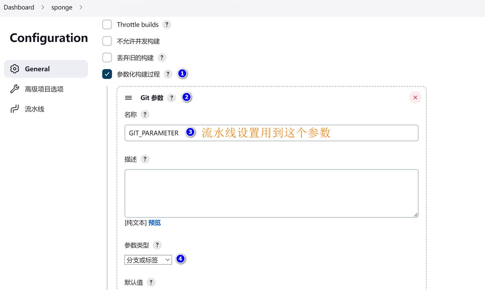
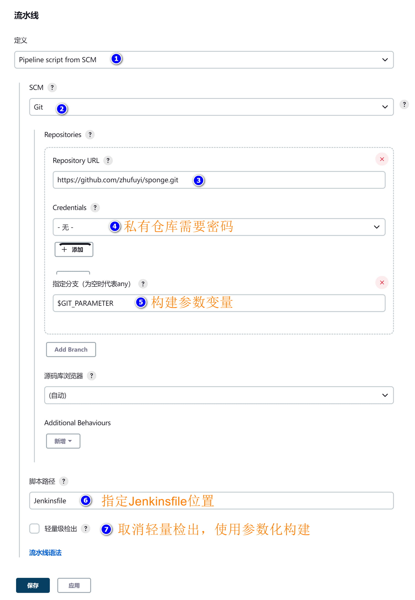
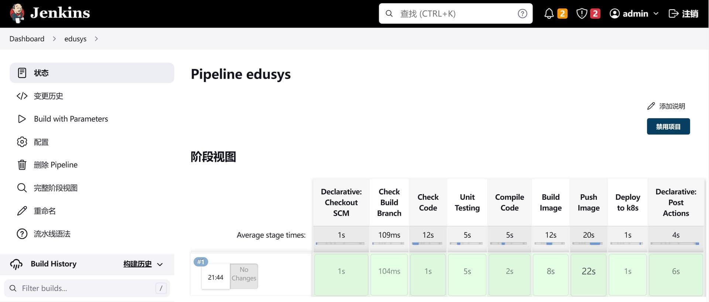

### 🏷二进制部署

sponge创建的web和微服务支持二进制部署，可以部署远程linux服务器，不支持部署到windows环境，切换到服务代码目录，执行部署命令示例：

```bash
make deploy-binary USER=root PWD=123456 IP=192.168.1.10
```

> [!note] 如果在windows环境执行该命令，windows环境必须支持expect、scp、ssh命令。

已部署的服务如果想启动或停止，需要进入目标机器目录`~/app/服务名称`，执行命令：

```bash
# 启动或重启服务，在启动服务前可以修改服务yaml配置
./run.sh

# 停止服务
./run.sh stop
```

<br>

### 🏷docker部署

sponge创建的web和微服务支持docker部署，部署在本机的docker容器上，部署需要依赖[docker服务](https://www.docker.com/)和[docker-compose命令](https://github.com/docker/compose/releases)，切换到服务代码目录，部署命令：

```bash
make deploy-docker
```

docker部署后，在服务代码目录`deployments/docker-compose`下多了`configs`目录，这是在docker运行的服务配置，如果想改服务配置，修改`configs`目录下的yaml配置文件即可，然后重启服务使得配置生效。

启动和停止服务，切换到服务代码目录`deployments/docker-compose`，执行命令：

```bash
# 启动服务
docker-compose up -d

# 停止服务
docker-compose down
```

<br>

### 🏷持续集成部署

sponge创建的web和微服务支持在 [jenkins](https://www.jenkins.io/doc/) 构建和部署，部署目标可以是docker、 [k8s](https://kubernetes.io/docs/home/) ，下面以使用jenkins自动构建和部署到k8s为示例。

#### 🔹搭建 jenkins-go 平台

为了可以在容器里编译go代码，需要构建一个 jenkins-go 镜像，这是已经构建好的 [jenkins-go镜像](https://hub.docker.com/r/zhufuyi/jenkins-go/tags)。如果想自己构建 jenkins-go 镜像，可以参考docker构建脚本[Dokerfile](https://github.com/zhufuyi/sponge/blob/main/test/server/jenkins/Dockerfile)。

准备好 jenkins-go 镜像之后，还需要准备一个k8s集群(网上有很多搭建k8s集群教程)，k8s鉴权文件和命令行工具[kubectl](https://kubernetes.io/zh-cn/docs/tasks/tools/#kubectl)，确保在 jenkins-go 容器中有操作k8s的权限。

jenkins-go 启动脚本 docker-compose.yml 内容如下：

```yaml
version: "3.7"
services:
  jenkins-go:
    image: zhufuyi/jenkins-go:2.37
    restart: always
    container_name: "jenkins-go"
    ports:
      - 38080:8080
    #- 50000:50000
    volumes:
      - $PWD/jenkins-volume:/var/jenkins_home
      # docker configuration
      - /var/run/docker.sock:/var/run/docker.sock
      - /usr/bin/docker:/usr/bin/docker
      - /root/.docker/:/root/.docker/
      # k8s api configuration directory, including config file
      - /usr/local/bin/kubectl:/usr/local/bin/kubectl
      - /root/.kube/:/root/.kube/
      # go related tools
      - /opt/go/bin/golangci-lint:/usr/local/bin/golangci-lint
```

启动jenkis-go服务：

```bash
docker-compose up -d
```

在浏览器访问 [http://localhost:38080](http://localhost:38080) ，第一次启动需要 admin 密钥(执行命令获取 `docker exec jenkins-go cat /var/jenkins_home/secrets/initialAdminPassword`)，然后安装推荐的插件和设置管理员账号密码，接着安装一些需要使用到的插件和一些自定义设置。

**(1) 安装插件**

```bash
# 中文插件
Locale

# 添加参数化构建插件
Extended Choice Parameter

# 添加git参数插件
Git Parameter

# 账号管理
Role-based Authorization Strategy
```

**(2) 设置中文**

点击【Manage Jenkins】->【Configure System】选项，找到【Locale】选项，输入【zh_CN】，勾选下面的选项，最后点击【应用】。

**(3) 配置全局参数**

点击【dashboard】 --> 【系统管理】 --> 【系统配置】 --> 【勾选环境变量】，设置容器镜像的仓库地址：

```bash
# 开发环境镜像仓库
DEV_REGISTRY_HOST http://localhost:27070

# 测试环境镜像仓库
TEST_REGISTRY_HOST http://localhost:28080

# 生产环境镜像仓库
PROD_REGISTRY_HOST http://localhost:29090
```

<br>

#### 🔹创建模板

创建jenkins新任务的一种相对简单的方法是在创建新任务时导入现有模板，然后修改git存储库地址，第一次使用jenkins还没有模板，可以按照下面步骤创建一个模板：

**(1) 创建新的任务**，如下图所示：


<br>

**(2) 参数化构设置**，使用参数名`GIT_parameter`，如下图所示：



<br>

**(3) 设置流水线**，如下图所示：



<br>

**(4) 构建项目**

单击左侧菜单栏上的 **Build with Parameters**，然后选择要分支或tag，如下图所示：


<br>

#### 🔹自动部署到k8s

以`⓵基于sql创建的web服务`为例，服务名称为`user`，使用jenkins构建和部署到k8s。

第一次构建服务需要做一些前期准备：

> (1) 把user代码上传到代码仓库。

> (2) 准备一个docker镜像仓库，确保jenkins-go所在docker有权限上传镜像到镜像仓库。

> (3) 确保在k8s集群节点有权限从镜像拉取镜像。
>
> 在已登录docker镜像仓库服务器上执行命令生成密钥：
> ```bash
> kubectl create secret generic docker-auth-secret \
>    --from-file=.dockerconfigjson=/root/.docker/config.json \
>    --type=kubernetes.io/dockerconfigjson
> ```

> (4) 在k8s创建user相关资源。
> ```bash
> # 切换到目录
> cd deployments/kubernetes
>
> # 创建名称空间，名称对应sponge创建服务参数project-name
> kubectl apply -f ./*namespace.yml
>
> # 创建configmap、service
> kubectl apply -f ./*configmap.yml
> kubectl apply -f ./*svc.yml
> ```

> (5) 设置钉钉通知(非必须)，如果想使用钉钉通知查看构建部署结果，打开代码库下的`Jenkinsfile`文件，找到字段`tel_num`填写手机号码，找到`access_token`填写token值。

<br>

前期准备好之后，在jenkins界面创建一个新任务(名称user)，使用上面创建的模板(名称sponge)，然后修改git仓库，保存任务，开始参数化构建，构建结果如下图所示：



<br>

使用命令 `kubectl get all -n user` 查看user服务在k8s运行状态：

```
NAME                             READY   STATUS    RESTARTS   AGE
pod/user-dm-77b4bcccc5-8xt8v     1/1     Running   0          21m

NAME                 TYPE        CLUSTER-IP      EXTERNAL-IP   PORT(S)    AGE
service/user-svc     ClusterIP   10.108.31.220   <none>        8080/TCP   27m

NAME                        READY   UP-TO-DATE   AVAILABLE   AGE
deployment.apps/user-dm     1/1     1            1           21m

NAME                                   DESIRED   CURRENT   READY   AGE
replicaset.apps/user-dm-77b4bcccc5     1         1         1       21m
```

<br>

在本地测试是否可以访问

```bash
# 代理端口
kubectl port-forward --address=0.0.0.0 service/user-svc 8080:8080 -n user

# 请求
curl http://localhost:8080/api/v1/teacher/1
```

<br>

sponge生成的web和微服务包括了Jenkinsfile、构建和上传镜像脚本、k8s部署脚本，基本不需要修改脚本就可以使用，当然也可以修改脚本适合自己场景。
