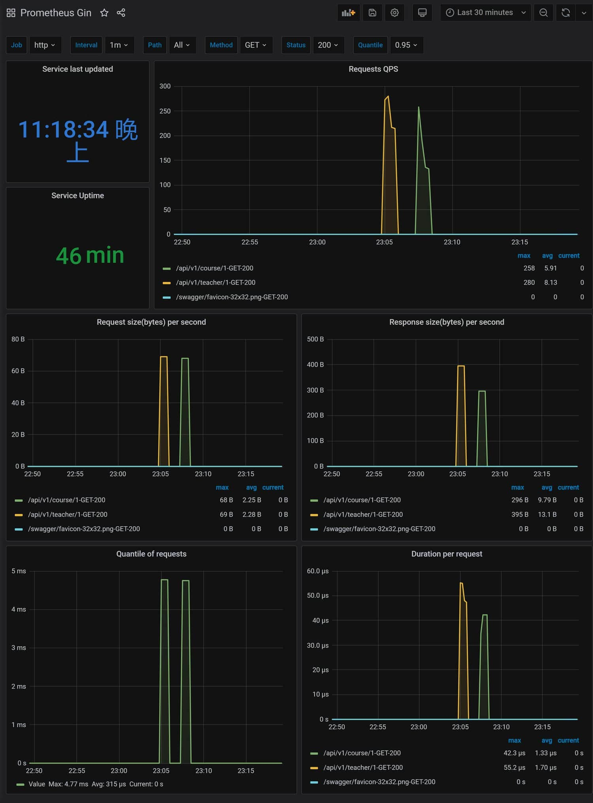

### 🏷Configuration Parsing

`conf` is a component for parsing configurations into Go structures, supporting three file formats: `yaml`, `json`, and `toml`. You can check out [usage examples](https://github.com/zhufuyi/sponge/tree/main/pkg/conf) for more information.

<br>

### 🏷Logging

`logger` is a component built on top of [zap](https://github.com/uber-go/zap), and you can find [usage examples here](https://github.com/zhufuyi/sponge/tree/main/pkg/logger).

In web or microservices created with sponge, the logging component is enabled by default. By default, it outputs logs to the terminal in console format. You can configure the logger by specifying settings in a YAML configuration file under the `configs` directory:

```yaml
# Logger settings
logger:
  level: "info"            # Log level: debug, info, warn, error (default is debug)
  format: "console"        # Log output format: console or json (default is console)
  isSave: false            # Log to file (false: output to terminal, true: output to file, default is false)
  logFileConfig:           # Effective when isSave=true
    filename: "out.log"    # File name (default is out.log)
    maxSize: 20            # Maximum file size (MB, default is 10MB)
    maxBackups: 50         # Maximum number of old files to retain (default is 100)
    maxAge: 15             # Maximum number of days to retain old files (default is 30 days)
    isCompression: true    # Whether to compress/archive old files (default is false)
```

<br>

### 🏷Error Codes

`errcode` includes two types of error codes: HTTP and gRPC. Each type is further divided into system-level and business-level error codes, and supports conversion between HTTP and gRPC error codes. Click to view the [error code rules and usage examples](https://github.com/zhufuyi/sponge/tree/main/pkg/errcode).

<br>

### 🏷Resource Statistics

`stat` is a component for monitoring the usage of system and service resources. Click to view [usage examples](https://github.com/zhufuyi/sponge/tree/main/pkg/stat).

In web or microservices created with sponge, the resource statistics component is enabled by default. You can configure it in the YAML configuration file located in the `configs` directory using the `enableStat` field:

```yaml
  enableStat: true    # Enable resource statistics: true = enabled, false = disabled
```

By default, statistics are generated and logged every minute, including CPU and memory data for both the system and the service itself.

<br>

### 🏷Adaptive Rate Limiting

Adaptive rate limiting dynamically determines whether to apply rate limiting based on a combination of default thresholds and system resource usage. Since servers may have varying processing capabilities, setting fixed parameters can be challenging. Adaptive rate limiting adapts to server capacity, eliminating the need for manual parameter adjustments. Click to view [usage examples](https://github.com/zhufuyi/sponge/blob/main/pkg/shield/ratelimit).

In web or microservices created with sponge, the rate limiting component is disabled by default. You can configure it in the YAML configuration file located in the `configs` directory using the `enableLimit` field:

```yaml
  enableLimit: false    # Enable adaptive rate limiting: true = enabled, false = disabled
```

Although there are default thresholds and system resource quotas, you can modify these values. For web services, modify the default values in `internal/routers/routers.go`. For example:

```go
	// limit middleware
	if config.Get().App.EnableLimit {
		r.Use(middleware.RateLimit(
			middleware.WithWindow(time.Second*5),
			middleware.WithBucket(200),
			middleware.WithCPUThreshold(600),
			middleware.WithCPUQuota(0),
		))
	}
```

For gRPC microservices, modify the defaults in `internal/server/grpc.go`. For example:

```go
	// limit interceptor
	if config.Get().App.EnableLimit {
		unaryServerInterceptors = append(unaryServerInterceptors, interceptor.UnaryServerRateLimit(
			interceptor.WithWindow(time.Second*5),
			interceptor.WithBucket(200),
			interceptor.WithCPUThreshold(600),
			interceptor.WithCPUQuota(0),
		))
	}
```

<br>

### 🏷Adaptive Circuit Breaking

Adaptive circuit breaking determines whether to initiate a circuit break based on the error rate of requests and system resource usage. Since servers may have varying processing capabilities, setting fixed parameters can be challenging. Adaptive circuit breaking adapts to server capacity, eliminating the need for manual parameter adjustments. Click to view [usage examples](https://github.com/zhufuyi/sponge/blob/main/pkg/shield/circuitbreaker).

In web or microservices created with sponge, the adaptive circuit breaking component is disabled by default. You can configure it in the YAML configuration file located in the `configs` directory using the `enableCircuitBreaker` field:

```yaml
  enableCircuitBreaker: false    # Enable adaptive circuit breaking: true = enabled, false = disabled
```

For web services, it defaults to being effective for HTTP error codes 500 and 503, while other errors do not trigger circuit breaking. You can add additional error codes to trigger circuit breaking by modifying the `CircuitBreaker` in `internal/routers/routers.go`. For example:

```go
	// circuit breaker middleware
	if config.Get().App.EnableCircuitBreaker {
		r.Use(middleware.CircuitBreaker(
			middleware.WithValidCode(403),
		))
	}
```

For gRPC microservices, it defaults to being effective for gRPC error codes Internal (13) and Unavailable (14), while other errors do not trigger circuit breaking. You can add additional error codes to trigger circuit breaking by modifying the `CircuitBreaker` in `internal/server/grpc.go`. For example:

```go
	// circuit breaker interceptor
	if config.Get().App.EnableCircuitBreaker {
		unaryServerInterceptors = append(unaryServerInterceptors, interceptor.UnaryServerCircuitBreaker(
			// set rpc code for circuit breaker, default already includes codes.Internal and codes.Unavailable
			interceptor.WithValidCode(codes.Unauthenticated),
		))
	}
```

<br>

### 🏷Distributed Tracing

Distributed tracing is a component built upon [go.opentelemetry.io/otel](https://github.com/open-telemetry/opentelemetry-go). Click to view [usage examples](https://github.com/zhufuyi/sponge/tree/main/pkg/tracer).

In web or microservices created with sponge, the distributed tracing component is disabled by default. You can configure it in the YAML configuration file located in the `configs` directory using the `enableTrace` and `jaeger` fields:

```yaml
  enableTrace: false    # Enable tracing: true = enabled, false = disabled (must set Jaeger configuration if true)
  tracingSamplingRate: 1.0      # Distributed tracing sampling rate, range from 0 to 1.0 float, 0 means no sampling, 1.0 means sample all traces

# Jaeger Configuration
jaeger:
  agentHost: "192.168.3.37"
  agentPort: 6831
```

<br>

#### 🔹Starting Jaeger and Elasticsearch Services

Distributed tracing uses Jaeger for tracing and Elasticsearch for storage. You can start both services locally using [docker-compose](https://github.com/docker/compose/releases).

**(1) Elasticsearch Service**

Here is the [script for starting the Elasticsearch service](https://github.com/zhufuyi/sponge/tree/main/test/server/elasticsearch). The `.env` file contains Elasticsearch configuration. To start the Elasticsearch service, run:

> docker-compose up -d

<br>

**(2) Jaeger Service**

Here is the [script for starting the Jaeger service](https://github.com/zhufuyi/sponge/tree/main/test/server/jaeger). The `.env` file contains Jaeger configuration. To start the Jaeger service, run:

> docker-compose up -d

Access the Jaeger query homepage in your browser at [http://localhost:16686](http://localhost:16686).

<br>

#### 🔹Single-Service Distributed Tracing Example

Taking the code for the `⓵ Web Service Based on SQL` as an example, modify the configuration file `configs/user.yml` to enable distributed tracing (set the `enableTrace` field to true) and provide Jaeger configuration details.

If you want to trace Redis and use Redis caching, change the cache type field **cacheType** to "redis" in the YAML configuration file and configure the Redis address. Additionally, start a Redis service locally using Docker with this [script](https://github.com/zhufuyi/sponge/tree/main/test/server/redis).

Run the web service:

```bash
# Compile and run the service
make run
```

Copy [http://localhost:8080/swagger/index.html](http://localhost:8080/apis/swagger/index.html) into your browser to access the Swagger homepage. As an example, for a GET request, make two consecutive requests with the same ID. The distributed tracing results are shown in the following image:


From the image, you can see that the first request consists of 4 spans:

- Request to the interface /api/v1/teacher/1
- Redis query
- MySQL query
- Redis cache set

This indicates that the first request checked Redis, did not find a cache, retrieved data from MySQL, and finally set the cache.

The second request only has 2 spans:

- Request to the interface /api/v1/teacher/1
- Redis query

This means that the second request directly hit the cache, skipping the MySQL query and cache setting processes.

These spans are automatically generated, but often you may need to manually add custom spans. Here's an example of adding a span:

```go
import "github.com/zhufuyi/sponge/pkg/tracer"

tags := map[string]interface{}{"foo": "bar"}
_, span := tracer.NewSpan(ctx, "spanName", tags)  
defer span.End()
```

<br>

#### 🔹Multi-Service Distributed Tracing Example

Taking a simplified e-commerce microservices cluster as an example, you can see the [source code here](https://github.com/zhufuyi/sponge_examples/tree/main/6_micro-cluster). This cluster consists of four services: **shopgw**, **product**, **inventory**, and **comment**. Modify the YAML configuration for each of these services (located in the `configs` directory) to enable distributed tracing and provide Jaeger configuration details.

In the **product**, **inventory**, and **comment** services, locate the template files in the **internal/service** directory and replace `panic("implement me")` with code that allows the service to run correctly. Additionally, manually add a **span** and introduce random delays in the code.

Start the **shopgw**, **product**, **inventory**, and **comment** services. Access [http://localhost:8080/apis/swagger/index.html](http://localhost:8080/apis/swagger/index.html) in your browser and execute a GET request. The distributed tracing interface will look like the image below:


From the image, you can see a total of 10 spans in the primary trace:

- Request to the /api/v1/detail interface
- shopgw service invoking the RPC client of product
- RPC server in the product service
- Manually added mockDAO in the product service
- shopgw service invoking the RPC client of inventory
- RPC server in the inventory service
- Manually added mockDAO in the inventory service
- shopgw service invoking the RPC client of comment
- RPC server in the comment service
- Manually added mockDAO in the comment service

The shopgw service sequentially calls the **product**, **inventory**, and **comment** services to fetch data. In practice, you can optimize this by making parallel calls to save time, but be mindful of controlling the number of concurrent goroutines.

<br>

### 🏷Monitoring

Monitoring involves services providing metrics, which are collected by [Prometheus](https://prometheus.io/docs/introduction/overview) and displayed in [Grafana](https://grafana.com/docs/).

- Click to view an [example of monitoring in the web service](https://github.com/zhufuyi/sponge/tree/main/pkg/gin/middleware/metrics).
- Click to view an [example of monitoring in gRPC microservices](https://github.com/zhufuyi/sponge/tree/main/pkg/grpc/metrics).

In web or microservices created with sponge, metric collection is enabled by default, and the default route is `/metrics`. You can configure it in the YAML configuration file located in the `configs` directory using the `enableMetrics` field:

```yaml
  enableMetrics: true    # Enable metric collection: true = enabled, false = disabled
```

#### 🔹Starting Prometheus and Grafana Services

**(1) Prometheus Service**

Here is the [script for starting the Prometheus service](https://github.com/zhufuyi/sponge/tree/main/test/server/monitor/prometheus). Start the Prometheus service:

```bash
docker-compose up -d
```

Access the Prometheus homepage in your browser at [http://localhost:9090](http://localhost:9090/).

<br>

**(2) Grafana Service**

Here is the [script for starting the Grafana service](https://github.com/zhufuyi/sponge/tree/main/test/server/monitor/grafana). Start the Grafana service:

```bash
docker-compose up -d
```

Access the main Grafana page in your browser at [http://localhost:33000](http://localhost:33000), and configure the Prometheus data source to be `http://localhost:9090`.

> [!attention] When importing JSON dashboards into Grafana, the **datasource** value in the JSON must match the name of the Prometheus data source you set in Grafana (in this case, **Prometheus**), or the graphs won't display data.

<br>

#### 🔹Web Service Monitoring Example

Taking the code for the `⓵ Web Service Based on SQL` as an example, it provides a default metrics interface at [http://localhost:8080/metrics](http://localhost:8080/metrics).

**(1) Adding Monitoring Targets to Prometheus**

Open the Prometheus configuration file `prometheus.yml` and add scraping targets:

```bash
  - job_name: 'http-edusys'
    scrape_interval: 10s
    static_configs:
      - targets: ['localhost:8080']
```

> [!attention] Before starting the Prometheus service, make sure to change the permissions of the `prometheus.yml` file to `0777`. Otherwise, changes made to `prometheus.yml` using `vim` won't be synchronized with the container.

Trigger the Prometheus configuration to take effect by executing `curl -X POST http://localhost:9090/-/reload`. Wait for a moment, then access [http://localhost:9090/targets](http://localhost:9090/targets) in your browser to check if the newly added scraping target is active.

<br>

**(2) Adding Monitoring Dashboards to Grafana**

Import the [HTTP monitoring dashboard](https://github.com/zhufuyi/sponge/blob/main/pkg/gin/middleware/metrics/gin_grafana.json) into Grafana. If the monitoring interface does not display data, check if the data source name in the JSON matches the Prometheus data source name in Grafana's configuration.

<br>

**(3) Load Testing the API and Observing Monitoring Data**

Use the [wrk](https://github.com/wg/wrk) tool to perform load testing on the API:

```bash
# test 1
wrk -t2 -c10 -d10s http://192.168.3.27:8080/api/v1/teacher/1

# test 2
wrk -t2 -c10 -d10s http://192.168.3.27:8080/api/v1/course/1
```

The monitoring interface will look like the following image:



<br>

#### 🔹Microservice Monitoring Example

Taking the code for the `⓶ Microservice Based on SQL` as an example, it provides a default metrics interface at [http://localhost:8283/metrics](http://localhost:8283/metrics).

**(1) Adding Monitoring Targets to Prometheus**

Open the Prometheus configuration file `prometheus.yml` and add scraping targets:

```yaml
  - job_name: 'rpc-server-user'
    scrape_interval: 10s
    static_configs:
      - targets: ['localhost:8283']
```

> [!attention] Before starting the Prometheus service, make sure to change the permissions of the `prometheus.yml` file to `0777`. Otherwise, changes made to `prometheus.yml` using `vim` won't be synchronized with the container.

Trigger the Prometheus configuration to take effect by executing `curl -X POST http://localhost:9090/-/reload`. Wait for a moment, then access [http://localhost:9090/targets](http://localhost:9090/targets) in your browser to check if the newly added scraping target is active.

<br>

**(2) Adding Monitoring Dashboards to Grafana**

Import the [RPC server monitoring dashboard](https://github.com/zhufuyi/sponge/blob/main/pkg/grpc/metrics/server_grafana.json) into Grafana. If the monitoring interface does not display data, check if the data source name in the JSON matches the Prometheus data source name in Grafana's configuration.

<br>

**(3) Load Testing RPC Methods and Observing Monitoring Data**

Open the `internal/service/teacher_client_test.go` file using the `Goland` IDE and test various methods under **Test_teacherService_methods** or **Test_teacherService_benchmark**.

The monitoring interface will look like the following image:


<br>

The monitoring for the RPC client is similar to the server monitoring, and you can find the [RPC client monitoring dashboard](https://github.com/zhufuyi/sponge/blob/main/pkg/grpc/metrics/client_grafana.json) here.

<br>

#### 🔹Automatically Adding and Removing Monitoring Targets in Prometheus

In real-world scenarios, managing monitoring targets in Prometheus manually can be cumbersome and error-prone, especially when dealing with a large number of services. Prometheus supports dynamic configuration using service discovery with tools like `Consul` to automatically add and remove monitoring targets.

Start a local Consul service using the [Consul service start script](https://github.com/zhufuyi/sponge/tree/main/test/server/consul):

```bash
docker-compose up -d
```

Open the Prometheus configuration file `prometheus.yml` and add Consul configuration:

```yaml
  - job_name: 'consul-micro-exporter'
    consul_sd_configs:
      - server: 'localhost:8500'
        services: []  
    relabel_configs:
      - source_labels: [__meta_consul_tags]
        regex: .*user.*
        action: keep
      - regex: __meta_consul_service_metadata_(.+)
        action: labelmap
```

Trigger the Prometheus configuration to take effect by executing `curl -X POST http://localhost:9090/-/reload`.

Once you've configured Prometheus with Consul service discovery, you can push service address information to Consul. Push the information using a JSON file named `user_exporter.json` with content like this:

```json
{
  "ID": "user-exporter",
  "Name": "user",
  "Tags": [
    "user-exporter"
  ],
  "Address": "localhost",
  "Port": 8283,
  "Meta": {
    "env": "dev",
    "project": "user"
  },
  "EnableTagOverride": false,
  "Check": {
    "HTTP": "http://localhost:8283/metrics",
    "Interval": "10s"
  },
  "Weights": {
    "Passing": 10,
    "Warning": 1
  }
}
```

> curl -XPUT --data @user_exporter.json http://localhost:8500/v1/agent/service/register

Wait for a moment, then open [http://localhost:9090/targets](http://localhost:9090/targets) in your browser to check if the newly added scraping target is active. Then, stop the service and wait for a moment to check if the target is automatically removed.

> [!tip] In web or microservices, the JSON information is usually submitted to Consul automatically via program code, not through commands. After the web or microservice starts normally, Prometheus can dynamically discover monitoring targets. When the web or microservice stops, Prometheus automatically removes the monitoring target.

<br>

### 🏷Collecting Go Program Profiles

Usually, the pprof tool is used to identify and locate program issues, especially when troubleshooting Go programs online. When problems occur in online Go programs, it's helpful to automatically capture program profiles (runtime information) and analyze them using the pprof tool.

Services generated by sponge support two methods for collecting profiles: through an HTTP interface and via system signal notifications. By default, the system signal notification method is enabled.

<br>

#### 🔹Collecting Profiles via HTTP Interface

Collecting profiles via the HTTP interface is disabled by default. To enable it, modify the configuration by setting the `enableHTTPProfile` field to `true`. This is typically used during development or testing. Enabling it in a production environment may cause slight performance overhead, so consider whether it's necessary. In addition to the default Go language profiles, it also supports I/O profiling, with the route `/debug/pprof/profile-io`.

- For web services, the default profile collection URL is http://localhost:8080/debug/pprof.
- For microservices, the default profile collection URL is http://localhost:8283/debug/pprof.

By combining it with the **go tool pprof**, you can analyze the program's runtime status at any time.

<br>

#### 🔹Collecting Profiles via System Signal Notifications

When using the HTTP interface, the program continuously records profile-related information in the background, even though most of the time this information is not needed. It can be improved by collecting profiles only when necessary and automatically stopping the collection afterward. Services generated by sponge support listening to system signals to start and stop profile collection. By default, it uses the **SIGTRAP** (5) system signal (recommended to change to SIGUSR1 on Linux; Windows environments do not support SIGUSR1). You can send a signal to the service like this:

```bash
# Find the service PID by name (second column)
ps aux | grep service-name

# Send a signal to the service
kill -trap pid-value
# kill -usr1 pid-value
```

After receiving the system signal, the service starts collecting profiles and saves them in the `/tmp/service-name_profile` directory. By default, profiles are collected for 60 seconds and then automatically stopped. If you want to collect profiles for only 30 seconds, send the first signal to start collection, and then send the second signal to stop collection after about 30 seconds. It's similar to a switch. By default, it collects six types of profiles: **cpu**, **memory**, **goroutine**, **block**, **mutex**, and **threadcreate**. The profile files are named in the format `datetime_pid_service-name_profile-type.out`, for example:

```
xxx221809_58546_user_cpu.out
xxx221809_58546_user_mem.out
xxx221809_58546_user_goroutine.out
xxx221809_58546_user_block.out
xxx221809_58546_user_mutex.out
xxx221809_58546_user_threadcreate.out
```

Trace profiles are relatively large, so they are not collected by default. You can enable trace collection as needed (call `prof.EnableTrace()` during service initialization).

Once you have the offline profile files, you can use the pprof tool for interactive or web-based analysis:

```bash
# Interactive mode
go tool pprof [options] source

# Web-based mode
go tool pprof -http=[host]:[port] [options] source
```

<br>

#### 🔹Adaptive Profile Collection

For services running online, you don't usually manually collect profiles unless there is an issue. However, you may want to collect profile files when the service issues an alert. To address this, services generated by sponge support adaptive profile collection, which combines system signal-based profile collection with resource usage alerting. The alerting conditions are:

- When the CPU usage exceeds 80% for three consecutive times (default is once per minute), an alert is triggered.
- When the physical memory usage exceeds 80% for three consecutive times (default is once per minute), an alert is triggered.
- If the alert threshold is continuously exceeded, an alert is sent approximately every 15 minutes.

When an alert is triggered, the program internally uses the `kill` function to send a system signal to initiate profile collection. The collected profile files are saved in the `/tmp/service-name_profile` directory. This way, even if the CPU or memory usage is high late at night, you can still analyze the profile the next day to identify the source of the CPU or memory usage issue.

> [!note] Adaptive profile collection is not supported in Windows environments.

<br>

### 🏷Configuration Center

Web or microservices generated by sponge defaultly support the [Nacos](https://nacos.io/zh-cn/docs/v2/what-is-nacos.html) configuration center. The configuration center's purpose is to manage configurations for different environments and services, effectively addressing the drawbacks of static configuration.

To get started, launch a local Nacos service using the [Nacos service startup configuration](https://github.com/zhufuyi/sponge/tree/main/test/server/nacos). After starting the Nacos service, open the management interface at http://localhost:8848/nacos/index.html. Log in with your credentials to access the main interface.

Taking the code for `⓵ Web Service Based on SQL` as an example, create a namespace named `user` in the Nacos interface. Then, create a new configuration. Set the Data ID to `user.yml`, the Group to `dev`, and the configuration content to the contents of the `configs/user.yml` file, as shown in the image below:


Next, open the configuration center file `configs/user_cc.yml` in the user directory and fill in the Nacos configuration information:

```yaml
# nacos settings
nacos:
  ipAddr: "192.168.3.37"    # server address
  port: 8848                # listening port
  scheme: "http"            # http or https
  contextPath: "/nacos"     # path
  namespaceID: "ecfe0595-cae3-43a2-9e47-216dc92207f9" # namespace id
  group: "dev"              # group name: dev, prod, test
  dataID: "user.yml"        # config file id
  format: "yaml"            # configuration file type: json,yaml,toml
```

Compile and start the user service:

```bash
# Navigate to the location of main.go
cd cmd/user

# Build
go build

# Run the service, the `-c` parameter specifies the configuration file, and the `-enable-cc` parameter indicates getting the configuration from the Configuration Center.
./user -enable-cc -c=../../configs/user_cc.yml
```

> [!tip] If you are deploying using Docker or Kubernetes, simply modify the default service startup command to start the service with Configuration Center. The deployment script generated by sponge includes two ways to start the service; you only need to choose one.

### 🏷Database ORM

`mysql` is a database component based on [gorm](https://github.com/go-gorm/gorm). It builds upon gorm and adds features like tracing and arbitrary condition querying. Check out the [usage example](https://github.com/zhufuyi/sponge/tree/main/pkg/mysql).

### 🏷Redis

`goredis` is a NoSQL component based on [go-redis](https://github.com/go-redis/redis). It builds upon go-redis and adds tracing functionality. Check out the [usage example](https://github.com/zhufuyi/sponge/tree/main/pkg/goredis).

### 🏷Gin Middleware

Gin middleware includes features like logging, JWT authentication, CORS handling, adaptive rate limiting, adaptive circuit breaking, tracing, metric collection, and Request ID. Check out the [usage example](https://github.com/zhufuyi/sponge/tree/main/pkg/gin/middleware).

### 🏷gRPC Interceptors

gRPC interceptors are available for both clients and servers and include features like logging, JWT authentication, recovery, adaptive rate limiting, adaptive circuit breaking, tracing, metric collection, Request ID, retry, timeouts, and token handling. Check out the [usage example](https://github.com/zhufuyi/sponge/tree/main/pkg/grpc/interceptor).

### 🏷Graceful Service Startup and Shutdown

`app` is a component for gracefully starting and stopping services. It uses [errgroup](https://github.com/zhufuyi/sponge/blob/main/pkg/app/golang.org/x/sync/errgroup) to ensure that multiple services are started correctly simultaneously. Check out the [usage example](https://github.com/zhufuyi/sponge/tree/main/pkg/app).

### 🏷Service Registration and Discovery

- [Service Registration Usage Example](https://github.com/zhufuyi/sponge/blob/main/pkg/servicerd/registry).
- [Service Discovery Usage Example](https://github.com/zhufuyi/sponge/tree/main/pkg/servicerd/discovery).

Service registration and discovery support three types: Consul, etcd, and Nacos.

- Consul client, check out the [usage example](https://github.com/zhufuyi/sponge/tree/main/pkg/consulcli).
- etcd client, check out the [usage example](https://github.com/zhufuyi/sponge/tree/main/pkg/etcdcli).
- Nacos client, check out the [usage example](https://github.com/zhufuyi/sponge/tree/main/pkg/nacoscli).

### 🏷HTTP Client

`gohttp` is a component that wraps the HTTP library. Check out the [usage example](https://github.com/zhufuyi/sponge/tree/main/pkg/gohttp).
