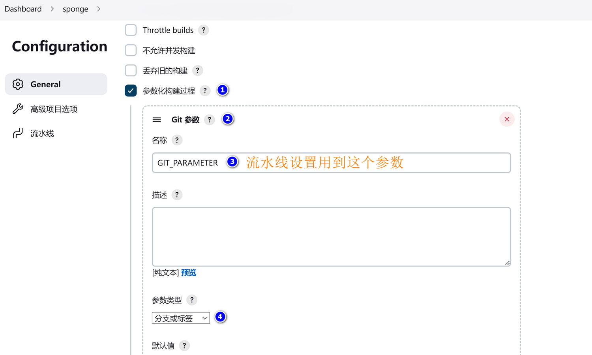
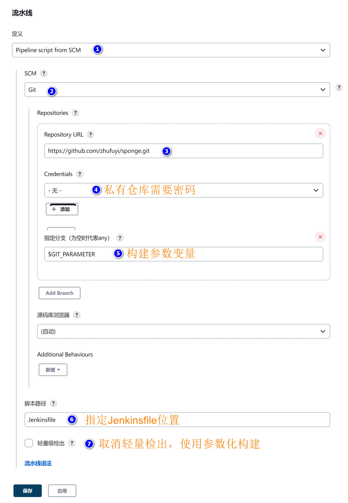
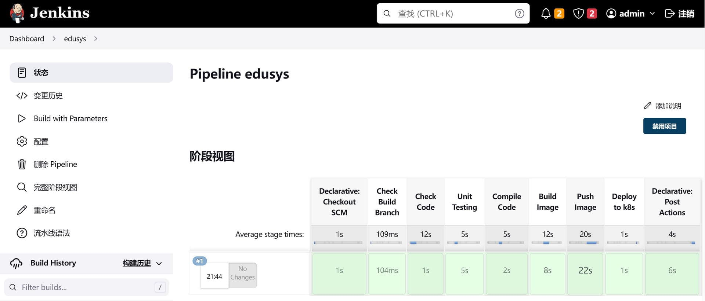

### 🏷Binary Deployment

Web and grpc services created by sponge support binary deployment in two ways.

**Method 1:** Run the service in the background on your local machine using the `nohup` command. Navigate to the service code directory and execute the deployment commands as follows:

```bash
# Run the service in the background on your local machine, execute this command again if you need to update the service
make run-nohup

# Stop the running service
make run-nohup CMD=stop
```

<br>

**Method 2:** Deploy to a remote Linux server (not supported on Windows). Navigate to the service code directory and execute the deployment commands as follows:

```bash
# Deploy the service to a remote Linux server, execute this command again if you need to update the service
make deploy-binary USER=root PWD=123456 IP=192.168.1.10
```

> [!note] If you are executing this command in a Windows environment, Windows must support the `expect`, `scp`, and `ssh` commands.

To start or stop a deployed service, you need to navigate to the target machine's directory `~/app/service-name-binary` and execute the following commands:

```bash
# Start or restart the service, you can modify the service YAML configuration before starting the service
./run.sh

# Stop the service
./run.sh stop
```

<br>

### 🏷Docker Deployment

Web and grpc services created by sponge also support Docker deployment, running on Docker containers on your local machine. You need to have [Docker](https://www.docker.com/) and [docker-compose](https://github.com/docker/compose/releases) commands installed locally. Navigate to the service code directory and use the following deployment commands:

```bash
# Build the image and run the service, execute this command again if you need to update the service
make deploy-docker
```

After Docker deployment, a `configs` directory will be added under the `deployments/docker-compose` directory of your service code. This directory contains the service configuration used when running in Docker. If you want to change the service configuration, modify the YAML configuration files under the `configs` directory and then restart the service to apply the changes.

To start and stop the service, navigate to the `deployments/docker-compose` directory of your service code and execute the following commands:

```bash
# Start the service
docker-compose up -d

# Stop the service
docker-compose down
```

> [!tip] If you want to reduce the size of the built image, open the script file `scripts/image-build-local.sh`, find the `# compressing binary file` section, and uncomment the lines below it. The resulting image size will be approximately half of the original size.

<br>

### 🏷Build and Upload Container Images

Web and grpc services created by sponge support building and pushing container images with simple commands, allowing you to easily push images to a private image repository.

#### 🔹Build Container Images

There are two ways to build container images.

**Method 1:** Compile the Go program locally and build the container based on parameters. Navigate to the service code directory and execute the deployment command as follows:

```bash
# Build the image
make image-build REPO_HOST=myRepo.com TAG=1.0
```

> [!tip] If you want to reduce the size of the built image, open the script file `scripts/image-build.sh`, find the `# compressing binary file` section, and uncomment the lines below it. The resulting image size will be approximately half of the original size.

<br>

**Method 2:** You do not need a Go environment locally; instead, you can compile the Go program in a container through a two-stage build process. Build the container based on parameters as follows:

```bash
# Build the image
make image-build2 REPO_HOST=myRepo.com TAG=2.0
```

> [!tip] The default Go version is 1.21. If you want to change the Go version, open the script file `scripts/build/Dockerfile_build`, and modify the version number here: `FROM golang:1.21-alpine`.

> [!tip] If you want to reduce the size of the built image, open the script file `scripts/build/Dockerfile_build`, find the `# compressing binary file` section, and uncomment the lines below it. The resulting image size will be approximately half of the original size.

<br>

#### 🔹Push Container Images to a Private Repository

Before pushing the image to a repository, you must log in to the private repository on your local machine. Execute the following command:

```bash
docker login myRepo.com
# Enter your private repository username and password
```

Then, navigate to the service code directory and execute the command to push the image:

```bash
# Push the image, using the same REPO_HOST and TAG parameters as used for building the image
make image-push REPO_HOST=myRepo.com TAG=1.0
```

> [!tip] Alternatively, you can use the `docker` command to push the container image, for example: `docker push myRepo.com/edusys/user:1.0`.

<br>

### 🏷Continuous Integration and Deployment

Web and grpc services created by sponge support building and deploying with [Jenkins](https://www.jenkins.io/doc/). The deployment targets can be Docker and [Kubernetes (k8s)](https://kubernetes.io/docs/home/). Below is an example of using Jenkins for automatic building and deploying to Kubernetes.

#### 🔹Setting up the jenkins-go Platform

To compile Go code inside a container, you need to build a `jenkins-go` image. An already built [jenkins-go image](https://hub.docker.com/r/zhufuyi/jenkins-go/tags) is available. If you want to build your own `jenkins-go` image, you can refer to the Docker build script [Dockerfile](https://github.com/zhufuyi/sponge/blob/main/test/server/jenkins/Dockerfile).

Once you have the `jenkins-go` image ready, you also need to prepare a Kubernetes cluster (there are many tutorials available online for setting up a Kubernetes cluster), the Kubernetes authentication files, and the command-line tool [kubectl](https://kubernetes.io/zh-cn/docs/tasks/tools/#kubectl). Ensure that the `jenkins-go` container has the necessary permissions to operate on Kubernetes, which requires copying the authorization files from the `.kube` directory to the container.

Here is the Docker Compose script `docker-compose.yml` for starting the `jenkins-go` service:

```yaml
version: "3.7"
services:
  jenkins-go:
    image: zhufuyi/jenkins-go:2.37
    restart: always
    container_name: "jenkins-go"
    ports:
      - 38080:8080
    #- 50000:50000
    volumes:
      - $PWD/jenkins-volume:/var/jenkins_home
      # docker configuration
      - /var/run/docker.sock:/var/run/docker.sock
      - /usr/bin/docker:/usr/bin/docker
      - /root/.docker/:/root/.docker/
      # k8s api configuration directory, including config file
      - /usr/local/bin/kubectl:/usr/local/bin/kubectl
      - /root/.kube/:/root/.kube/
      # go related tools
      - /opt/go/bin/golangci-lint:/usr/local/bin/golangci-lint
```

Start the `jenkins-go` service with the following command:

```bash
docker-compose up -d
```

Access [http://localhost:38080](http://localhost:38080) in your web browser. The first time you start it, you will need an admin key. Retrieve the key using the following command:

```bash
docker exec jenkins-go cat /var/jenkins_home/secrets/initialAdminPassword
```

After obtaining the key, install the recommended plugins and set up the admin account. Then, install some additional plugins and make some custom settings:

**(1) Install Plugins**

```bash
# Chinese language plugin
Locale

# Add parameterized build plugin
Extended Choice Parameter

# Add Git parameter plugin
Git Parameter

# Account management
Role-based Authorization Strategy
```

**(2) Set the Language to Chinese**

Navigate to **Manage Jenkins** -> **Configure System**, locate the **Locale** section, enter `zh_CN`, check the options below, and click **Apply**.

**(3) Configure Global Parameters**

Navigate to **dashboard** -> **System Management** -> **System Configuration** -> **Check Environment Variables** and set the repository address for container images:

```bash
# Development environment image repository
DEV_REGISTRY_HOST http://localhost:27070

# Testing environment image repository
TEST_REGISTRY_HOST http://localhost:28080

# Production environment image repository
PROD_REGISTRY_HOST http://localhost:29090
```

<br>

#### 🔹Creating Templates

When you first use Jenkins, you won't have templates. To avoid filling in redundant parameters every time you create a new task, you can create a generic template. With a template in place, you only need to modify the Git repository address when creating a new task. Follow these steps to create a template:

**(1) Create a New Job** as shown below:


<br>

**(2) Configure Parameterized Builds** using the parameter name `GIT_parameter` as shown below:



<br>

**(3) Set up the Pipeline** as shown below:



<br>

**(4) Build the Project**

Click on **Build with Parameters** on the left sidebar, then select the branch or tag as shown below:


<br>

#### 🔹Automatic Deployment to Kubernetes

For example, let's take the web service created based on SQL, named `user`, and use Jenkins to build and deploy it to Kubernetes.

Before building the service for the first time, some preliminary steps are needed:

> (1) Upload the `user` code to a code repository.

> (2) Prepare a Docker image repository, ensuring that the `jenkins-go` Docker container has the permissions to upload images to the repository by logging into it.

> (3) Ensure that Kubernetes cluster nodes have the permission to pull images from the repository.
>
> Execute the following command on the Docker image repository server to generate a secret:
> ```bash
> kubectl create secret generic docker-auth-secret \
>    --from-file=.dockerconfigjson=/root/.docker/config.json \
>    --type=kubernetes.io/dockerconfigjson
> ```

> (4) Create the necessary resources for `user` in Kubernetes.
> ```bash
> # Navigate to the directory
> cd deployments/kubernetes
>
> # Create a namespace (the name should match the 'project-name' parameter when creating the service with sponge)
> kubectl apply -f ./*namespace.yml
>
> # Create configmap and service
> kubectl apply -f ./*configmap.yml
> kubectl apply -f ./*svc.yml
> ```

> (5) Set up DingTalk notifications (optional). If you want to use DingTalk notifications to check the build and deployment results, open the `Jenkinsfile` in your code repository. Find the `tel_num` field and enter your phone number. Find the `access_token` field and enter your token value.

<br>

Once the preliminary steps are completed, create a new Jenkins task (named `user`) in the Jenkins interface using the previously created template (`sponge`), and then modify the Git repository. Save the task and start the parameterized build. The build result will look like the following:



<br>

To check the status of the `user` service in Kubernetes, use the command `kubectl get all -n user`:

```
NAME                             READY   STATUS    RESTARTS   AGE
pod/user-dm-77b4bcccc5-8xt8v     1/1     Running   0          21m

NAME                 TYPE        CLUSTER-IP      EXTERNAL-IP   PORT(S)    AGE
service/user-svc     ClusterIP   10.108.31.220   <none>        8080/TCP   27m

NAME                        READY   UP-TO-DATE   AVAILABLE   AGE
deployment.apps/user-dm     1/1     1            1           21m

NAME                                   DESIRED   CURRENT   READY   AGE
replicaset.apps/user-dm-77b4bcccc5     1         1         1       21m
```

<br>

To test whether you can access the service locally, run:

```bash
# Port forward
kubectl port-forward --address=0.0.0.0 service/user-svc 8080:8080 -n user

# Send a request
curl http://localhost:8080/api/v1/teacher/1
```

<br>

sponge-generated web and grpc services come with Jenkinsfiles, scripts for building and uploading images, and Kubernetes deployment scripts. You can use these scripts without modification for most use cases, but you also have the option to customize them to suit your specific needs.