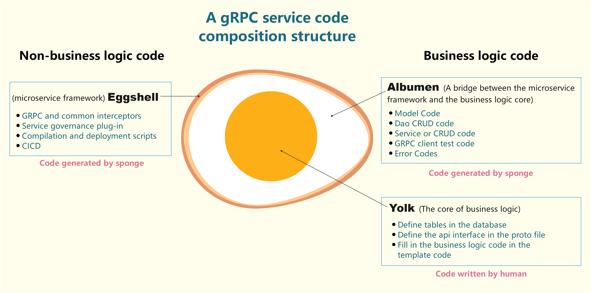
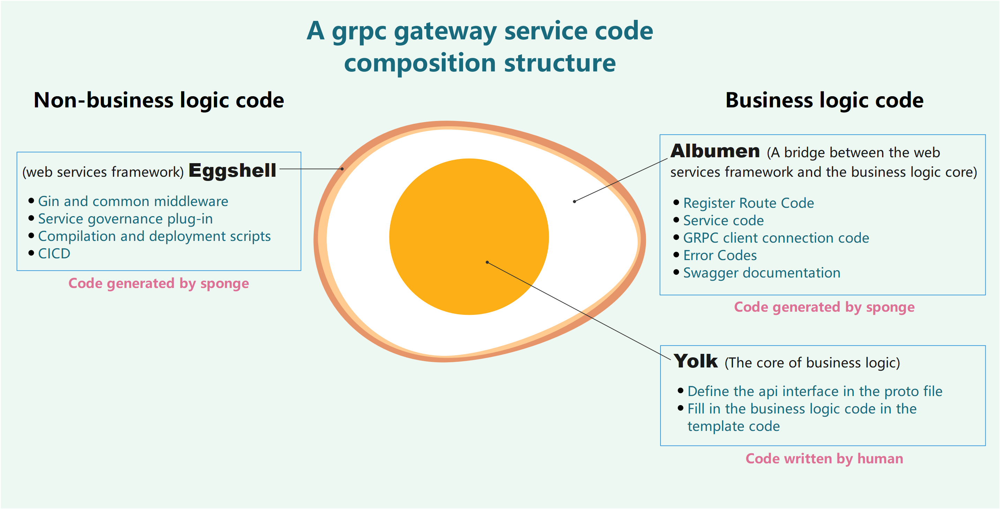

### 🏷Sponge Development Phases

**sponge's development has gone through several key phases:**

> 🔸**Phase One**: In this phase, sponge converts YAML configuration files into Go code and MySQL tables into GORM code. It generates simple GORM CRUD code and serves as a development aid for code writing.

> 🔸**Phase Two**: sponge adds support for generating DAO CRUD code, handler CRUD code, and web service code. Currently, it supports generating web service code for standard CRUD API interfaces but does not support generating custom API interface code. It has certain limitations in this phase.

> 🔸**Phase Three**: sponge introduces support for using the Protocol Buffers (protobuf) protocol to generate custom API interfaces. It also adds the capability to generate generic web service code. In this phase, sponge supports both "SQL web development" and "protobuf web development."

> 🔸**Phase Four**: sponge supports generating "grpc service code based on SQL," "Generic grpc service code based on protobuf," and "grpc gateway service code based on protobuf." In this phase, the microservices framework has matured.

> 🔸**Phase Five**: sponge adds features such as a graphical user interface (UI) for code generation commands, a rich set of out-of-the-box components, grpc service testing, and automated build and deployment. It has evolved into a foundational development framework.

In summary, sponge is an integrated `automated code generation`, `Gin and GRPC` go base development framework.

<br>

### 🏷Code Generation Framework

The code generation primarily relies on two methods: **SQL** and **protobuf**. Each method can generate different types of functional code, among them **SQL** support common database mysql, mongodb, postgresql, tidb, sqlite. The framework for generating code is illustrated in the diagram below:


<p align="center">sponge Code Generation Framework</p>

From the diagram, you can see that there are two ways to create projects based on SQL:

- `⓵Create web service based on sql` (gin, represented by the green box).
- `⓶Create grpc service based on sql` (grpc, represented by the purple box).

There are three ways to create projects based on protobuf:

- `⓷Create web service based on protobuf` (gin, represented by the green box).
- `⓸Create grpc service based on protobuf` (grpc, represented by the purple box).
- `⓹Create grpc gateway service based on protobuf` (gin and grpc, represented by the green box).

In other words, sponge supports a total of five project creation methods, each suitable for different project scenarios:

<!-- tabs:start -->

#### **⓵Create web service based on sql**

`⓵Create web service based on sql` is a complete web back-end service that includes data storage. It includes complete functionality from development to deployment and provides standardized CRUD API interfaces.

**Use Case:** The vast majority of api interfaces are web projects with standardised CRUD interfaces, such as admin panel projects.

**Features:**

- Support databases mysql, mongodb, postgresql, tidb, sqlite.
- You can run and use it without writing any Go code; just connect to the MySQL database. It generates complete project code, including standardized CRUD API interfaces, ready to use out of the box.
- It supports batch addition of standardized CRUD API interfaces, and the generated code seamlessly integrates into the project code.
- Custom API interfaces are also supported, but you need to manually write the complete API interface code, similar to traditional web development.

As shown in the diagram above, the generated web service code includes three submodules: `handler`, `dao`, and `model`. Similarly, when generating `handler` module code, it includes `dao` and `model` submodules.

#### **⓶Create grpc service based on sql**

`⓶Create grpc service based on sql` is a complete grpc service including data storage. It includes complete functionality from development to deployment, standardized CRUD API interfaces, and grpc client testing code.

**Use Case:** Generic microservice project using the specified database storage.

**Features:**

- Support databases mysql, mongodb, postgresql, tidb, sqlite.
- You can run and use it without writing any Go code; just connect to the MySQL database. It generates complete project code, including standardized CRUD API interfaces, ready to use out of the box.
- It generates standardized CRUD API interface descriptions in the proto file by parsing SQL, eliminating the need for manual definitions.
- It supports batch addition of standardized CRUD API interfaces.
- Custom API interfaces are supported. To add custom API interfaces, fill in the description in the proto file and then provide specific logic in the API interface template.
- It supports generating DAO CRUD code separately and seamlessly integrating it into the grpc service project code. Then, you can call the `dao` interface in the `service`.
- It automatically generates grpc client testing and load testing code, eliminating the need for third-party grpc client tools to test grpc service. You can test API interfaces directly in GoLand or Visual Studio Code.

As shown in the diagram above, the generated grpc service code includes `service`, `dao`, `model`, and `protobuf` four submodules. When generating the `service` module code, it includes `dao`, `model`, and `protobuf` three submodules.

#### **⓷Create web service based on protobuf**

`⓷Create web service based on protobuf` is a generic web backend service that does not include database storage, including functionality required from development to deployment, api interface template code, support for optional database types and ORM.

**Use Case:** General web service projects.

**Features:**

- It supports batch generation of template code for any API interfaces.
- When adding new API interfaces, it automatically merges the added API interface code into the template code.
- If MySQL is selected as the data storage type, it is essentially an enhanced version of `⓵Create web service based on sql`. It not only supports batch addition of standardized CRUD API interfaces, but also automatically generates custom API interface code (except for specific logic). Adding a complete custom API interface does not require manually writing all the interface code, similar to traditional API development.
- If a non-MySQL data type is selected, you must manually write code to connect to the data and create the DAO. The handler calls the DAO interface.

Refer to the diagram above. The generated web service code includes the `handler template`. If MySQL is used as the data type, the generated code also includes the `dao` and `model` submodules. For other data types, you need to manually write the `dao` and `model` submodule code.

#### **⓸Create grpc service based on protobuf**

`⓸Create grpc service based on protobuf` is a generic grpc service that does not include database storage, including functionality required from development to deployment, api interface template code, support for optional database types and ORM.

**Use Case:** General microservice projects.

**Features:**

- It supports batch generation of template code for any API interfaces.
- When adding new API interfaces, it automatically merges the added API interface code into the template code.
- If MySQL is selected as the data storage type, it is the same as `⓶Create grpc service based on sql`. It supports batch addition of standardized CRUD API interfaces and can seamlessly generate DAO CRUD code to integrate into the grpc service project code. Then, you can call the `dao` interface in the `service`.
- If a non-MySQL data type is selected, you must manually write code to connect to the data and create the DAO. The service module calls the DAO interface.
- It automatically generates grpc client testing and load testing code, eliminating the need for third-party grpc client tools to test grpc service. You can test API interfaces directly in GoLand or Visual Studio Code.
- Knowledge of Protocol Buffers (protobuf) is required.

As shown in the diagram, the generated grpc service code includes the `service template`. If MySQL is used as the data type, the generated code also includes the `dao`, `model`, and `protobuf` submodules. For other data types, you need to manually write the `dao`, `model`, and `protobuf` submodule code.

#### **⓹Create grpc gateway service based on protobuf**

`⓹Create grpc gateway service based on protobuf` serves as the unified entry point for grpc services and is a web service that includes all the necessary functionality, API interface template code, and features for various database types.

**Use Case:** Microservices architecture, distributed systems, cross-platform systems.

**Features:**

- It supports batch generation of template code for any API interfaces. Simply define the API interface in the protobuf file and provide specific logic in the generated template files.
- When adding new API interfaces, it automatically merges the added API interface code into the template code.
- It seamlessly integrates with the generated grpc service connection code.
- It supports load balancing, routing, authentication, and monitoring features.
- Knowledge of Protocol Buffers (protobuf) is required.

As shown in the diagram, the generated grpc gateway service code includes the `router` and `service template` submodules. The `service` template code mainly invokes grpc service API interfaces.

<!-- tabs:end -->

<br>

These five project creation methods cater to different project scenarios and requirements, providing flexibility and efficiency in Go development with sponge.

<br>

### 🏷Microservices Framework

Sponge is essentially a microservice framework that includes code generation capabilities. The microservice framework is shown in the following figure, which is a typical microservice hierarchical structure, with high performance, high scalability, contains commonly used service governance features, you can easily replace or add their own service governance features.


<p align="center">Microservices Framework Diagram</p>

Key functionalities of the microservices:

- Web framework: [gin](https://github.com/gin-gonic/gin)
- RPC framework: [grpc](https://github.com/grpc/grpc-go)
- Configuration parsing: [viper](https://github.com/spf13/viper)
- Configuration center: [nacos](https://github.com/alibaba/nacos)
- Logging component: [zap](https://github.com/uber-go/zap)
- Database ORM component: [gorm](https://github.com/go-gorm/gorm), [mongo-go-driver](https://github.com/mongodb/mongo-go-driver)
- Cache components: [go-redis](https://github.com/go-redis/redis), [ristretto](https://github.com/dgraph-io/ristretto)
- Automated API documentation: [swagger](https://github.com/swaggo/swag), [protoc-gen-openapiv2](https://github.com/grpc-ecosystem/grpc-gateway/v2/protoc-gen-openapiv2)
- Authentication: [jwt](https://github.com/golang-jwt/jwt)
- Parameter validation: [validator](https://github.com/go-playground/validator)
- Message Queue [rabbitmq](https://github.com/rabbitmq/amqp091-go)
- Distributed Transaction Manager [dtm](https://github.com/dtm-labs/dtm)
- Adaptive rate limiting: [ratelimit](https://github.com/zhufuyi/sponge/tree/main/pkg/shield/ratelimit)
- Adaptive circuit breaking: [circuitbreaker](https://github.com/zhufuyi/sponge/tree/main/pkg/shield/circuitbreaker)
- Distributed tracing: [opentelemetry](https://github.com/open-telemetry/opentelemetry-go)
- Metric monitoring: [prometheus](https://github.com/prometheus/client_golang/prometheus), [grafana](https://github.com/grafana/grafana)
- Service registration and discovery: [etcd](https://github.com/etcd-io/etcd), [consul](https://github.com/hashicorp/consul), [nacos](https://github.com/alibaba/nacos)
- Adaptive profiling: [profile](https://go.dev/blog/pprof)
- Resource statistics: [gopsutil](https://github.com/shirou/gopsutil)
- Code linting: [golangci-lint](https://github.com/golangci/golangci-lint)
- Continuous integration and deployment: [jenkins](https://github.com/jenkinsci/jenkins), [docker](https://www.docker.com/), [kubernetes](https://github.com/kubernetes/kubernetes)

This comprehensive set of features makes sponge an all-in-one solution for Golang development, providing a powerful microservices framework along with various essential tools and components.

<br>

### 🏷Project Code Directory Structure

The project code directory structure created by sponge follows the [project-layout](https://github.com/golang-standards/project-layout) convention and is structured as follows:

```bash
.
├── api            # Directory for exposing external API interfaces, typically containing proto files and generated *.pb.go files. The directory structure is typically in the form `api/xxx/v1`, where v1 indicates the version.
├── assets         # Store various static resources, such as images, markdown files, etc.
├── cmd            # Program entry directory
│    └── serviceName
│         ├── initial     # Program initialization, consisting of three files: initApp initializes configurations, registerServers registers services (HTTP or grpc), and registerClose registers resource cleanup.
│         └── main.go     # Program entry file
├── configs        # Directory for configuration files
├── deployments    # Directory for deployment scripts, supporting binary, Docker, and Kubernetes deployments.
├─ docs            # Directory for API interface Swagger documentation.
├── internal       # Directory for code of private applications and libraries.
│    ├── cache        # Cache directory wrapped around business logic.
│    ├── config       # Directory for Go structure configuration files.
│    ├── dao          # Data access directory, e.g., interfaces for CRUD operations on MySQL tables.
│    ├── ecode        # Directory for system error codes and custom business error codes.
│    ├── handler      # Directory for implementing HTTP business functionality (specific to web services).
│    ├── model        # Database model directory.
│    ├── routers      # HTTP routing directory.
│    ├── rpcclient    # Directory for client-side code that connects to grpc services.
│    ├── server       # Directory for creating services, including HTTP and grpc.
│    ├── service      # Directory for implementing grpc business functionality (specific to grpc service).
│    └── types        # Directory for defining request and response parameter structures for HTTP.
├── pkg            # Directory for shared libraries.
├── scripts        # Directory for scripts, including compilation, execution, code generation, and deployment scripts.
├── test           # Directory for scripts required for testing services, such as scripts to start dependencies (e.g., MySQL, Redis) and test data (SQL).
└── third_party    # Directory for external helper programs, forked code, and other third-party tools.
```

> [!tip] The directory structure is mostly the same for web services and grpc service. However, there are some directories that are unique to web services (e.g., `routers`, `handler`, `types`) and some unique to grpc service (e.g., `service`) within the `internal` directory.

<br>

### 🏷Sponge Core Features

#### 🔹Template Code

sponge's source code consists of three major parts: "Code Generation Tools," "Web and GRPC Services Code," and "Basic Development Framework Scripts." The latter two are collectively referred to as "Template Code." The directory structure of the service code created using the five different methods is similar, and they share the same set of template code found within the sponge source code.

> [!tip] In the sponge source code, apart from the `cmd/sponge`, `cmd/protoc-gen-go-gin`, and `cmd/protoc-gen-go-rpc-tmpl` directories, which belong to the code generation tools, all other directories' code is template code.

If you understand the project code created by sponge, you essentially understand the sponge source code (developing projects makes it easier to comprehend). The main areas to focus on in the project code are the `api` and `internal` directories. The `api` directory is primarily used to define API interface descriptions, while the `internal` directory is where business logic code is stored. The typical workflow when using sponge to develop projects is to "define API interfaces in proto files" -> "write business logic code in the generated template code." This process remains consistent for both web and grpc services development.

> [!tip] If you initially start with a monolithic web service (`⓷Create web service based on protobuf`) and find that your business functionality is growing, it's incredibly convenient to split the complex monolithic web service into grpc service. This can be achieved with minimal code rewriting, as web and grpc service share the same set of template code.

> [!tip] sponge's code generation commands and template code are kept in sync. Executing the `sponge upgrade` command ensures that both code generation commands and template code remain consistent.

<br>

#### 🔹Code Generation

`Code Generation` is one of the three core features of sponge projects. It automatically organizes generated code according to specific rules and integrates it with template code to build a complete project codebase. Think of template code as a fixed-structure building, and `Code Generation` is the process of adding bricks, tiles, and decoration to the building.

sponge offers a rich set of code generation capabilities. You can generate code in two primary places when developing a project with sponge: the UI interface and the Makefile file within your created project code.

In the sponge UI interface, you can create projects in five different ways:

- `⓵Create web service based on sql`
- `⓶Create grpc service based on sql`
- `⓷Create web service based on protobuf`
- `⓸Create grpc service based on protobuf`
- `⓹Create grpc gateway service based on protobuf`

The sponge UI interface also supports generating various common code snippets, all of which can be seamlessly integrated into your project code. These include:

- Generate handler CRUD code
- Generate service CRUD code
- Generate dao CRUD code
- Generate protobuf CRUD code
- Generate model code
- Generate config code
- Generate grpc service connection code
- Generate cache code

In reality, the code generation performed in the UI interface is equivalent to executing sponge's code generation commands in the background. You can find the corresponding code generation subcommands in the `sponge web` and `sponge micro` commands. The UI interface offers memory features, detailed parameter explanations, and instructions on how to use the generated code. Thus, using the UI interface is simpler and more user-friendly compared to the sponge command line.

<br>

In addition to generating code in the UI interface, many code generation commands are integrated into the Makefile file within the service code directory. These include:

- Generate API interface template code
- Generate grpc client test code
- Register route code
- API error codes
- Automatic merging of template code
- *pb.go code generated by the protoc plugin

The code generated via Makefile is seamlessly integrated into the project code, eliminating the need for manual adjustments to fit the project codebase.

sponge offers a variety of code generation commands to minimize or eliminate the need for manual coding during project development, enabling "low-code development" in Go.

<br>

### 🏷Egg Model for Generate Service Code

The sponge code generation process strips away the business logic and non-business logic of the two major parts of the code. Sponge's code generation function as a hen, the generated service code is the egg, take the generated web service backend code as an example:

- `Eggshell` is web service framework code (automatically generated without manual writing).
- `Yolk` is the core of business logic. For example, defining mysql tables, defining api interfaces, and writing specific logic codes all belong to yolk (code that needs to be written manually).
- `Albumen` is a bridge connecting the core code of business logic and the web framework code. For example, the registration route code, handler code, parameter verification code, error code, and swagger document generated according to the proto file belong to the albumen (code that automatically generated without manual writing).

The egg model for `⓷Create web service based on protobuf` code is illustrated in the following diagram:


<br>

The egg model for `⓶Create grpc service based on sql` and `⓸Create grpc service based on protobuf` code is illustrated in the following diagram:



<br>

The egg model for `⓹Create grpc gateway service based on protobuf` code is illustrated in the following diagram:



<br>