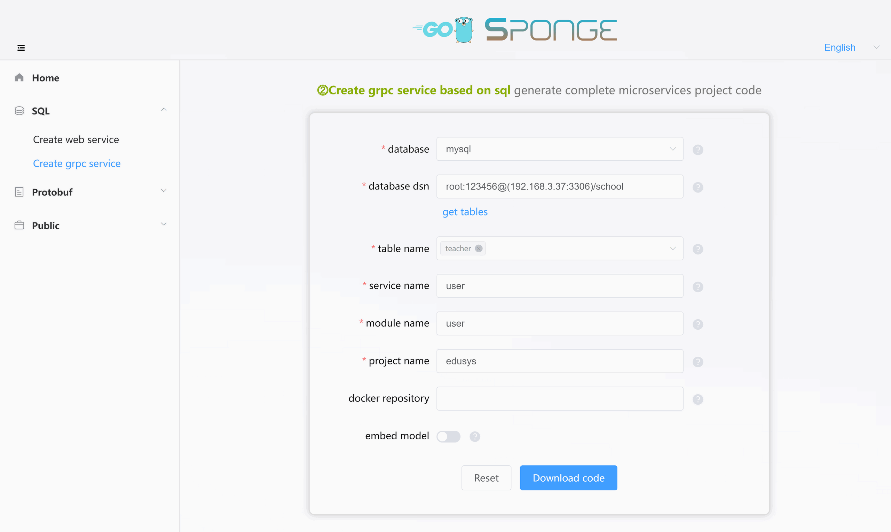
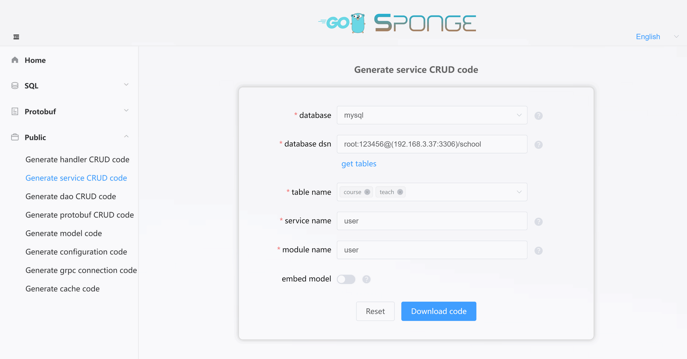

`⓶Microservice created based on sql` is gRPC microservices that use MySQL as their data storage. Since the database type has been chosen, and sponge supports generating standardized CRUD code using GORM, you can easily generate complete microservice code with CRUD API interfaces at the push of a button. Within the microservice code, you can batch-add CRUD API interface code without writing a single line of Go code; all you need to do is connect to the MySQL database.

If you're developing a microservice that only requires standardized CRUD API interfaces, this is one of the simplest ways to develop microservices. You won't need to write Go code, and it enables "low-code development" for microservice API interfaces. Adding custom API interfaces is also relatively straightforward; you just need to define the API interface in a proto file and then write specific logic in the generated API interface templates.

Therefore, `⓶Microservice created based on sql` using MySQL as the database are suitable for microservice projects where MySQL is the preferred database option.

<br>

### 🏷Pre-development Preparations

Before developing a microservice project, make sure you have the following:

- sponge installed
- MySQL service
- MySQL tables

> [!tip] Generating code requires a MySQL service and MySQL tables. If you don't have them prepared, you can use this [Docker Compose script to start a MySQL service](https://github.com/zhufuyi/sponge/blob/main/test/server/mysql/docker-compose.yaml). After starting the MySQL service, you can import the SQL script for the example database and tables that are used.

Open your terminal and start the sponge UI service:

```bash
sponge run
```

Access http://localhost:24631 in your web browser to enter the sponge code generation UI.

### 🏷Creating a Microservice Project

In the sponge UI, navigate to the left sidebar **SQL** -> **Create Microservice Project**. Fill in the `MySQL DSN address`, then click the button to `Fetch Table Names`. Select the table names (you can select multiple), fill in the other parameters, and hover over the question marks `?` to see parameter explanations. After filling in the parameters, click the button to `Download Code` to generate the complete microservice project code, as shown in the image below:



> [!tip] Equivalent command: **sponge micro rpc --module-name=user --server-name=user --project-name=edusys --db-dsn="root:123456@(192.168.3.37:3306)/school" --db-table=teacher**

> [!tip] The directory name for the extracted microservice code follows the format `ServiceName-Type-Date`. You can modify the directory name, for example, removing the type and date.

> [!tip] After successfully generating the code, sponge saves the record, making it convenient for generating code the next time. If the `MySQL DSN address` remains the same, refreshing or reopening the page will automatically fetch the table names without clicking the `Fetch Table Names` button.

This is the directory structure of the created microservice code:

```
.
├─ api
│   ├─ types
│   └─ user
│       └─ v1
├─ cmd
│   └─ user
│       ├─ initial
│       └─ main.go
├─ configs
├─ deployments
│   ├─ binary
│   ├─ docker-compose
│   └─ kubernetes
├─ docs
├─ internal
│   ├─ cache
│   ├─ config
│   ├─ dao
│   ├─ ecode
│   ├─ model
│   ├─ server
│   └─ service
└─ scripts
```

The created microservice code follows the egg model structure:


Unzip the code files, open your terminal, navigate to the microservice code directory, and execute the following commands:

```bash
# Generate and merge code related to API interfaces
make proto

# Compile and run the service
make run
```

> [!note] During development, you will frequently use the `make proto` command. It internally executes a series of subcommands for generating code: generating `template code` for API interfaces, `error codes`, `RPC client test code`, and the related `*.pb.go` files. It also automatically merges code related to API interfaces. You don't need to worry about overwriting existing business logic code. Even if something unexpected happens (like a power outage), you can find backup code before each merge in the `/tmp/sponge_merge_backup_code` directory. In Windows, it's located in `C:\Users\YourUsername\AppData\Local\Temp\sponge_merge_backup_code`. Execute this command whenever you add or update API interface descriptions in the proto file; otherwise, it's not necessary.

Open the project code using the `GoLand` IDE, go to the `internal/service` directory, and open the test file with the suffix `_client_test.go`. Here, you will find tests and performance benchmarking functions for each API interface defined in the proto file. Before testing, fill in the request parameters, similar to testing API interfaces in a Swagger interface, as shown in the image below:


If you don't have the `GoLand` IDE, you can still test using commands. Navigate to the `internal/service` directory, open the test file with the suffix `_client_test.go`, modify the request parameters for the RPC method, and execute the test command like this: `go test -run Test_service_teacher_methods/GetByID`.

> [!tip] In the CRUD API interfaces, there is a paginated query interface with arbitrary conditions. With this interface, you can avoid writing many API query interfaces. Click to see <a href="/public-doc?id=%f0%9f%94%b9arbitrary-condition-paging-query" target="_blank">Arbitrary Condition Paging Query</a> instructions.

<br>

### 🏷Automatically Adding CRUD API Interfaces

If you have new MySQL tables that need CRUD API interface code generated, go to the left sidebar **Public** -> **Generate Service CRUD Code**. Fill in the `MySQL DSN address`, then click `Fetch Table Names` and select the MySQL tables (you can select multiple). Next, fill in the other parameters. Once you've filled in the parameters, click the button to `Download Code`, as shown in the image below:



> [!tip] Equivalent command: **sponge micro service --module-name=user --db-dsn="root:123456@(192.168.3.37:3306)/school" --db-table=cause,teach**. There's an even simpler equivalent command. Use the `--out` parameter to specify the user service code directory and directly merge the code into the user service code. Example: **sponge micro service --db-dsn="root:123456@(192.168.3.37:3306)/school" --db-table=cause,teach --out=user**

The generated service CRUD code directory structure is shown below. The `internal` and `api/user` directories contain subdirectories `cache`, `dao`, `ecode`, `model`, `service`, and `v1`, each of which contains Go files and test files named after the table names.

```
.
├─ api
│   └─ user
│       └─ v1
└─ internal
     ├─ cache
     ├─ dao
     ├─ ecode
     ├─ model
     └─ service
```

Unzip the code and move the `internal` and `api` directories to your microservice code directory. This completes the bulk addition of service CRUD API interfaces to your microservice project.

> [!note] Moving the `internal` and `api` directories should not normally result in conflicting files. If there are conflicting files, it means that you previously specified the same MySQL table to generate service CRUD code. In this case, you can ignore file overwrites.

In the terminal, execute the following commands:

```bash
# Generate and merge code related to API interfaces
make proto

# Compile and run the service
make run
```

> [!attention] If you encounter an error like **api/types/types.proto: File not found.** or **internal\cache\xxx.go:40:38: undefined: model.CacheType** when running the `make proto` command, please execute the `make patch` command and then run `make proto` again.

Similarly, use the `GoLand` IDE to open the project code, navigate to the `internal/service` directory, and open the test file with the suffix `_client_test.go`. Before testing, fill in the request parameters. If you're not using the `GoLand` IDE for testing, you can execute the test command in the terminal, like this: `go test -run Test_service_teacher_methods/GetByID`.

<br>

### 🏷Manually Adding Custom API Interfaces

Projects typically include custom API interfaces in addition to standard CRUD API interfaces. The main process for adding custom API interfaces is to `define the API interfaces in the proto file` -> `write specific logic code in the generated template code`.

For example, to add a login interface to this project:

**(1) Define the Login Interface in the Proto File**

Go to the `api/user/v1` directory, open the `teacher.proto` file, and add the description of the login interface:

```protobuf
import "validate/validate.proto";

service teacher {
  // ...

  rpc Login(LoginRequest) returns (LoginReply) {}
}

message LoginRequest {
  string email = 1 [(validate.rules).string.email = true];
  string password = 2 [(validate.rules).string.min_len = 6];
}

message LoginReply {
  uint64 id = 1;
  string token = 2;
}
```

> [!tip] The `validate.rules` following the `email` and `password` fields are validation rules for the fields. You can find more about [validate validation rules](https://github.com/envoyproxy/protoc-gen-validate#constraint-rules) by clicking the link. Don't forget to add `import "validate/validate.proto"` to your proto file.

After adding the API interface description, execute the following command in the terminal:

```bash
# Generate and merge code related to API interfaces
make proto
```

**(2) Write Specific Logic Code**

Go to the `internal/service` directory, open the `teacher.go` file, and write specific logic code under the `Login` method function. For example, you can include code to validate passwords and generate tokens.

> [!tip] In manually added custom API interfaces, you may need to perform data CRUD operations (also known as DAO CRUD). These DAO CRUD code sections can be generated automatically without manual coding. Click to view <a href="/public-doc?id=%f0%9f%94%b9generating-and-using-dao-crud-code" target="_blank">Generating and Using dao CRUD Code</a> instructions.

> [!tip] In manually added custom API interfaces, you may need to use caching, such as generating tokens. For string-type cache code like this, you can generate it directly and don't need to write it manually. Click to view <a href="/public-doc?id=%f0%9f%94%b9generating-and-using-cache-code" target="_blank">Generating and Using Cache Code</a> instructions.

**(3) Test the API Interface**

After writing the specific logic code, execute the following command in the terminal:

```bash
# Compile and run the service
make run
```

In the `GoLand` IDE, go to the `internal/service` directory and open the test file with the suffix `_client_test.go` (in this case, `teacher_client_test.go`). Fill in the Login request parameters, then click the green button on the left for testing.

If you're not using the `GoLand` IDE for testing, you can execute the test command in the terminal like this: `go test -run Test_service_teacher_methods/GetByID`.

Adding a custom API interface is straightforward. Simply define the API interface description in the proto file, then write the specific logic code in the generated template. The gRPC client testing code is automatically generated, eliminating the need for third-party gRPC client tools for testing. You don't need to write complete API interface code as in traditional gRPC development, allowing developers to focus on writing specific business logic.

<br>

### 🏷Calling APIs from Other Microservices

If you need to call APIs from other microservices in this service, follow the steps below.

**(1) Adding Connection to Target Microservice Code**

To call the API of the target microservice within this service, you first need to establish a connection to the target microservice. Below are the steps to automatically generate RPC connection code.

Navigate to the Sponge UI interface, click on the left menu bar **[Public]** -> **[Generate RPC Service Connection Code]**. Fill in the module name, specify the RPC service name(s) (multiple names supported, separated by commas). After providing the parameters, click the `Download Code` button to generate the RPC service connection code, as shown in the image below:


> [!tip] Equivalent command: **sponge micro rpc-conn --module-name=edusys  --rpc-server-name=user**. There is a simpler equivalent command available by using the `--out` parameter to specify the microservice code directory and directly merge the code into this service. Command: **sponge micro rpc-conn --rpc-server-name=user --out=edusys**

The generated RPC service connection code directory will look like this:

```
.
└─ internal
    └─ rpcclient
```

> [!tip] The RPC connection code is actually a gRPC client connection code, which includes settings for service discovery, load balancing, secure connections, trace linking, metric collection, etc. You can also add your own custom connection settings.

Extract the code and move the `internal` directory to the code directory of this service.

> [!note] Moving the `internal` directory to the service directory should not normally result in conflicts. If there are conflicting files, it means that you previously specified the same microservice name to generate the RPC service connection code. In this case, simply ignore overwriting the files.

<br>

**(2) Configuring the Address of the Target Microservice**

After adding the connection to the target microservice code, set the address of the target microservice in the configuration file `configs/service_name.yml`. The main configuration is as follows:

```yaml
grpcClient:
  - name: "user"        # Microservice name
    host: "127.0.0.1"   # Microservice address (This field is ignored if service discovery is enabled)
    port: 8282          # Microservice port (This field is ignored if service discovery is enabled)
    registryDiscoveryType: ""  # Service discovery, default is disabled, supports consul, etcd, nacos
```

> [!tip] For more grpcClient settings, refer to `configs/service_name.yml`, such as load balancing, secure connections, etc.

If you need to connect to multiple microservices, you need to set the addresses of multiple microservices. An example is shown below:

```yaml
grpcClient:
  - name: "user"
    host: "127.0.0.1"
    port: 18282
    registryDiscoveryType: ""
  - name: "relation"
    host: "127.0.0.1"
    port: 28282
    registryDiscoveryType: ""
  - name: "creation"
    host: "127.0.0.1"
    port: 38282
    registryDiscoveryType: ""
```

<br>

**(3) Adding Proto Files of the Target Microservice**

Even though you can connect to the target microservice, you may not know which API interfaces of the target microservice can be called. You can use proto files to inform this service of the available API interfaces.

Copy the `api/target_microservice_name/v1/xxx.proto` file from the target microservice code directory and move it to the `api` directory of this service. With the proto files of the target microservice, this service will know which API interfaces can be called.

Switch to the directory of this service, open the terminal, and execute the following command:

```bash
# Copy proto files from other microservices to this service project. If there are multiple target microservice directories, separate them with commas.
make copy-proto SERVER=../user
```

> [!note] `make copy-proto` will copy all proto files. If a proto file already exists, it will be overwritten. You can find the backup of overwritten proto files in the directory `/tmp/sponge_copy_backup_proto_files`.

<br>

**(4) Running the Target Microservice**

In the directory of the target microservice, open the terminal and execute the following commands:

```bash
# Generate and merge API interface related code
make proto

# Compile and run the service
make run
```

<br>

### 🏷Configuring the Service

The created microservice code includes various components, some of which are disabled by default. You can enable and configure these components as needed in the configuration file `configs/service-name.yml`, which contains detailed explanations.

> [!tip] You can replace, add your own components (gRPC interceptors), or remove unnecessary components in the service code by modifying the code file `internal/server/grpc.go`.

**Components Enabled by Default:**

- **logger**: Logging component, which is set to output to the terminal by default. The default log format is console, but you can configure it to output logs in JSON format, save logs to a specific file, and set log file rotation and retention times.
- **enableMetrics**: Metric collection, with the default route `/metrics`.
- **enableStat**: Resource statistics, which tracks CPU and memory resource usage for both the system and the program. By default, it logs resource usage every minute. If the program's resource usage exceeds 80% (configurable), it will automatically collect profiles in the background and save them to the directory `/tmp/service-name_profile` for offline analysis.
- **cacheType**: Cache component, which defaults to local memory but can be changed to Redis. Note that Redis must be used in a clustered deployment.

**Components Disabled by Default:**

- **enableHTTPProfile**: Profile component.
- **enableLimit**: Adaptive rate limiting component.
- **enableCircuitBreaker**: Adaptive circuit breaking component.
- **enableTrace**: Distributed tracing component.
- **registryDiscoveryType**: Service registration and discovery component.
- **gRPC Security**:
  - **serverSecure**: Certificate-based authentication, supporting server-side authentication and mutual authentication.
  - **enableToken**: Token-based authentication.

Other configurations can be set according to your needs, and you can also add new configurations. If you add or change configuration fields, you'll need to update the corresponding Go structs. To do this, run the following command in the terminal within the service code directory:

```bash
make update-config
```