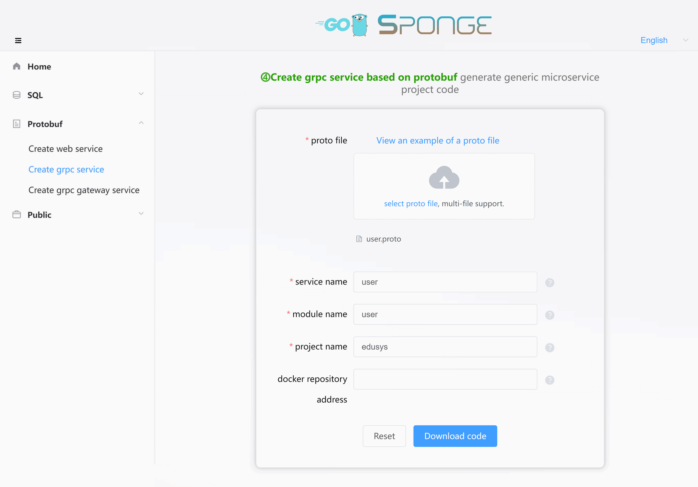

`⓸Microservice created based on protobuf` is intended for general microservices development and supports choosing a database type as data storage. On the other hand, `⓶Microservice created based on sql`, which is <a href="/microservice-development-mysql" target="_blank">Microservices Development with MySQL</a>, specifically selects MySQL as the database type. This is the primary difference between the two methods of creating microservices. You can consider `⓶Microservice created based on sql` as a specialized subset of `⓸Microservice created based on protobuf`.

`⓸Microservice created based on protobuf` allows you to choose any database type, including MySQL. If you select MySQL as the database type, it is essentially equivalent to `⓶Microservice created based on sql`, except for the initial service creation, where the dependency on proto files differs. Otherwise, everything else remains the same.

When you choose a database type other than MySQL with `⓸Microservice created based on protobuf`, you will need to manually write DAO (Data Access Object), model, and database initialization code.

Therefore, `⓸Microservice created based on protobuf` is suitable for generic microservices project development.

<br>

## 🏷Using MySQL for Microservices Development

### 🔹Pre-development Preparations

Before developing a microservices project, make sure you have:

- sponge installed
- MySQL service
- MySQL tables
- Proto files, for example, [user.proto](https://github.com/zhufuyi/sponge_examples/blob/main/2_web-gin-protobuf/api/user/v1/user.proto).

> [!tip] Generating service CRUD code requires a MySQL service and MySQL tables. If you don't have them ready, here is a [script to start a MySQL service using Docker](https://github.com/zhufuyi/sponge/blob/main/test/server/mysql/docker-compose.yaml). After starting the MySQL service, import the SQL script for the [sample database and table](https://github.com/zhufuyi/sponge_examples/blob/main/1_web-gin-CRUD/test/sql/user.sql).

Open a terminal and start the sponge UI service:

```bash
sponge run
```

Access the sponge code generation UI by navigating to http://localhost:24631 in your web browser.

<br>

### 🔹Creating a Microservice Project

Inside the sponge UI, go to the left sidebar, click on **Protobuf** -> **Create Microservices Project**, select the proto file(s) (you can select multiple), and fill in the other parameters. Hover over the question mark `?` to see parameter explanations. After filling in the parameters, click the **Download Code** button to generate the complete microservices project code, as shown below:



> [!tip] Equivalent command: **sponge micro rpc-pb --module-name=user --server-name=user --project-name=edusys --protobuf-file=./user.protor**

> [!tip] The generated code directory name format is `ServiceName-Type-Date`. You can modify the directory name (e.g., remove the type and date) if desired.

> [!tip] After successfully generating the code, sponge saves the record for future use. It displays the previously used parameters when you refresh or reopen the page.

Here is the created microservices code directory structure:

```
.
├─ api
│   ├─ types
│   └─ user
│       └─ v1
├─ cmd
│   └─ user
│       ├─ initial
│       └─ main.go
├─ configs
├─ deployments
│   ├─ binary
│   ├─ docker-compose
│   └─ kubernetes
├─ docs
├─ internal
│   ├─ config
│   ├─ ecode
│   ├─ server
│   └─ service
└─ scripts
```

The egg model for the created microservices code structure:


Unzip the code files, open a terminal, switch to the microservices code directory, and execute the following commands:

```bash
# Generate and merge API-related code
make proto

# Compile and run the service
make run
```

> [!note] During development, you will frequently use the `make proto` command, which internally runs a series of code generation subcommands: it generates template code for API interfaces, error codes, RPC client testing code, and relevant *.pb.go files. It also automatically merges the API-related code. You don't need to worry about overwriting existing business logic code. Even if something unexpected happens (e.g., a power outage), you can find a backup of the code before each merge in the `/tmp/sponge_merge_backup_code` directory. If you are on a Windows environment, it will be located at `C:\Users\YourUserName\AppData\Local\Temp\sponge_merge_backup_code`. If you add or update API interface descriptions in the proto files, you need to execute this command; otherwise, it's not necessary.

Use the **Goland** IDE to open the project code, navigate to the `internal/service` directory, and open the test file with the suffix `_client_test.go`. This file contains tests and performance benchmarking functions for each API interface defined in the proto file. You can fill in request parameters before testing, similar to testing API interfaces in a Swagger interface, as shown below:


If you don't have the **Goland** IDE, you can run tests using commands. Switch to the `internal/service` directory, open the test file with the suffix `_client_test.go`, modify the request parameters for the RPC methods, and execute the test command, e.g., `go test -run Test_service_teacher_methods/GetByID`.

<br>

### 🔹Automatically Adding CRUD API Interfaces

Automatically adding CRUD API interfaces is the same as described in the "Microservice Development with MySQL" section in the document. You can click to view the documentation on <a href="/microservice-development-mysql?id=%f0%9f%8f%b7automatically-adding-crud-api-interfaces" target="_blank">Automatically Adding CRUD API Interfaces</a>.

> [!tip] In the CRUD API interfaces, there is a paginated query interface with arbitrary conditions. With this interface, you can avoid writing many API query interfaces. Click to see <a href="/public-doc?id=%f0%9f%94%b9arbitrary-condition-paging-query" target="_blank">Arbitrary Condition Paging Query</a> instructions.

<br>

### 🔹Manually Adding Custom API Interfaces

Manually adding custom API interfaces is the same as described in the "Microservices Development (MySQL)" section in the document. You can click to view the documentation on <a href="/microservice-development-mysql?id=%f0%9f%8f%b7manually-adding-custom-api-interfaces" target="_blank">Manually Adding Custom API Interfaces</a>.

<br>

### 🔹Calling APIs from Other Microservices

Calling APIs from Other Microservices is the same as `Calling APIs from Other Microservices` in the `Microservice Development  With MySQL` chapter, click to view
<a href="/microservice-development-mysql?id=%f0%9f%8f%b7calling-apis-from-other-microservices" target="_blank">Calling APIs from Other Microservices documentation</a>.

<br>

### 🔹Configuration the Service

The configuration of services is the same as described in the "Microservices Development (MySQL)" section in the document. You can click to view the documentation on <a href="/microservice-development-mysql?id=%f0%9f%8f%b7configuring-the-service" target="_blank">Configuring the Service</a>.

<br>

## 🏷Developing Microservices with Other Databases

`⓸Microservice created based on protobuf` doesn't include database-related code by default. Developers can choose any database type for data storage. The process of developing microservices with other databases is essentially the same as the one described above for MySQL, with the primary difference being the manual creation of database operation-related code.

Although sponge doesn't support automatically generating database-related code for other database types, it generates API interface template code, RPC client test code, error codes, and automates the merging of template code. This significantly reduces the need for manual code writing, making microservices development simpler and more convenient compared to traditional microservices (gRPC) development.

The process for developing microservices with other database types is mostly the same as the one for MySQL, with the main difference being in the database operation-related code, which needs to be manually written.

<br>

### 🔹Pre-development Preparations

Before developing a microservices project:

- Ensure that sponge is installed.
- Have a database service running.
- Prepare proto files, e.g., [user.proto](https://github.com/zhufuyi/sponge_examples/blob/main/2_web-gin-protobuf/api/user/v1/user.proto).

Open your terminal and start the sponge UI by running:

```bash
sponge run
```

Access the sponge code generation UI by visiting http://localhost:24631 in your web browser.

<br>

### 🔹Creating a Microservice Project

Please refer to the section above on <a href="/microservice-development-protobuf?id=%f0%9f%94%b9creating-a-microservice-project" target="_blank">Creating a Microservice Project</a>.

<br>

### 🔹Initializing the Database

**(1) Adding Database Configuration**

Open the configuration file `configs/service-name.yml` and add the data address configuration. For example:

```yml
# mongodb settings
mongodb:
  dsn: "mongodb://127.0.0.1:27017/user"
```

In your terminal, navigate to the service directory and execute the following command to update the configuration Go structure:

```bash
make update-config
```

<br>

**(2) Adding Initialization Code for Data**

Create a new file `init.go` in the `internal/model` directory and add the code for connecting to the database. You can refer to the [MySQL initialization example](https://github.com/zhufuyi/sponge/blob/main/internal/model/init.go).

Next, go to the `cmd/service-name/initial` directory and open `initApp.go`. Replace the default comments with MySQL and cache initialization code. Also, open `registerClose.go` and replace the default comments with MySQL and cache connection closing code.

<br>

### 🔹Adding Custom API Interfaces

> [!note] When writing specific logic in API interface template code, if it involves data operations, such as the need to manually write `model`, `dao`, and other code.

Adding custom API interfaces is the same as described in the "Custom API interfaces" section of the document under "Microservices Development With MySQL". You can click to view the documentation on <a href="/microservice-development-mysql?id=%f0%9f%94%b9generating-and-using-cache-code" target="_blank">Generating and Using Cache Code</a> instructions.

> [!tip] In manually added custom API interfaces, you may need to use caching, such as generating tokens. For string-type cache code like this, you can generate it directly and don't need to write it manually. Click to view <a href="/public-doc?id=%f0%9f%94%b9generating-and-using-cache-code" target="_blank">Generating and Using Cache Code</a> instructions.

<br>

### 🔹Calling APIs from Other Microservices

Calling APIs from Other Microservices is the same as `Calling APIs from Other Microservices` in the `Microservice Development  With MySQL` chapter, click to view 
 <a href="/microservice-development-mysql?id=%f0%9f%8f%b7calling-apis-from-other-microservices" target="_blank">Calling APIs from Other Microservices documentation</a>.

<br>

### 🔹Configuring the Service

Configuring the service is the same as described in the "Microservices Development with MySQL" section of the document. You can click to view the documentation on <a href="/microservice-development-mysql?id=%f0%9f%8f%b7configuring-the-service" target="_blank">Configuring the Service</a>.

