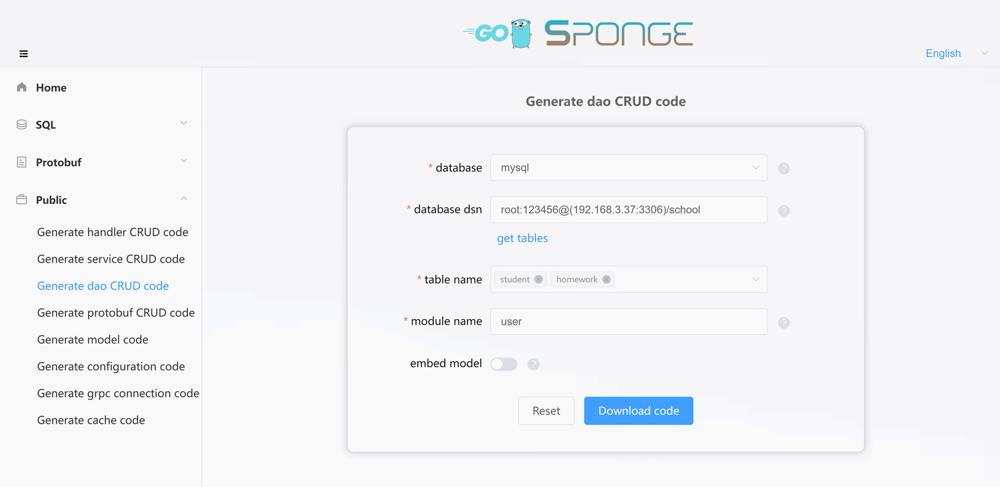
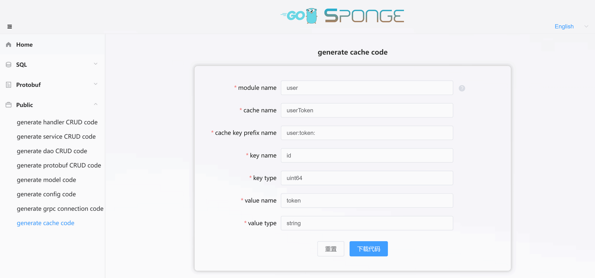

### 🔹Arbitrary Condition Paging Query

Within the CRUD API interfaces, there's one called Arbitrary Conditional Pagination. This interface includes parameters for both `pagination` and `conditions`. Here are the specific usage rules:

```yaml
Pagination Parameters (required):
	page: Page number, starting from 0.
	size(limit): Rows per page, default maximum is 1000. Only `⓵Create web service based on sql` use `size`, other services created using different methods use `limit`.
	sort: Sorting field, default is descending by `id`, but you can change it to sort by other fields. If a field name is preceded by a minus sign "-", it indicates descending order, otherwise, it's ascending. You can use a comma to sort by multiple fields.

Condition Parameters (columns, optional):
	name: Column name.
	exp: Expression, defaults to "=" if empty. You can use "=", "!=", ">", ">=", "<", "<=", "like", "in"
	value: Column value, if exp=in, multiple values are separated by commas.
	logic: Logic between multiple columns. If empty, it represents logical AND, and you can use "&" (AND) or "|" (OR).

Example: Querying males older than 20
	{
	    page: 0,
	    size: 20,
	    columns: [
			{
				name: "age",
				exp: ">",
				value: 20,
			},
			{
				name: "gender",
				value: "male",
			}
		]
	}
```

<br>

---

### 🔹Generating and Using DAO CRUD Code

Click on the left sidebar menu **Public** --> **Generate DAO CRUD Code**, fill in the `MySQL DSN address`, then click **Fetch Table Names**, select the MySQL table(s) you want (you can select multiple), and then fill in the other parameters. After filling in the parameters, click the **Download Code** button to generate DAO CRUD code, as shown in the image below:



> [!tip] Equivalent command: **sponge web dao --module-name=user --db-dsn="root:123456@(192.168.3.37:3306)/school" --db-table=teach**, there is a simpler equivalent command by using the `--out` parameter to specify the directory of the user service, and the code will be merged directly into the user service: **sponge web dao --db-dsn="root:123456@(192.168.3.37:3306)/school" --db-table=teach --out=user**

The generated DAO CRUD code directory structure is as follows, and it contains Go files and test files that start with the table name in subdirectories `cache`, `dao`, and `model` under the `internal` directory:

```
.
└─ internal
     ├─ cache
     ├─ dao
     └─ model
```

Unzip the code and move the `internal` directory to the `web` or `grpc` service code directory. This completes the process of adding DAO CRUD API interfaces in batch to the grpc service.

> [!note] Moving the `internal` directory should not result in conflicts in normal circumstances. If there are conflicts, it means that the same MySQL table was specified to generate DAO CRUD code before. In such cases, ignore the file overwrite.

<br>

Next, you can use the DAO CRUD interfaces. The location of calling the DAO CRUD interfaces differs between the `web` and `grpc` service:

**Calling DAO CRUD Interfaces in Handler for Web Services:**

Navigate to the `internal/handler` directory,

- For `⓵Create web service based on sql`, open the `table_name.go` file.
- For `⓷Create web service based on protobuf`, open the `proto_file_name.go` file.
- You can also create a new `.go` file.

Reference the DAO interface inside the structure, as shown below:

```go
type userHandler struct {
	// Reference the DAO interface
	userDao                 dao.UserDao
}
```

**Calling DAO CRUD Interfaces in Service for GRPC Service:**

Navigate to the `internal/service` directory,

- For `⓶Create grpc service based on sql`, open the `table_name.go` file.
- For `⓸Create grpc service based on protobuf`, open the `proto_file_name.go` file.
- You can also create a new `.go` file.

Reference the DAO interface inside the structure, as shown below:

```go
type userService struct {
	// Reference the DAO interface
	userDao                 dao.UserDao
}
```

After a simple declaration, you can use the DAO CRUD interfaces in the API interface template code.

<br>

---

### 🔹Generating and Using Cache Code

Click on the left sidebar menu **Public** --> **Generate Cache Code**, fill in the parameters as instructed, and then click the **Download Code** button to generate cache code, as shown in the image below:



> [!tip] Equivalent command: **sponge web cache --module-name=user --cache-name=userToken --prefix-key=user:token: --key-name=id --key-type=uint64 --value-name=token --value-type=string**, there is a simpler equivalent command by using the `--out` parameter to specify the directory of the user service, and the code will be merged directly into the user service: **sponge web cache --cache-name=userToken --prefix-key=user:token: --key-name=id --key-type=uint64 --value-name=token --value-type=string --out=user**

The generated cache code directory structure is as follows, and it contains Go files and test files in the `cache` subdirectory under the `internal` directory:

```
.
└─ internal
     └─ cache
```

Unzip the code and move the `internal` directory to the `web` or `grpc` service code directory.

<br>

Next, you can use the cache interface. The location of calling the cache code differs between the `web` and `grp` service:

**Calling Cache Code in Handler for Web Services:**

Navigate to the `internal/handler` directory,

- For `⓵Create web service based on sql`, open the `table_name.go` file.
- For `⓷Create web service based on protobuf`, open the `proto_file_name.go` file.
- You can also create a new `.go` file.

Reference the cache interface inside the structure, as shown below:

```go
type userHandler struct {
	// Reference the cache interface
	userTokenCache       cache.UserTokenCache
}
```

**Calling Cache Code in Service for GRPC Service:**

Navigate to the `internal/service` directory,

- For `⓶Create grpc service based on sql`, open the `table_name.go` file.
- For `⓸Create grpc service based on protobuf`, open the `proto_file_name.go` file.
- You can also create a new `.go` file.

Reference the cache interface inside the structure, as shown below:

```go
type userService struct {
	// Reference the cache interface
	userTokenCache       cache.UserTokenCache
}
```

After a simple declaration, you can use the cache interface in the API interface template code.
