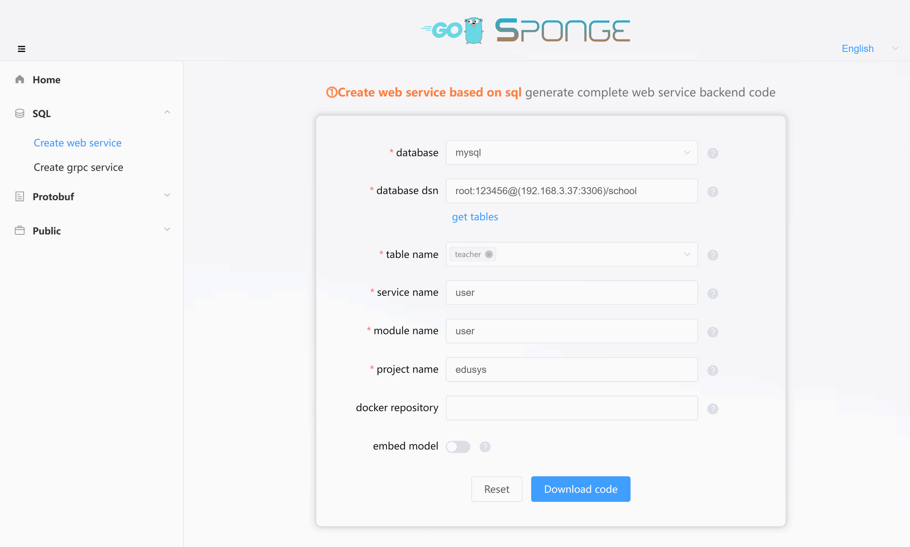

### 🏷Installing Sponge

> [!tip] Before installing sponge, you need to install `go` and `protoc`.

**✅ Install go**

Download Go from the following link: [https://go.dev/doc/install](https://go.dev/doc/install)

> [!note] Go version 1.16 or higher is required.

Check your Go version: `go version`

<br>

**✅ Install protoc**

Download Protocol Buffers (protoc) from the following link: [https://github.com/protocolbuffers/protobuf/releases/tag/v3.20.3](https://github.com/protocolbuffers/protobuf/releases/tag/v3.20.3)

> [!note] Version 3.20 or higher is required. add the directory where the protoc binaries are located to the system environment variable path.

Check your protoc version: `protoc --version`

<br>

**✅ Install sponge**

After installing Go and protoc, proceed to install sponge. sponge supports installation on Windows, macOS, and Linux.

<!-- tabs:start -->

#### **Windows Environment**

> [!note] In a Windows environment, you need to install mingw64, make, and Cmder to support Linux command-line operations for sponge.

**✅ Install mingw64**

Download mingw64 from the following link: [x86_64-8.1.0-release-posix-seh-rt_v6-rev0.7z](https://sourceforge.net/projects/mingw-w64/files/Toolchains%20targetting%20Win64/Personal%20Builds/mingw-builds/8.1.0/threads-posix/seh/x86_64-8.1.0-release-posix-seh-rt_v6-rev0.7z)

After downloading, extract it to the `D:\Program Files\mingw64` directory. Add the directory containing commonly used Linux commands, which is `D:\Program Files\mingw64\bin`, to the system's PATH environment variable.

<br>

**✅ Install the make command**

Navigate to the `D:\Program Files\mingw64\bin` directory, find the `mingw32-make.exe` executable file, copy it, and rename it to `make.exe`.

Check your make version: `make -v`

<br>

**✅ Install Cmder**

Download Cmder from the following link: [cmder-v1.3.20.zip](https://github.com/cmderdev/cmder/releases/download/v1.3.20/cmder.zip)

After downloading, extract it to the `D:\Program Files\cmder` directory. Add the `D:\Program Files\cmder` directory to the system's PATH environment variable.

Perform some basic configuration for Cmder:

- **Configure right-click to open Cmder**: Press `Win+X`, then press 'A' to open a command prompt with administrative privileges. Run the command `Cmder.exe /REGISTER ALL`. Right-click in any folder and select `Cmder Here` to open the Cmder interface.
- **Fix the space issue when entering commands**: Open the Cmder interface, press `Win+Alt+P` to access the settings, search for `Monospace` in the upper-left corner, uncheck it, and save your changes.

> [!attention] When using sponge for project development in a Windows environment, it's recommended to use Cmder to avoid errors related to missing Linux commands. Please do not use the built-in Windows cmd terminal, the terminal within GoLand, or VS Code.

Open the `cmder.exe` terminal and verify support for common Linux commands.

```bash
ls --version
make --version
cp --version
chmod --version
rm --version
```

<br>

**✅ Install sponge**

Open the `cmder.exe` terminal (not the built-in Windows cmd).

1. Add `GOBIN` to the system path, skip this step if already set.

```bash
# Set the directory where the "go get" command downloads third-party packages
setx GOPATH "D:\your-directory"
# Set the directory where the executable binary files generated by the "go install" command are stored.
setx GOBIN "D:\your-directory\bin"

# Close the terminal and open a new one to view the GOBIN directory.
go env GOBIN
```

<br>

2. Execute the command to install sponge, sponge and dependent plugins will be installed to the `GOBIN` directory.

```bash
# Install sponge
go install github.com/zhufuyi/sponge/cmd/sponge@latest

# Initialize sponge and automatically install sponge's dependent plugins
sponge init

# Check if all plugins have been successfully installed. If you find that some plugins haven't been installed successfully, execute the following command to retry: sponge plugins --install
sponge plugins

# Check the sponge version
sponge -v
```

#### **macOS Environment**

Install sponge in a macOS environment.

1. Add `$GOBIN` to the system path, skip this step if already set.

```bash
# Open .bashrc file
vim ~/.bashrc

# Copy the following command to .bashrc file
export GOROOT="/opt/go"     # your go installation directory
export GOPATH=$HOME/go      # Set the directory where the "go get" command downloads third-party packages
export GOBIN=$GOPATH/bin    # Set the directory where the executable binaries are compiled by the "go install" command.
export PATH=$PATH:$GOBIN:$GOROOT/bin  # Add the $GOBIN directory to the system path.

# Save .bashrc file, and make the settings take effect
source ~/.bashrc

# View the GOBIN directory
go env GOBIN
```

<br>

2. Execute the command to install sponge, sponge and dependent plugins will be installed to the `$GOBIN` directory.

```bash
# Install Sponge
go install github.com/zhufuyi/sponge/cmd/sponge@latest

# Initialize Sponge, automatically install Sponge's dependency plugins
sponge init

# Check if all plugins have been successfully installed. If any plugins fail to install, retry with the command: sponge plugins --install
sponge plugins

# Check Sponge version
sponge -v
```

#### **Linux Environment**

Install sponge in a Linux environment.

1. Add `$GOBIN` to the system path, skip this step if already set.

```bash
# Open .bashrc file
vim ~/.bashrc

# Copy the following command to .bashrc file
export GOROOT="/opt/go"     # your go installation directory
export GOPATH=$HOME/go      # Set the directory where the "go get" command downloads third-party packages
export GOBIN=$GOPATH/bin    # Set the directory where the executable binaries are compiled by the "go install" command.
export PATH=$PATH:$GOBIN:$GOROOT/bin  # Add the $GOBIN directory to the system path.

# Save .bashrc file, and make the settings take effect
source ~/.bashrc

# View the GOBIN directory
go env GOBIN
```

<br>

2. Execute the command to install sponge, sponge and dependent plugins will be installed to the `$GOBIN` directory.

```bash
# Install Sponge
go install github.com/zhufuyi/sponge/cmd/sponge@latest

# Initialize Sponge, automatically install Sponge's dependency plugins
sponge init

# Check if all plugins have been successfully installed. If any plugins fail to install, retry with the command: sponge plugins --install
sponge plugins

# Check Sponge version
sponge -v
```

#### **Docker Environment**

> [!note] The sponge installed using docker is just the sponge ui interface service, if you need to develop on the basis of the generated service code, you still need to locally install sponge and dependent plugin binaries.

**Docker Run**

```bash
docker run -d --name sponge -p 24631:24631 zhufuyi/sponge:latest -a http://your_host_ip:24631
```

<br>

**Docker Compose**

The content of the `docker-compose.yaml` file is as follows:

```yaml
version: "3.7"

services:
  sponge:
    image: zhufuyi/sponge:latest
    container_name: sponge
    restart: always
    command: ["-a","http://your_host_ip:24631"]
    ports:
      - "24631:24631"
```

Start the service:

```bash
docker-compose up -d
```

After a successful Docker deployment, access `http://your_host_ip:24631` in your browser.

<br>

<!-- tabs:end -->

> [!tip] To upgrade to the latest version of the sponge framework, execute the command `sponge upgrade`.

<br>

### 🏷Starting the sponge UI Service

sponge supports a rich set of code generation commands, and many commonly used code generation commands have corresponding UI interfaces. The UI provides features like command history, detailed parameter descriptions, and usage instructions after code generation, making it more user-friendly.

Open a terminal and execute the following command:

```bash
sponge run
```

Access the sponge code generation UI interface in your web browser at http://localhost:24631.

The sponge UI interface supports creating projects in five ways:

- `⓵Create web service based on sql`
- `⓶Create grpc service based on sql`
- `⓷Create web service based on protobuf`
- `⓸Create grpc service based on protobuf`
- `⓹Create grpc gateway service based on protobuf`

Each project creation method has its use cases, which are explained in the <a href="/learn-about-sponge?id=%f0%9f%8f%b7code-generation-framework" target="_blank">Code Generation Framework</a> section. Choose one of these methods based on your project's needs. The sponge UI interface also supports generating various common code components, all of which can seamlessly integrate into your project's code. In addition to UI-based code generation, many code generation commands are integrated into the Makefile file within your project's code. These commands are designed to enable "low-code development" in Go.

<br>

### 🏷Creating a Project Example

Below is an example of creating a project using the `⓵Create web service based on sql` method. This is one of the simplest ways to create a project, as it requires no manual Go code writing. You only need to connect to a MySQL database to generate a fully deployed web service project. The web service includes standardized `CRUD` operations, `pagination with arbitrary conditions`, and `caching`. It also comes with a variety of components that are ready to use.

> [!tip] Code generation depends on a MySQL service and MySQL tables. If you don't have them ready, here are the [scripts to start a MySQL service with Docker](https://github.com/zhufuyi/sponge/blob/main/test/server/mysql/docker-compose.yaml). After starting the MySQL service, import the [MySQL table SQL](https://github.com/zhufuyi/sponge_examples/blob/main/1_web-gin-CRUD/test/sql/user.sql).

Enter the sponge UI interface, click on the left menu bar **[SQL]** -> **[Create Web Service]**, fill in the `MySQL DSN address`, click `Fetch Table Names`, then select the table name(s) (multiple selections are allowed). Next, fill in other parameters, and hover over the question mark `?` to view parameter descriptions. After filling in the parameters, click the `Download Code` button to generate the complete web service project, as shown in the screenshot below:



Unzip the code files, and you will have the following directory structure for the created user project:

```
.
├─ cmd
│   └─ user
│       ├─ initial
│       └─ main.go
├─ configs
├─ deployments
│   ├─ binary
│   ├─ docker-compose
│   └─ kubernetes
├─ docs
├─ internal
│   ├─ cache
│   ├─ config
│   ├─ dao
│   ├─ ecode
│   ├─ handler
│   ├─ model
│   ├─ routers
│   ├─ server
│   └─ types
└─ scripts
```

Open a terminal, navigate to the code directory, and execute the following commands:

```bash
# Generate Swagger documentation
make docs

# Compile and run the service
make run
```

In your browser, open [http://localhost:8080/swagger/index.html](http://localhost:8080/swagger/index.html) to perform API interface testing for create, read, update, and delete operations, as shown in the screenshot below:


<br>

If you have new MySQL tables, how can you seamlessly generate standardized CRUD API code and integrate it into your project? How do you add custom API interfaces? Detailed instructions are provided in the <a href="/web-development-mysql" target="_blank">Web Development with MySQL</a> section.

> [!tip] There are five different project creation methods, each explained in detail in the following sections.
