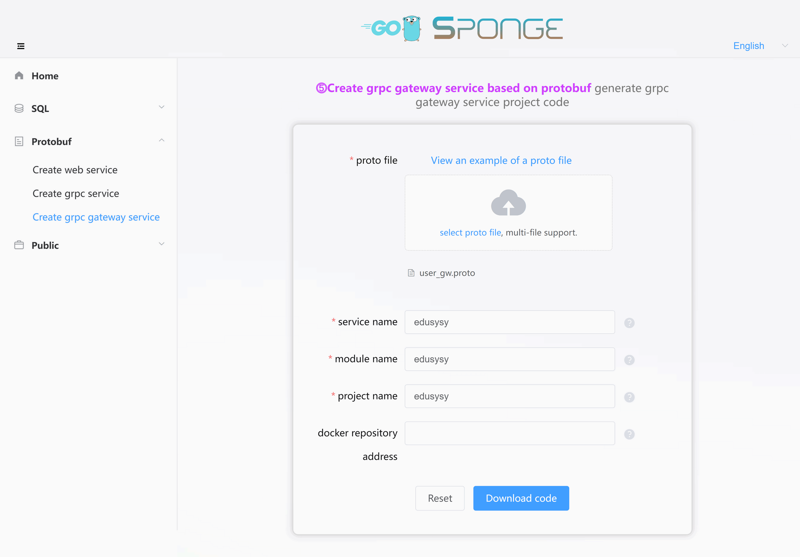

An RPC gateway serves as the unified entry point for RPC services, providing functionalities such as load balancing, routing, security, and monitoring for clients. This enhances the performance, availability, and security of RPC services.

**Main Functions:**

- Typically located between clients and RPC services, an RPC gateway evenly distributes client requests to multiple RPC servers, thereby improving the throughput and availability of RPC services.
- It simplifies client development by forwarding requests to the appropriate RPC servers based on client requests.
- The RPC gateway provides security features such as authentication, authorization, and encryption to protect RPC services.
- It collects runtime status information of RPC services and offers monitoring capabilities to help users manage RPC services.

**Use Cases:**

- In a microservices architecture, an RPC gateway can serve as the unified entry point for microservices, simplifying client development and improving the scalability and maintainability of microservices.
- In a distributed system, an RPC gateway can provide load balancing, routing, and security functions, thereby enhancing the performance and availability of the distributed system.
- In a cross-platform system, an RPC gateway can support RPC services on different platforms, helping users build cross-platform RPC systems.

Here, `⓹RPC gateway service created based on protobuf` is a web service serving as the unified entry point for RPC services. The following section outlines the specific development process for an RPC gateway service.

<br>

### 🏷Pre-development Preparations

Before developing an RPC gateway service, ensure the following preparations:

- sponge is installed.
- You have a protobuf file, such as [user_gw.proto](https://github.com/zhufuyi/sponge_examples/blob/main/5_micro-gin-rpc-gateway/user-gateway/api/user_gw/v1/user_gw.proto).
- You have a microservice [user](https://github.com/zhufuyi/sponge_examples/tree/main/4_micro-grpc-protobuf), or you can quickly create one by referring to the <a href="/microservice-development-protobuf?id=%f0%9f%94%b9creating-a-microservice-project" target="_blank">Creating a Microservice Project</a>.

Open a terminal and start the sponge UI service:

```bash
sponge run
```

Access the sponge code generation UI interface in your web browser at http://localhost:24631.

<br>

### 🏷Creating an RPC Gateway Service Project

Access the sponge UI interface, click on the left menu bar **[Protobuf]** -> **[Create RPC Gateway Project]**, select the protobuf file(s) (multiple selections allowed), and then fill in the other parameters. Hover over the question mark `?` to view parameter descriptions. After filling in the parameters, click the `Download Code` button to generate the RPC gateway service project code, as shown in the screenshot below:



> [!tip] Equivalent command: **sponge micro rpc-gw-pb --module-name=edusys --server-name=edusys --project-name=edusys --protobuf-file=./user_gw.proto**

> [!tip] The format of the directory name for the extracted RPC gateway service code is `ServiceName-Type-Date`. You can modify the directory name (e.g., remove the type and date).

> [!tip] After successfully generating the code, it will be saved as a record for your convenience, making it easy to use for the next code generation. The record is displayed when you refresh or reopen the page.

Unzip the code files, and you will have the following directory structure for the created RPC gateway service:

```
.
├─ api
│   └─ edusys
│       └─ v1
├─ cmd
│   └─ edusys
│       ├─ initial
│       └─ main.go
├─ configs
├─ deployments
│   ├─ binary
│   ├─ docker-compose
│   └─ kubernetes
├─ docs
├─ internal
│   ├─ config
│   ├─ ecode
│   ├─ routers
│   ├─ server
│   └─ service
└─ scripts
```

The created RPC gateway service code structure follows the egg model:


<br>

### 🏷Working with Microservice Integration

#### 🔹Adding Microservice Connection Code

If you want to call the microservice api interface in the rpc gateway service, you must first be able to connect to the microservice, and the following rpc connection code is automatically generated.

Navigate to the sponge UI interface, click on the left-hand menu bar **[Public]** --> **[Generate RPC Service Connection Code]**. Fill in the module name, the name of the RPC service(s) (supporting multiple RPC service names separated by commas), and after filling in the parameters, click the `Download Code` button to generate the RPC service connection code, as shown in the image below:


> [!tip] Equivalent command: **sponge micro rpc-conn --module-name=edusys --rpc-server-name=user**. There is a simpler equivalent command available. Use the `--out` parameter to specify the directory for the RPC gateway service code, and it will merge the code directly into the RPC gateway service code: **sponge micro rpc-conn --rpc-server-name=user --out=edusys**

The generated RPC service connection code directory structure is as follows:

```
.
└─ internal
    └─ rpcclient
```

> [!tip] rpc connection code is actually grpc client connection code, including settings for service discovery, load balancing, secure connection, link tracking, metrics collection, etc. You can also add your own defined connection settings.

Unzip the code and move the `internal` directory to the RPC gateway service code directory.

> [!note] Move the directory `internal` to the rpc service directory normally there will be no conflicting files, if there are conflicting files, it means that the same microservice name has been specified previously to generate the rpc service connection code, ignore the overwrite file at this time.

<br>

#### 🔹Configuring Microservice Addresses

After adding the microservice connection code, set the address for connecting to the microservice in the configuration file `configs/service-name.yml`. The main configuration details are as follows:

```yaml
grpcClient:
  - name: "user"        # Microservice name
    host: "127.0.0.1"   # Microservice address (if service discovery is enabled, this field is ineffective)
    port: 8282          # Microservice port (if service discovery is enabled, this field is ineffective)
    registryDiscoveryType: ""  # Service discovery, default is disabled, supports consul, etcd, nacos
```

> [!tip] For more grpcClient settings, refer to `configs/service-name.yml`, such as load balancing, secure connections, and more.

If you need to connect to multiple microservices, you should set the addresses for each of them as shown below:

```yaml
grpcClient:
  - name: "user"
    host: "127.0.0.1"
    port: 18282
    registryDiscoveryType: ""
  - name: "relation"
    host: "127.0.0.1"
    port: 28282
    registryDiscoveryType: ""
  - name: "creation"
    host: "127.0.0.1"
    port: 38282
    registryDiscoveryType: "
```

<br>

#### 🔹Adding Proto Files for Microservices

Although in the rpc gateway service can connect to the microservice, but do not know the microservice which api interfaces can be called, through the proto file can tell the rpc gateway service can be called api interface.

Copy the `api/micro service name/v1/xxx.proto` file from the microservice code directory and move it to the `api` directory of the rpc gateway service code. With the microservice proto file, the rpc gateway service will know what api interfaces are available to call.

Navigate to the RPC gateway service directory, open a terminal, and execute the following command:

```bash
# Copy proto files from other microservice(s) to this service project. If there are multiple microservice directories, separate them with commas.
make copy-proto SERVER=../user
```

> [!note] `make copy-proto` will copy all proto files. If a proto file already exists, it will be overwritten. You can find the backup of the overwritten proto file in the directory `/tmp/sponge_copy_backup_proto_files`.

<br>

#### 🔹Running the Prepared Microservice

In the prepared [user](https://github.com/zhufuyi/sponge_examples/tree/main/4_micro-grpc-protobuf) microservice directory, open a terminal and execute the following commands:

```bash
# Generate and merge code related to API interfaces.
make proto

# Compile and run the service.
make run
```

<br>

### 🏷Manually Adding API Interfaces

Adding new API interfaces to the RPC gateway service is relatively straightforward, with the main process being to `define API interface descriptions in the proto file` --> `write specific logic code in template files`.

> [!note] Defining API interface descriptions in the proto file should be done within the directory specific to the RPC gateway service. For example, if the directory is `api/edusys/v1`, add API interface descriptions to the proto file within that directory. You can also create a new proto file and add API interface descriptions.

<br>

**(1) Defining API Interface Descriptions in the Proto File**

Navigate to the `api/edusys/v1` directory and open the `user_gw.proto` file. Add the description for the change password interface:

```protobuf
import "validate/validate.proto";
import "tagger/tagger.proto";

service user {
  // ...

  // change password
  rpc ChangePassword(ChangePasswordRequest) returns (ChangeRegisterReply)  {
    option (google.api.http) = {
      post: "/api/v1/user/change_password"
      body: "*"
    };
    option (grpc.gateway.protoc_gen_openapiv2.options.openapiv2_operation) = {
      summary: "change password",
      description: "change password",
      security: {
        security_requirement: {
          key: "BearerAuth";
          value: {}
        }
      }
    };
  }
}

message ChangePasswordRequest {
  uint64 id = 1 [(validate.rules).uint64.gte  = 1, (tagger.tags) = "uri:\"id\"" ];
  string password = 2 [(validate.rules).string.min_len = 6];
}

message ChangePasswordReply {
}
```

> [!tip] The `validate.rules` following the `id` and `password` fields are field validation rules. For more details, click [here](https://github.com/envoyproxy/protoc-gen-validate#constraint-rules). The `tagger.tags` in the struct field indicates the path parameter `id`. Don't forget to add `import "validate/validate.proto"` and `"tagger/tagger.proto"` to your proto file.

After adding the API interface descriptions, run the following command in the terminal:

```bash
# Generate and merge code related to API interfaces
make proto
```

> [!note] During development, you will frequently use the `make proto` command. It internally executes a series of sub-commands to generate code, including template code for API interfaces, error codes, registration of routing code, Swagger documentation, and relevant `*.pb.go` files. It also automatically merges the template code for API interfaces. You don't need to worry about overwriting existing business logic code. Even if something unexpected happens, like a power outage, you can find a backup of the code before each merge in the `/tmp/sponge_merge_backup_code` directory. If you are using Windows, the backup is stored in `C:\Users\YourUsername\AppData\Local\Temp\sponge_merge_backup_code`.

<br>

**(2) Writing Specific Logic Code in Template Files**

With the `microservice connection code`, `microservice API interfaces`, and `generated template code` in place, you can now write specific logic code. Execute the following command:

If you simply want to forward HTTP requests to microservices, the generated template code should already provide the necessary functionality, and you won't need to write Go code. Remove the `panic("implement me")` line and uncomment the code under the `example` directory. Then, make any necessary adjustments. For example, open the `internal/service/user_gw.go` file and the uncommented code will look like this:

```go
package service

import (
  userV1 "edusys/api/user/v1"
  // ......
)

var _ edusysV1.UserLogicer = (*userClient)(nil)

type userClient struct {
  // example:
  userCli userV1.UserClient
}

// NewUserClient create a client
func NewUserClient() edusysV1.UserLogicer {
  return &userClient{
    // example:
    userCli: userV1.NewUserClient(rpcclient.GetUserRPCConn()),
  }
}

// Register 注册
func (c *userClient) Register(ctx context.Context, req *edusysV1.RegisterRequest) (*edusysV1.RegisterReply, error) {
  // example:
  err := req.Validate()
  if err != nil {
    logger.Warn("req.Validate error", logger.Err(err), logger.Any("req", req), interceptor.ServerCtxRequestIDField(ctx))
    return nil, ecode.StatusInvalidParams.Err()
  }

  reply, err := c.userCli.Register(ctx, &userV1.RegisterRequest{
    Email:    req.Email,
    Password: req.Password,
  })
  if err != nil {
    return nil, err
  }

  return &edusysV1.RegisterReply{
    Id: reply.Id,
  }, nil
}

// Login
func (c *userClient) Login(ctx context.Context, req *edusysV1.LoginRequest) (*edusysV1.LoginReply, error) {
  // example:
  // ......
}

// Logout
func (c *userClient) Logout(ctx context.Context, req *edusysV1.LogoutRequest) (*edusysV1.LogoutReply, error) {
  // example:
  // ......
}

// ChangePassword change password
func (c *userClient) ChangePassword(ctx context.Context, req *edusysV1.ChangePasswordRequest) (*edusysV1.ChangeRegisterReply, error) {
  // example:
  // ......
}
```

<br>

If you need to retrieve data from multiple microservices and assemble it into the desired format for the client, you can import multiple microservice client interfaces into the `xxxClient` struct and instantiate them. Here's an example:

```go
package service

import (
  userV1 "edusys/api/user/v1"
  relationV1 "edusys/api/relation/v1"
  creationV1 "edusys/api/creation/v1"
  // ......
)

var _ edusysV1.UserLogicer = (*userClient)(nil)

type userClient struct {
  // example:
  userCli userV1.UserClient
  relationCli relationV1.RelationClient
  creationCli creationV1.CreationClient
}

// NewUserClient create a client
func NewUserClient() edusysV1.UserLogicer {
  return &userClient{
    // example:
    userCli: userV1.NewUserClient(rpcclient.GetUserRPCConn()),
    relationCli: userV1.NewRelationClient(rpcclient.GetRelationRPCConn()),
    creationCli: userV1.NewCreationClient(rpcclient.GetCreationRPCConn()),
  }
}

// ......
```

<br>

**(3) Running the RPC Gateway Service**

Switch to the RPC gateway service code directory and execute the following command:

```bash
# Compile and run the service
make run
```

Open [http://localhost:8080/apis/swagger/index.html](http://localhost:8080/apis/swagger/index.html) in your browser. You will see the API interfaces on the page, as shown in the image below. Test whether you can successfully call the microservice interfaces by making requests through the Swagger interface.

> [!warning] Before writing specific logic code, if you directly request via the Swagger page, it will return a 500 error because the generated template code (internal/service/xxx.go) has a `panic("implement me")` line in every method function, indicating that specific logic code needs to be implemented.


> [!note] If you have modified the port number under the HTTP section in the configuration file `configs/service-name.yml`, for example, changing the default value of 8080 to 9090, you must update the `host` field to `localhost:9090` in all proto files within the directory `api/user/v1`. Then, run the `make proto` command, as inconsistent port numbers can cause request failures.

<br>

### 🏷Configuring the Service

The code for the created RPC Gateway service includes a rich set of components, some of which are disabled by default. You can enable and configure these components based on your specific requirements. The configurations can be managed uniformly in the `configs/service_name.yml` configuration file, which contains detailed instructions.

> [!tip] You can replace, add your own components (gin middleware), or remove unnecessary components in the code file `internal/routers/routers.go`.

> [!tip] If API interfaces require authentication, you can uncomment the `middleware.Auth()` code in the individual `internal/routers/proto_file_router.go` files. This supports both individual route and group route authentication. Of course, you can also use your own authentication middleware. If you do, you'll need to replace `jwt.Init` in `internal/routers/routers.go` with your own authentication initialization.

**Components Enabled by Default:**

- **logger**: Logging component, which by default logs to the console. You can configure it to output logs in JSON format, specify a log file, and manage log rotation and retention settings.
- **enableMetrics**: Metrics collection, with the default route `/metrics`.
- **enableStat**: Resource statistics, capturing CPU and memory usage information for both the system and the program. By default, this information is logged every minute. If the program consumes more than 80% of system resources (configurable), it automatically collects profiles and stores them in the `/tmp/service_name_profile` directory for later offline analysis.
- **cacheType**: Cache component, defaulting to in-memory caching but can be configured to use Redis. Note that Redis is required for cluster deployments.

**Components Disabled by Default:**

- **enableHTTPProfile**: Profile component
- **enableLimit**: Adaptive rate limiting component
- **enableCircuitBreaker**: Adaptive circuit breaking component
- **enableTrace**: Distributed tracing component
- **registryDiscoveryType**: Service registration and discovery component
- **gRPC Client**:
  - **enableLoadBalance**: Load balancing
  - **serverSecure**: Certificate validation, supporting server-side verification and mutual authentication
  - **enableToken**: Token-based authentication

Other configurations can be adjusted as needed or new configurations can be added. If you add or modify configuration fields, remember to update the corresponding Go structures. You can do this by running the following command in the terminal within the service code directory:

```bash
make update-config
```
