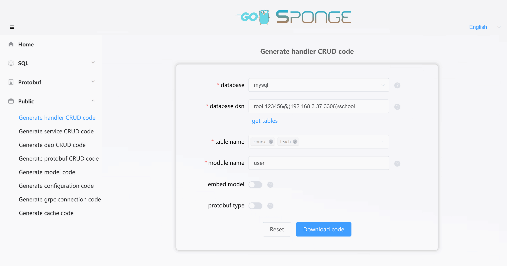

The `⓵Web service created based on sql` (web service based on SQL) is a web service that uses MySQL as its data storage. Since the database type has already been chosen, and sponge supports generating standardized CRUD code using GORM, you can generate a complete web service code with CRUD API interfaces with a single click. This web service allows you to easily add standardized CRUD API interfaces without writing a single line of Go code, as long as you connect it to a MySQL database.

If you're developing a web service with only standardized CRUD API interfaces, this is one of the simplest ways to develop a web application. It allows you to achieve "low-code development" of web service APIs without writing Go code. However, when adding custom API interfaces, you'll need to manually write the complete API interface code, just like traditional API development. This is a limitation of the `⓵Web service created based on sql`, as it doesn't automatically generate custom API interface code. This limitation is addressed in another web development approach called `⓷Web service created based on protobuf` (web development with [protobuf](https://en.wikipedia.org/wiki/Protocol_Buffers)), as explained in the <a href="/web-development-protobuf" target="_blank">Web Development</a> section.

Therefore, `⓵Web service created based on sql` is suitable for web projects that use MySQL as the data store and where the majority of API interfaces are standardized CRUD interfaces, such as backend administration projects.

<br>

### 🏷Pre-development Preparations

Before developing a web project:

- Ensure that sponge is installed.
- Have a running MySQL service.
- Define the MySQL tables.

> [!tip] Code generation depends on the availability of a MySQL service and tables. If you don't have them prepared, you can use this [Docker script to start a MySQL service](https://github.com/zhufuyi/sponge/blob/main/test/server/mysql/docker-compose.yaml). After starting the MySQL service, import the [SQL script for the example database and tables](https://github.com/zhufuyi/sponge_examples/blob/main/1_web-gin-CRUD/test/sql/user.sql) used in this example.

Open a terminal and start the sponge UI interface:

```bash
sponge run
```

Access the sponge code generation UI interface in your browser by navigating to http://localhost:24631.

<br>

### 🏷Creating a Web Service Project

In the sponge UI interface, navigate to the left sidebar, click on "SQL," and then click on "Create Web Project." Fill in the `MySQL DSN address`, click the "Get Table Names" button, select the table names (you can select multiple), and then fill in the other parameters. Hover over the question mark `?` to view parameter explanations. After filling in the parameters, click the "Download Code" button to generate the complete project code for the web service, as shown in the image below:


> [!tip] Equivalent command: **sponge web http --module-name=user --server-name=user --project-name=edusys --db-dsn="root:123456@(192.168.3.37:3306)/school" --db-table=teacher**

> [!tip] The directory name format for the extracted web service code is `service_name-type-time`. You can modify the directory name, such as removing the type and time from the name.

> [!tip] After successfully generating the code, it will be saved for future use. If the `MySQL DSN address` remains the same, the table names will be automatically retrieved when you refresh or reopen the page, so you don't need to click the "Get Table Names" button again.

This is the structure of the created web service code directory:

```
.
├─ cmd
│   └─ user
│       ├─ initial
│       └─ main.go
├─ configs
├─ deployments
│   ├─ binary
│   ├─ docker-compose
│   └─ kubernetes
├─ docs
├─ internal
│   ├─ cache
│   ├─ config
│   ├─ dao
│   ├─ ecode
│   ├─ handler
│   ├─ model
│   ├─ routers
│   ├─ server
│   └─ types
└─ scripts
```

Unzip the code files, open a terminal, navigate to the web service code directory, and execute the following commands:

```bash
# Generate Swagger documentation
make docs

# Compile and run the service
make run
```

> [!note] During web service development, you'll frequently use the `make docs` command to generate Swagger documentation. If you add or modify API interfaces, you'll need to execute this command. Otherwise, it's not necessary.

In your browser, open [http://localhost:8080/swagger/index.html](http://localhost:8080/swagger/index.html) to perform testing of CRUD API interfaces, as shown in the image below:


> [!tip] In the CRUD API interfaces, there is a paginated query interface with arbitrary conditions. With this interface, you can avoid writing many API query interfaces. Click to see <a href="/public-doc?id=%f0%9f%94%b9arbitrary-condition-paging-query" target="_blank">Arbitrary Condition Paging Query</a> instructions.

> [!note] If you change the port in the configuration file `configs/service_name.yml`, for example, from the default 8080 to 9090, you must also modify the `@host` value in the code file `cmd/service_name/main.go` to match (e.g., change it to localhost:9090) and then execute the `make docs` command to avoid request failures due to port mismatch.

<br>

### 🏷Automatically Adding CRUD API Interfaces

If you have new MySQL tables and need to generate CRUD API interface code for them, follow these steps:

1. Click on the left sidebar menu "Public" and then select "Generate handler CRUD code."
2. Fill in the `MySQL DSN address` and click on "Get Table Names." Select the MySQL tables you want to generate code for (you can select multiple tables).
3. Fill in the remaining parameters.
4. After completing the parameters, click the "Download Code" button to generate the CRUD handler code, as shown in the image below:



> [!tip] Equivalent command: **sponge web handler --module-name=user --db-dsn="root:123456@(192.168.3.37:3306)/school" --db-table=cause,teach**. There's a simpler equivalent command that allows you to specify the web service code directory using the `--out` parameter and directly merge the code into the web service code: **sponge web handler --db-dsn="root:123456@(192.168.3.37:3306)/school" --db-table=cause,teach --out=user**

The generated CRUD handler code directory structure is as follows. The `internal` directory contains subdirectories such as `cache`, `dao`, `ecode`, `handler`, `model`, `routers`, and `types`, which include Go files and test files named after the table names.

```
.
└─ internal
    ├─ cache
    ├─ dao
    ├─ ecode
    ├─ handler
    ├─ model
    ├─ routers
    └─ types
```

Unzip the code and move the `internal` directory into your web service code directory. This completes the process of adding CRUD API interfaces to your web service in bulk.

> [!note] Moving the `internal` directory should not result in conflicts in normal cases. If there are conflicting files, it means that you've previously specified the same MySQL tables to generate CRUD handler code, and you can safely overwrite the files in this case.

Execute the following commands in the terminal:

```bash
# Generate Swagger documentation
make docs

# Compile and run the service
make run
```

In your browser, refresh the page [http://localhost:8080/swagger/index.html](http://localhost:8080/swagger/index.html) to see the newly added CRUD API interfaces and test them directly on the page.

<br>

Adding standardized CRUD API interface code to your web service project requires no manual Go code writing. However, if you want to add custom API interfaces, manual code writing is required.

<br>

### 🏷Manually Adding Custom API Interfaces

The `⓵Web service created based on sql` (web service based on SQL) does not support automatic generation of custom API interface template code. You'll need to manually write handler functions, define request parameters and response structures, set field validation tags, define custom error codes, register routes, provide Swagger annotations, and write the actual logic, just like traditional web API development.

For example, to add a login interface to this project, you'll need to follow these six steps:

**(1) Define Request Parameters and Response Structures**

Navigate to the `internal/types` directory and open the `teacher_types.go` file. Add the request and response structures for the login interface:

```go
// LoginRequest login request params
type LoginRequest struct {
	Email      string `json:"email" binding:"email"`
	Password   string `json:"password" binding:"min=6"`
}

// LoginRespond list data
type LoginRespond []struct {
	ID       uint64 `json:"id"`
	Token    string `json:"token"`
}
```

> [!tip] The field tags in the structure (e.g., `binding`) are used for field validation. You can learn more about [validator validation rules](https://github.com/go-playground/validator#baked-in-validations) by clicking the link.

<br>

**(2) Define Error Codes**

Navigate to the `internal/ecode` directory and open the `teacher_http.go` file. Add a line of code to define error codes for the login interface:

```go
var (
	teacherNO       = 1
	teacherName     = "teacher"
	teacherBaseCode = errcode.HCode(teacherNO)

	// ...
	ErrLoginTeacher        = errcode.NewError(teacherBaseCode+8, "failed to login "+teacherName)
	// for each error code added, add +1 to the previous error code
)
```

<br>

**(3) Define Handler Functions**

Navigate to the `internal/handler` directory and open the `teacher.go` file. Define a login method and add Swagger annotations:

```go
// Login login
// @Summary login
// @Description login by account and password
// @Tags teacher
// @accept json
// @Produce json
// @Param data body types.CreateLoginRequest true "login information"
// @Success 200 {object} types.Result{}
// @Router /api/v1/teacher/login [post]
func (h *teacherHandler) Login(c *gin.Context) {
	// verify password

	// generating and storing tokens

	response.Success(c, gin.H{
    	"id": 1,
    	"token": "xxxxxx",
    })
}
```

Then, add the Login method to the `TeacherHandler` interface:

```go
type TeacherHandler interface {
	Create(c *gin.Context)
	// ...
	Login(c *gin.Context)
}
```

<br>

**(4) Register Routes**

Navigate to the `internal/routers` directory and open the `teacher.go` file. Register the Login route:

```go
func teacherRouter(group *gin.RouterGroup, h handler.TeacherHandler) {
	group.POST("/teacher", h.Create)
	// ...
	group.POST("/teacher/login", h.Login)
}
```

<br>

**(5) Write Specific Logic Code**

Write the specific logic code for the login functionality, such as password validation and token generation.

> [!tip] In manually added custom API interfaces, you may need to perform data CRUD operations (also known as DAO CRUD). These DAO CRUD code sections can be generated automatically without manual coding. Click to view <a href="/public-doc?id=%f0%9f%94%b9generating-and-using-dao-crud-code" target="_blank">Generating and Using dao CRUD Code</a> instructions.

> [!tip] In manually added custom API interfaces, you may need to use caching, such as generating tokens. For string-type cache code like this, you can generate it directly and don't need to write it manually. Click to view <a href="/public-doc?id=%f0%9f%94%b9generating-and-using-cache-code" target="_blank">Generating and Using Cache Code</a> instructions.

<br>

**(6) Test API interfaces**

After writing the specific logic code, execute the following commands in the terminal:

```bash
# Generate Swagger documentation
make docs

# Compile and run the service
make run
```

In your browser, refresh [http://localhost:8080/swagger/index.html](http://localhost:8080/swagger/index.html). You will see the login API interface, and once it passes the test on the page, your custom API interface is officially added.

<br>

It's clear that adding custom API interfaces is more complex than adding standardized CRUD API interfaces (which are automatically generated). All related code for custom API interfaces must be manually written. Therefore, the `⓵Web service created based on sql` (web service based on SQL) approach is suitable for scenarios where the majority of API interfaces are standardized CRUD, and only a few are custom. If your web project includes a significant number of custom API interfaces, it's advisable to use the `⓷Web service created based on protobuf` (web service based on [protobuf](https://en.wikipedia.org/wiki/Protocol_Buffers)) approach for web service development.

<br>

### 🏷Configuring the Service

The created web service code includes a variety of components, some of which are disabled by default. You can enable and configure these components based on your specific requirements. Configuration settings are centralized in the `configs/service_name.yml` file, which provides detailed explanations for each setting.

> [!tip] You can replace, add your own components (Gin middleware), or remove unnecessary components by modifying the code in the `internal/routers/routers.go` file.

> [!tip] If your API interfaces require authentication, you can add `middleware.Auth()` in the routing registration code in each `internal/routers/table_name.go` file. Of course, you can also use your own authentication middleware. If you choose to use your own middleware, you'll need to replace `jwt.Init` in `internal/routers/routers.go` with your own authentication initialization.

**Components Enabled by Default:**

- **logger**: Logging component, which logs to the console by default. You can configure it to output logs in JSON format, specify log files, and manage log rotation and retention settings.
- **enableMetrics**: Metric collection, with the default route `/metrics`.
- **enableStat**: Resource statistics, which track CPU and memory resource usage for both the system and the program. By default, this information is logged every minute. If the program consumes more than 80% of system resources (configurable), it will automatically collect profiles and save them in the `/tmp/service_name_profile` directory for offline analysis.
- **cacheType**: Cache component, defaulting to local memory but can be configured to use Redis. Note that Redis is required for cluster deployments.

**Components Disabled by Default:**

- **enableHTTPProfile**: Profile component
- **enableLimit**: Adaptive rate limiting component
- **enableCircuitBreaker**: Adaptive circuit breaking component
- **enableTrace**: Distributed tracing component
- **registryDiscoveryType**: Service registration and discovery component

Other configurations can be adjusted as needed, and you can also add custom configurations. If you add or modify configuration file fields, remember to update the corresponding Go structures. To do this, execute the following command in the terminal within the service code directory:

```bash
make update-config
```
