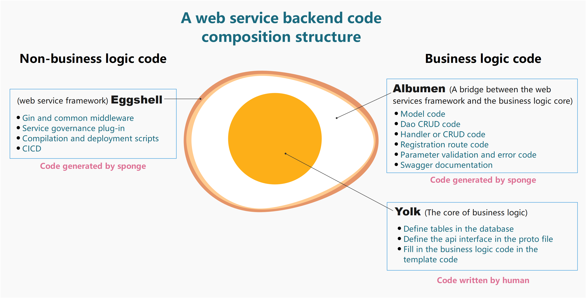
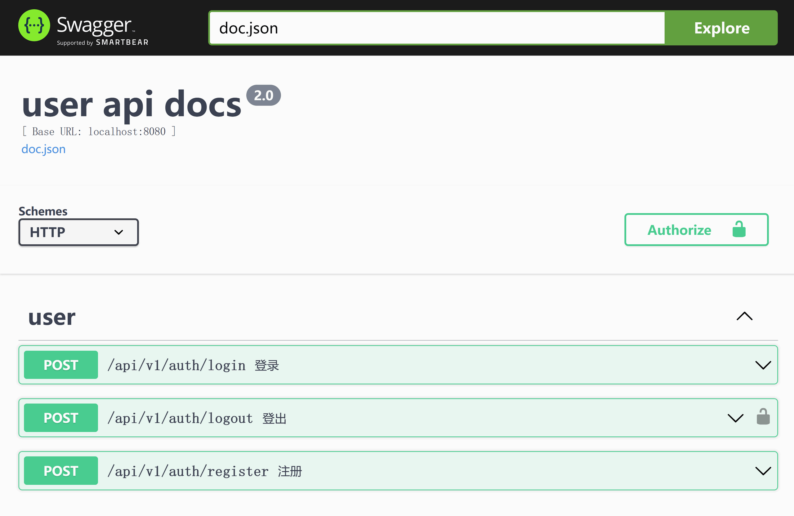
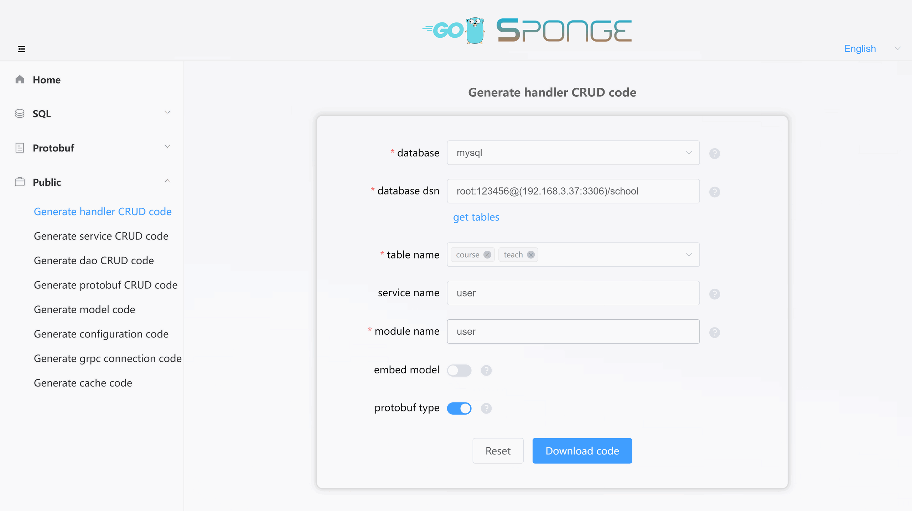

The `⓷Web service created based on protobuf` is designed for general web service development and supports various database types as data storage options. On the other hand, the `⓵Web service created based on sql`, which is <a href="/web-development-mysql" target="_blank">Web Development with MySQL</a>, specifically uses MySQL as the database type. This is one of the main differences between the two methods, and you can consider `⓵Web service created based on sql` as a specialized subset of `⓷Web service created based on protobuf`.

When you choose `⓷Web service created based on protobuf`, you have the flexibility to select any database type, including MySQL. If you opt for MySQL as the database type, it not only supports batch addition of standardized CRUD API interfaces but, more importantly, it also allows the generation of template code for custom API interfaces. This means that with `⓷Web service created based on protobuf`, you don't need to write complete API interface code as you would in traditional web development. Instead, you define API interface descriptions in proto files and then write specific logic code in the generated templates.

When using other database types with `⓷Web service created based on protobuf`, you'll need to manually write DAO, model, database initialization, and other code, as auto-generation is not supported.

Therefore, `⓷Web service created based on protobuf` is suitable for general web project development.

<br>

## 🏷Choosing MySQL for Web Development

When you choose MySQL as the database:

- If your web project only requires standardized CRUD API interfaces, `⓷Web service created based on protobuf` and `⓵Web service created based on sql` are functionally equivalent, and you don't need to write any Go code.
- If your web project includes custom API interfaces, `⓷Web service created based on protobuf` is simpler than `⓵Web service created based on sql` because it can batch generate template code for custom API interfaces.

<br>

### 🔹Pre-development Preparations

Before developing a web project:

- Make sure you have installed sponge.
- Set up a MySQL service.
- Create the necessary MySQL tables.
- Prepare proto files, for example, [user.proto](https://github.com/zhufuyi/sponge_examples/blob/main/2_web-gin-protobuf/api/user/v1/user.proto).

> [!tip] Generating handler CRUD code depends on a MySQL service and existing MySQL tables. If you don't have them ready, here's a [script to start a MySQL service with Docker](https://github.com/zhufuyi/sponge/blob/main/test/server/mysql/docker-compose.yaml). After starting the MySQL service, you can import the SQL script for the example [database and tables](https://github.com/zhufuyi/sponge_examples/blob/main/1_web-gin-CRUD/test/sql/user.sql) used.

Open a terminal and start the sponge UI service:

```bash
sponge run
```

Access [http://localhost:24631](http://localhost:24631) in your browser to enter the sponge code generation UI.

<br>

### 🔹Creating a Web Service Project

In the sponge UI interface, click on the left-hand menu **[Protobuf]** --> **[Create Web Project]**. Select the proto file(s) (multiple selections are possible), fill in the other parameters, and hover over the question mark `?` to view parameter descriptions. After completing the parameters, click the `Download Code` button to generate the web service project code, as shown in the image below:


> [!tip] Equivalent command: **sponge web http-pb --module-name=user --server-name=user --project-name=edusys --protobuf-file=./user.proto**

> [!tip] The format of the extracted web service code directory name is `service-name-type-time`. You can modify the directory name (e.g., removing the type and time).

> [!tip] After successfully generating the code, sponge saves the record for your convenience during subsequent code generation. When you refresh or reopen the page, the previous parameters will be displayed.

Here is the directory structure of the created web service code:

```
.
├─ api
│   └─ user
│       └─ v1
├─ cmd
│   └─ user
│       ├─ initial
│       └─ main.go
├─ configs
├─ deployments
│   ├─ binary
│   ├─ docker-compose
│   └─ kubernetes
├─ docs
├─ internal
│   ├─ config
│   ├─ ecode
│   ├─ handler
│   ├─ routers
│   └─ server
└─ scripts
```

Anatomy of the created web service code structure:



Unzip the code files, open a terminal, navigate to the web service code directory, and execute the following commands:

```bash
# Generate and merge code related to API interfaces
make proto

# Compile and run the service
make run
```

> [!note] During development, you will frequently use the `make proto` command. It internally executes a series of sub-commands to generate code, including template code for API interfaces, error codes, registration of routing code, Swagger documentation, and relevant `*.pb.go` files. It also automatically merges the template code for API interfaces. You don't need to worry about overwriting existing business logic code. Even if something unexpected happens, like a power outage, you can find a backup of the code before each merge in the `/tmp/sponge_merge_backup_code` directory. If you are using Windows, the backup is stored in `C:\Users\YourUsername\AppData\Local\Temp\sponge_merge_backup_code`.

Open [http://localhost:8080/apis/swagger/index.html](http://localhost:8080/apis/swagger/index.html) in your browser. You will see the API interfaces on the page, as shown in the image below:

> [!warning] Before writing specific logic code, if you directly request via the Swagger page, it will return a 500 error because the generated template code (internal/handler/xxx.go) has a `panic("implement me")` line in every method function, indicating that specific logic code needs to be implemented.



> [!note] If you have modified the port number under the HTTP section in the configuration file `configs/service-name.yml`, for example, changing the default value of 8080 to 9090, you must update the `host` field to `localhost:9090` in all proto files within the directory `api/user/v1`. Then, run the `make proto` command, as inconsistent port numbers can cause request failures.

<br>

### 🔹Automatically Adding CRUD API Interfaces

Some API interfaces in the project require standardized CRUD (Create, Read, Update, Delete) functionality. These standardized CRUD API interfaces can be automatically generated and seamlessly added to the web service code.

Click on the left menu bar "Public" -> "Generate handler CRUD code." Fill in the `MySQL DSN address`, then click "Get table names" and select the MySQL tables (multiple selections are allowed). Note that you must enable the `protobuf type`. Fill in parameters like module name, service name, and others, then click the "Download code" button to generate handler CRUD code, as shown in the image below:



> [!tip] Equivalent command: **sponge web handler-pb --module-name=user --db-dsn="root:123456@(192.168.3.37:3306)/school" --db-table=teacher,cause**. There is a simpler equivalent command that uses the `--out` parameter to specify the web service code directory and directly merge the code into the web service code: **sponge web handler --db-dsn="root:123456@(192.168.3.37:3306)/school" --db-table=teacher,cause --out=user**.

The generated CRUD handler code directory structure includes subdirectories under `internal` and `api/user`, such as `cache`, `dao`, `ecode`, `handler`, `model`, and `v1`. These directories contain Go files and test files named after the table names.

```
.
├─ api
│   └─ user
│       └─ v1
└─ internal
    ├─ cache
    ├─ dao
    ├─ ecode
    ├─ handler
    └─ model
```

Unzip the code and move the `internal` and `api` directories to the web service code directory. This completes the process of adding CRUD API interfaces in bulk to the web service.

> [!note] Moving the `internal` and `api` directories should not result in conflicts under normal circumstances. If conflicts occur, it means that the same MySQL tables were previously specified to generate handler CRUD code. In such cases, simply ignore the file replacement.

> [!note] Since MySQL database type was chosen, before running the `make run` command, navigate to the `cmd/service_name/initial` directory, open `initApp.go`, and uncomment the default MySQL and cache initialization code to indicate that MySQL and cache should be initialized before running the service. Also, open `registerClose.go` and uncomment the default MySQL and cache connection closing code to release MySQL and cache connections before stopping the service.

> [!note] Before running the `make run` command, open `configs/service_name.yml` and modify the MySQL address.

Execute the following commands in the terminal:

```bash
# Fill in missing types.proto and MySQL initialization code (only needs to be done once per project)
# make patch

# Generate and merge code related to API interfaces
make proto

# Compile and run the service
make run
```

> [!attention] If you encounter errors like **api/types/types.proto: File not found.** or **internal\cache\xxx.go:40:38: undefined: model.CacheType** while executing the `make proto` command, please run the `make patch` command and then execute the `make proto` command again.

Refresh the page in your browser [http://localhost:8080/apis/swagger/index.html](http://localhost:8080/apis/swagger/index.html). You will see the newly added CRUD API interfaces, and you can test these interfaces on the page.

> [!tip] In the CRUD API interfaces, there is a paginated query interface with arbitrary conditions. With this interface, you can avoid writing many API query interfaces. Click to see <a href="/public-doc?id=%f0%9f%94%b9arbitrary-condition-paging-query" target="_blank">Arbitrary Condition Paging Query</a> instructions.

Adding standardized CRUD API interface code in bulk to the web service project code does not require manual Go code writing.

<br>

### 🔹Manually Adding Custom API interfaces

As business requirements evolve, there may be a need to add new custom API interfaces. The main process for adding custom API interfaces is to `define the API interfaces in the proto files` -> `write specific logic code in the generated template code`.

For example, to add a "Change Password" API interface to this project:

**(1) Define the "Change Password" API in the Proto File**

Navigate to the `api/user/v1` directory, open the `user.proto` file, and add the description of the "Change Password" API:

```protobuf
import "validate/validate.proto";
import "tagger/tagger.proto";

service user {
  // ...

  // change password
  rpc ChangePassword(ChangePasswordRequest) returns (ChangePasswordReply) {
    option (google.api.http) = {
      post: "/api/v1/user/change_password"
      body: "*"
    };
    option (grpc.gateway.protoc_gen_openapiv2.options.openapiv2_operation) = {
      summary: "change password",
      description: "change password",
      security: {
        security_requirement: {
          key: "BearerAuth";
          value: {}
        }
      }
    };
  }
}

message ChangePasswordRequest {
  uint64 id = 1 [(validate.rules).uint64.gte  = 1, (tagger.tags) = "uri:\"id\"" ];
  string password = 2 [(validate.rules).string.min_len = 6];
}

message ChangePasswordReply {
}
```

> [!tip] The `validate.rules` following the `id` and `password` fields are validation rules for the fields. Click here to learn more about [validation rules](https://github.com/envoyproxy/protoc-gen-validate#constraint-rules), and the `tagger.tags` indicate the path parameter `id` in the struct field tag. Make sure to add `import "validate/validate.proto"` and `"tagger/tagger.proto"` to the proto file.

After adding the API description information, execute the following command in the terminal:

```bash
# Generate and merge code related to API interfaces
make proto
```

<br>

**(2) Write Specific Logic Code**

Navigate to the `internal/handler` directory and open the `user.go` file. Write the specific logic code under the `ChangePassword` method.

> [!tip] In manually added custom API interfaces, you may need to perform data CRUD operations (also known as DAO CRUD). These DAO CRUD code sections can be generated automatically without manual coding. Click to view <a href="/public-doc?id=%f0%9f%94%b9generating-and-using-dao-crud-code" target="_blank">Generating and Using dao CRUD Code</a> instructions.

> [!tip] In manually added custom API interfaces, you may need to use caching, such as generating tokens. For string-type cache code like this, you can generate it directly and don't need to write it manually. Click to view <a href="/public-doc?id=%f0%9f%94%b9generating-and-using-cache-code" target="_blank">Generating and Using Cache Code</a> instructions.

<br>

**(3) Test the API interface**

After writing the specific logic code, execute the following command in the terminal:

```bash
# Compile and run the service
make run
```

Refresh the page in your browser [http://localhost:8080/apis/swagger/index.html](http://localhost:8080/apis/swagger/index.html). You will see the "Change Password" API interface, and you can request and test the interface on the page.

<br>

Adding a custom API interface is relatively simple. You only need to define the API interface description in the proto file and then fill in the specific logic code in the generated template. You don't need to write the entire API interface code as you would in traditional web development. This allows developers to focus on writing specific business logic.

<br>

> [!tip] The template code files generated by `Automatically Adding CRUD API interfaces` have different naming conventions compared to those generated based on proto files. Although both generate template files in the `internal/handler` directory, the former uses the table name as the naming convention (`table_name.go`), while the latter uses the proto file name as the naming convention (`proto_file_name.go`).

<br>

### 🔹Configuring the Service

The created web service code includes a rich set of components, some of which are disabled by default. You can enable and configure these components based on your actual needs in the `configs/service_name.yml` configuration file, which contains detailed instructions.

> [!tip] You can replace, add your own components (gin middleware), or remove components not needed in the code file `internal/routers/routers.go`.

> [!tip] If your API interface requires authentication, you can uncomment the `middleware.Auth()` code in each `internal/routers/proto_file_router.go`. This supports both individual and grouped routes. Of course, you can also use your own authentication middleware. If you use your own authentication middleware, you will need to change `jwt.Init` in `internal/routers/routers.go` to your own authentication initialization.

**Components Enabled by Default:**

- **logger**: Logging component. It defaults to outputting logs to the terminal with a console log format. You can configure it to output logs in JSON format, save logs to specific files, and set log rotation and retention times.
- **enableMetrics**: Metric collection, with the default route `/metrics`.
- **enableStat**: Resource statistics, which tracks CPU and memory resource usage of both the system and the program. By default, it logs this information every minute. If the program's resource usage exceeds 80% (configurable), it will automatically collect profiles and save them in the `/tmp/service_name_profile` directory for offline analysis.
- **cacheType**: Cache component, which defaults to local memory. You can change it to use Redis, but keep in mind that Redis is required for cluster deployments.

**Components Disabled by Default:**

- **enableHTTPProfile**: Profile component.
- **enableLimit**: Adaptive rate limiting component.
- **enableCircuitBreaker**: Adaptive circuit breaking component.
- **enableTrace**: Distributed tracing component.
- **registryDiscoveryType**: Service registration and discovery component.

You can configure other settings according to your needs and add new configurations if necessary. If you add or change configuration file fields, you will need to update the corresponding Go structs. You can do this by running the following command in the terminal within the service code directory:

```bash
make update-config
```

<br>

## 🏷Using Other Databases for Web Development

`⓷Web service created based on protobuf` do not include database-related code by default. Developers can choose any database type for data storage. The above describes the specific process of choosing mysql for web development, the operation is simple and convenient, thanks to sponge's support for generating various code (e.g., dao, model, cache) based on MySQL tables to create API interfaces. sponge currently does not support generating these codes for other database types.

While sponge does not support generating database-related code for other database types, it simplifies web service development by generating API interface templates, route registration code, error codes, and automatically merging template code based on protobuf files, eliminating the need to write a significant amount of code compared to traditional web service development.

The development process for using other database types is similar to that of using MySQL, with the main difference being in the database operation-related code. The former is written manually, while the latter is generated automatically.

<br>

### 🔹Pre-development Preparations

Before developing a web project:

- Ensure that sponge is installed.
- Have a database service available.
- Prepare a proto file, such as [user.proto](https://github.com/zhufuyi/sponge_examples/blob/main/2_web-gin-protobuf/api/user/v1/user.proto).

Open a terminal and start the sponge UI interface service:

```bash
sponge run
```

Access http://localhost:24631 in your web browser to enter the sponge code generation UI.

<br>

### 🔹Creating a Web Service Project

Please refer to the section on <a href="/web-development-protobuf?id=%f0%9f%94%b9creating-a-web-service-project" target="_blank">Creating a Web Service Project</a>.

<br>

### 🔹Initializing the Database

**(1) Adding Database Configuration**

Open the configuration file `configs/service_name.yml` and add the data address configuration, for example:

```yml
# mongodb settings
mongodb:
  dsn: "mongodb://127.0.0.1:27017/user"
```

Open a terminal, navigate to the service directory, and execute the command to update the configuration Go structs:

```bash
make update-config
```

<br>

**(2) Adding Initialization Code for Data**

Create a file `init.go` in the `internal/model` directory, and fill it with code to connect to the data. You can refer to the [MySQL initialization](https://github.com/zhufuyi/sponge/blob/main/internal/model/init.go) for guidance.

Then, navigate to the `cmd/service_name/initial` directory, open `initApp.go`, and replace the default commented-out MySQL and cache initialization code. Also, open `registerClose.go` and replace the default commented-out MySQL and cache connection closing code.

<br>

### 🔹Adding Custom API Interfaces

Please refer to the section on <a href="/web-development-protobuf?id=%f0%9f%94%b9manually-adding-custom-api-interfaces" target="_blank">Manually Adding Custom API interfaces</a>.

> [!tip] When writing specific logic code in the API interface template code, if it involves data operations, such as the need to manually write `model` and `dao` code, be sure to do so.

> [!tip] In manually added custom API interfaces, you may need to use caching, such as generating tokens. For string-type cache code like this, you can generate it directly and don't need to write it manually. Click to view <a href="/public-doc?id=%f0%9f%94%b9generating-and-using-cache-code" target="_blank">Generating and Using Cache Code</a> instructions.

<br>

### 🔹Configuring the Service

Please refer to the section on <a href="/web-development-protobuf?id=%f0%9f%94%b9configuring-the-service" target="_blank">Configuring the Service</a>.
